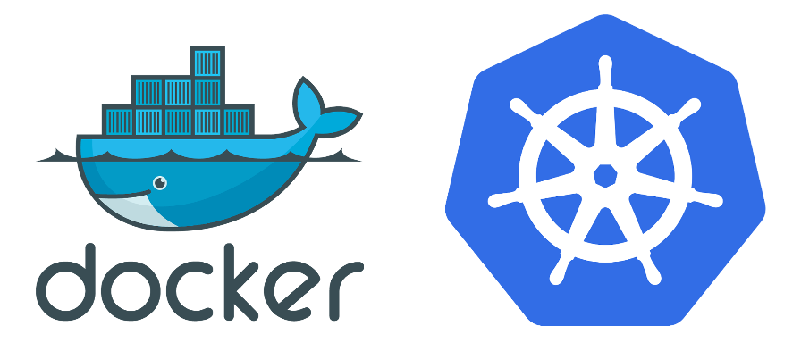

# 1. 课程介绍
之前一直有同学跟我说我`Docker`掌握得还可以，但是不知道怎么使用`Kubernetes`，网上的其他关于 Kubernetes 的课程费用又太高，这节课就是为你们准备的，当然如果你不了解 Docker，不了解 Kubernetes，都没有关系，我们这个课程会从 Docker 入门一步步深入，到 Kubernetes 的进阶使用的。所以大家完全没必要担心。
​​

学完本课程以后，你将会对 Docker 和 Kubernetes 有一个更加深入的认识，我们会讲到:

* Docker 的一些常用方法，当然我们的重点会在 Kubernetes 上面
* 会用 kubeadm 来搭建一套 Kubernetes 的集群
* 理解 Kubernetes 集群的运行原理
* 常用的一些控制器使用方法
* 还有 Kubernetes 的一些调度策略
* Kubernetes的运维
* 包管理工具 Helm 的使用
* 最后我们会实现基于 Kubernetes 的 CI/CD
