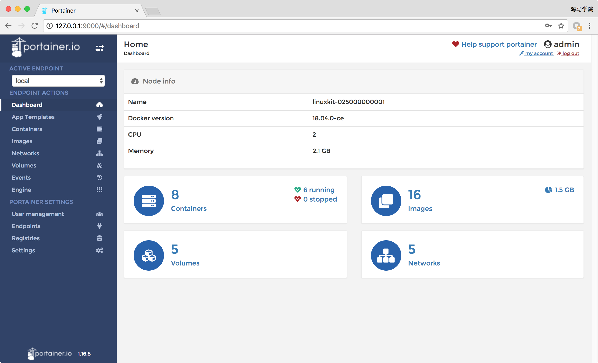
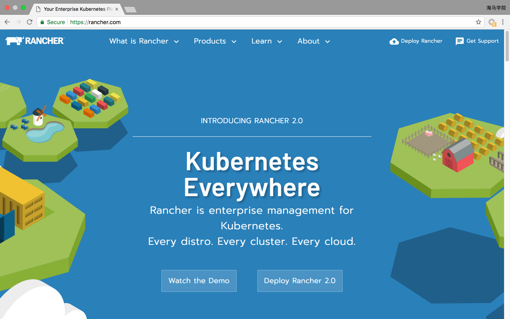
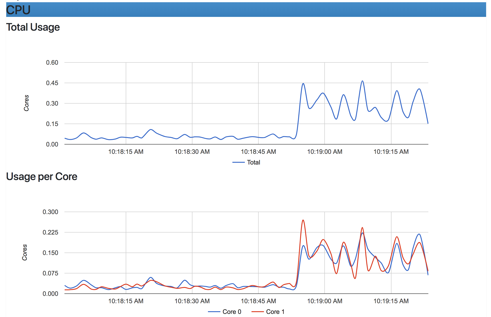

# 11. 图形化管理和监控
下面我们介绍几个可以用图形化的方式来管理`Docker`的工具。

> Shipyard：https://github.com/shipyard/shipyard（已停止维护）

## Portainer
[Portainer](https://portainer.io/)（基于 Go）是一个轻量级的管理界面，可让您轻松管理`Docker`主机或`Swarm`集群。

`Portainer`的使用意图是简单部署。它包含可以在任何 Docker 引擎上运行的单个容器（Docker for Linux 和 Docker for Windows）。

`Portainer`允许您管理 Docker 容器、image、volume、network 等。 它与独立的 Docker 引擎和 Docker Swarm 兼容。

Docker 命令安装：
```shell
$ docker volume create portainer_data
$ docker run -d -p 9000:9000 -v /var/run/docker.sock:/var/run/docker.sock -v portainer_data:/data portainer/portainer
```

Swarm集群部署：
```shell
$ docker volume create portainer_data
$ docker service create \
--name portainer \
--publish 9000:9000 \
--replicas=1 \
--constraint 'node.role == manager' \
--mount type=bind,src=//var/run/docker.sock,dst=/var/run/docker.sock \
--mount type=volume,src=portainer_data,dst=/data \
portainer/portainer \
-H unix:///var/run/docker.sock
```

Docker Compose 部署：
```yaml
version: '2'
services:
  portainer:
    image: portainer/portainer
    command: -H unix:///var/run/docker.sock
    volumes:
      - /var/run/docker.sock:/var/run/docker.sock
      - portainer_data:/data
volumes:
  portainer_data:
```


## Rancher
`Rancher`是一个开源的企业级容器管理平台。通过`Rancher`，企业不必自己使用一系列的开源软件去从头搭建容器服务平台。`Rancher`提供了在生产环境中使用管理`Docker`和`Kubernetes`的全栈化容器部署与管理平台。
​​

在后面学习`kubernetes`的课程的时候会给大家演示，用于我们快速搭建一个可运行`kubernetes`集群环境，非常方便。

## cAdvisor
`cAdvisor`是`Google`开发的容器监控工具，我们来看看 cAdvisor 有什么能耐。

* 监控 Docker Host
cAdvisor 会显示当前 host 的资源使用情况，包括 CPU、内存、网络、文件系统等。

* 监控容器
点击 Docker Containers 链接，显示容器列表。点击某个容器，比如 sysdig，进入该容器的监控页面。

以上就是 cAdvisor 的主要功能，总结起来主要两点：
* 展示 Host 和容器两个层次的监控数据。
* 展示历史变化数据。

由于`cAdvisor`提供的操作界面略显简陋，而且需要在不同页面之间跳转，并且只能监控一个 host，这不免会让人质疑它的实用性。但 cAdvisor 的一个亮点是它可以将监控到的数据导出给第三方工具，由这些工具进一步加工处理。

我们可以把 cAdvisor 定位为一个监控数据收集器，收集和导出数据是它的强项，而非展示数据。
cAdvisor 支持很多第三方工具，其中就包括后面我们重点要学习的`Prometheus`。
```shell
$ docker run \
  --volume=/:/rootfs:ro \
  --volume=/var/run:/var/run:rw \
  --volume=/sys:/sys:ro \
  --volume=/var/lib/docker/:/var/lib/docker:ro \
  --volume=/dev/disk/:/dev/disk:ro \
  --publish=8080:8080 \
  --detach=true \
  --name=cadvisor \
  google/cadvisor:latest
```

通过访问地址：http://127.0.0.1:8080/containers/ 可以查看所有容器信息：

​​
除此之外，cAdvisor 还提供了一个 Rest API：https://github.com/google/cadvisor/blob/master/docs/api.md

cAdvisor 通过该 REST API 暴露监控数据，格式如下：
```
http://<hostname>:<port>/api/<version>/<request>
```
