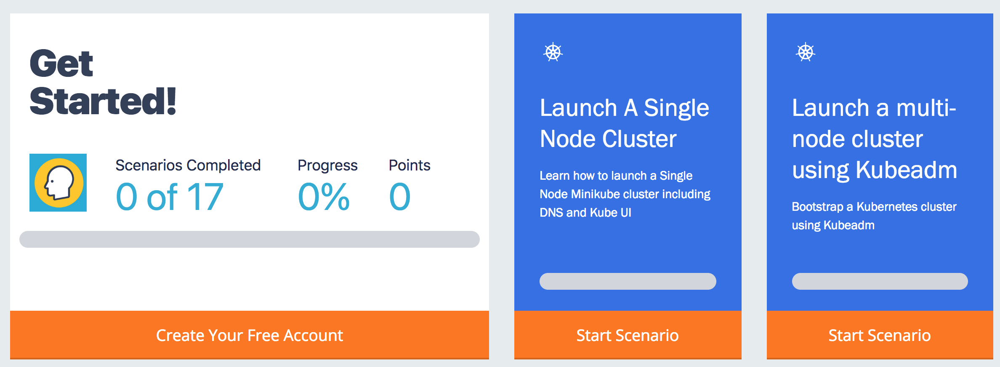
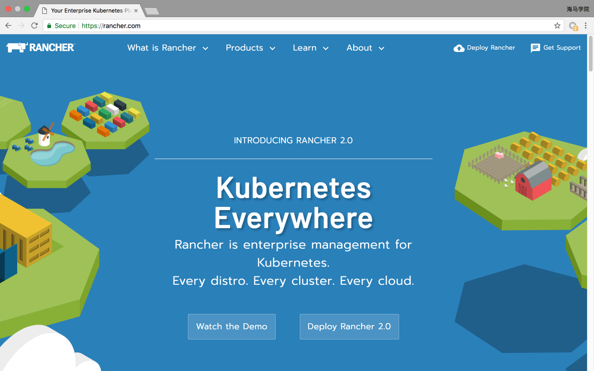
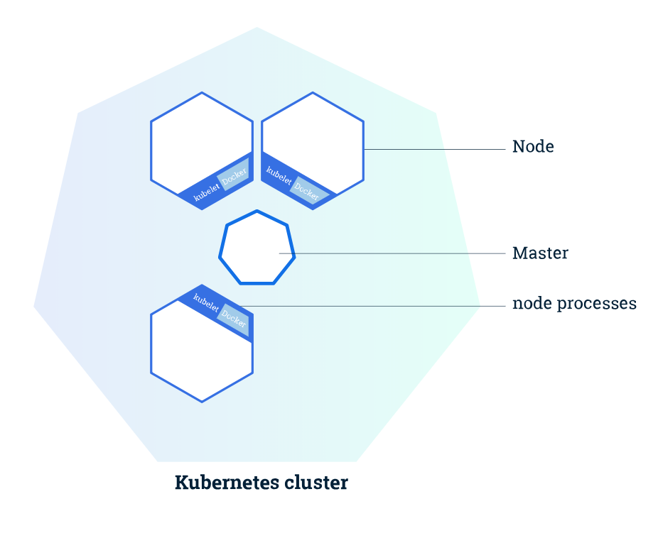
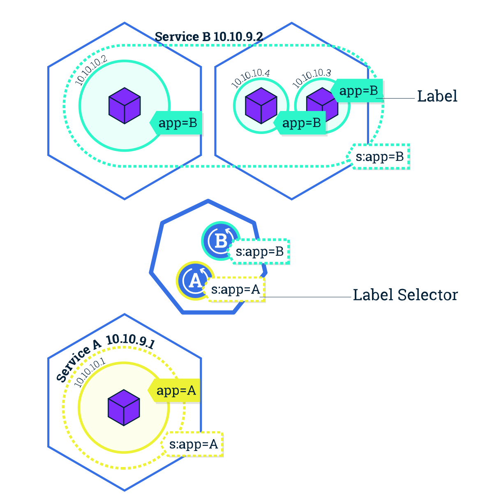

# 14. Kubernetes 初体验
今天开始正式进入 Kubernetes 的课程学习，Kubernetes 我们已经听过很多了，那么什么是Kubernetes呢？

## 简介
Kubernetes 是 Google 团队发起的一个开源项目，它的目标是管理跨多个主机的容器，用于自动部署、扩展和管理容器化的应用程序，主要实现语言为 Go 语言。Kubernetes 的组件和架构还是相对较复杂的，如果我们一上来就给大家讲解这些概念，可能很多同学都消化不了，所以我们先让我们的同学来使用我们的Kubernetes，去感受下，去体验下里面的一些概念和用法，等你对这些基本概念熟悉以后，再来给大家讲解Kubernetes的组件和架构应该就更加容易了。

怎样体验呢？当然最好的办法就是我们自己搭建一套集群了，但是如果完完全全都我们手动去搭建的话，第一是太耗时，第二是太复杂，可能我们现在还没有这个实力，没关系，我们可以使用一些工具来辅助我们。

1.`katacoda`的课程：[katacoda](https://www.katacoda.com/courses/kubernetes)，可以在网站上帮我们启动一个minikube的环境（学习）
​​

2.需要我们自己来搭建的 - [`Rancher`](https://rancher.com/)，我们之前给大家介绍过，如果你网速不好的话安装 Rancher 可能需要花费一点时间，不过这是值得的。（测试）
```shell
$ docker run -d --restart=unless-stopped -p 80:80 -p 443:443 rancher/rancher:v2.0.0 # 查看日志
$ docker logs -f rancher
```


3.Docker for MAC/Windows（推荐）/[minikube](https://github.com/kubernetes/minikube)/（本地）

> Docker for MAC/Windows 和 minikube 安装之前需要安装[kubectl](https://kubernetes.io/docs/tasks/tools/install-kubectl/)工具

4.[kubeadm](https://k8s.qikqiak.com/docs/16.%E7%94%A8%20kubeadm%20%E6%90%AD%E5%BB%BA%E9%9B%86%E7%BE%A4%E7%8E%AF%E5%A2%83.html)（测试）

5.[二进制纯手动搭建](https://blog.qikqiak.com/post/manual-install-high-available-kubernetes-cluster/)（生产）

## 集群
集群是一组节点，这些节点可以是物理服务器或者虚拟机，在他上面安装了Kubernetes环境。
​​

**Master 负责管理集群**, master 协调集群中的所有活动，例如调度应用程序、维护应用程序的所需状态、扩展应用程序和滚动更新。
**节点是 Kubernetes 集群中的工作机器，可以是物理机或虚拟机。**每个工作节点都有一个 kubelet，它是管理节点并与 Kubernetes Master 节点进行通信的代理。节点上还应具有处理容器操作的容器运行时，例如 [Docker](https://www.docker.com/) 或 [rkt](https://coreos.com/rkt/)。一个 Kubernetes 工作集群至少有三个节点。
Master 管理集群，而 节点 用于托管正在运行的应用程序。

当您在 Kubernetes 上部署应用程序时，您可以告诉 master 启动应用程序容器。Master 调度容器在集群的节点上运行。 节点使用 Master 公开的 Kubernetes API 与 Master 通信。用户也可以直接使用 Kubernetes 的 API 与集群交互。

### Pod
Pod 是一组紧密关联的容器集合，它们共享 PID、IPC、Network 和 UTS namespace，是Kubernetes 调度的基本单位。Pod 的设计理念是支持多个容器在一个 Pod 中共享网络和文件系统，可以通过进程间通信和文件共享这种简单高效的方式组合完成服务。

​​
在 Kubernetes 中，所有对象都使用 manifest（yaml或json）来定义，比如一个简单的 nginx 服务可以定义为 nginx.yaml，它包含一个镜像为 nginx 的容器：
```yaml
apiVersion: v1
kind: Pod
metadata:  
  name: nginx  
  labels:    
    app: nginx
spec:  
  containers:  
  - name: nginx    
    image: nginx    
    ports:    
    - containerPort: 80
```

### Label
Label 是识别 Kubernetes 对象的标签，以 key/value 的方式附加到对象上（key最长不能超过63字节，value 可以为空，也可以是不超过253字节的字符串）。
Label 不提供唯一性，并且实际上经常是很多对象（如Pods）都使用相同的 label 来标志具体的应用。
Label 定义好后其他对象可以使用 Label Selector 来选择一组相同 label 的对象（比如Service 用 label 来选择一组 Pod）。Label Selector支持以下几种方式：

* 等式，如app=nginx和env!=production
* 集合，如env in (production, qa)
* 多个label（它们之间是AND关系），如app=nginx,env=test

### Namespace
Namespace 是对一组资源和对象的抽象集合，比如可以用来将系统内部的对象划分为不同的项目组或用户组。常见的 pods, services,deployments 等都是属于某一个 namespace 的（默认是default），而 Node, PersistentVolumes 等则不属于任何 namespace。

### Deployment
是否手动创建 Pod，如果想要创建同一个容器的多份拷贝，需要一个个分别创建出来么，能否将Pods划到逻辑组里？

Deployment 确保任意时间都有指定数量的 Pod“副本”在运行。如果为某个 Pod 创建了Deployment 并且指定3个副本，它会创建3个 Pod，并且持续监控它们。如果某个 Pod 不响应，那么 Deployment 会替换它，保持总数为3.

如果之前不响应的 Pod 恢复了，现在就有4个 Pod 了，那么 Deployment 会将其中一个终止保持总数为3。如果在运行中将副本总数改为5，Deployment 会立刻启动2个新 Pod，保证总数为5。Deployment 还支持回滚和滚动升级。

当创建 Deployment 时，需要指定两个东西：

* Pod模板：用来创建 Pod 副本的模板
* Label标签：Deployment 需要监控的 Pod 的标签。

现在已经创建了 Pod 的一些副本，那么在这些副本上如何均衡负载呢？我们需要的是 Service。

### Service
Service 是应用服务的抽象，通过 labels 为应用提供负载均衡和服务发现。匹配 labels 的Pod IP 和端口列表组成 endpoints，由 kube-proxy 负责将服务 IP 负载均衡到这些endpoints 上。

每个 Service 都会自动分配一个 cluster IP（仅在集群内部可访问的虚拟地址）和 DNS 名，其他容器可以通过该地址或 DNS 来访问服务，而不需要了解后端容器的运行。

