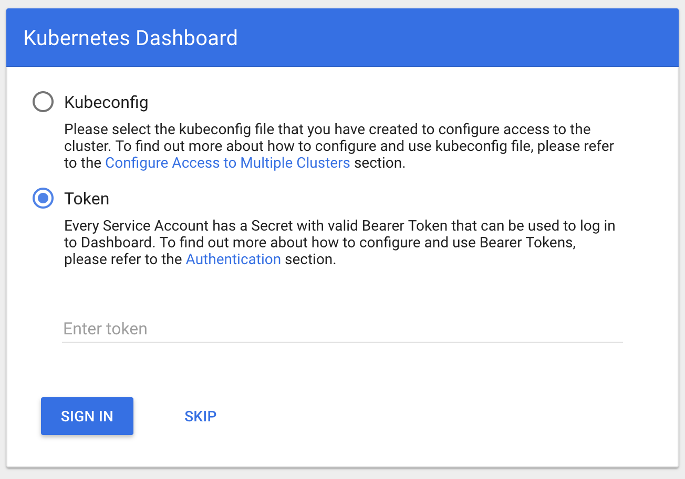
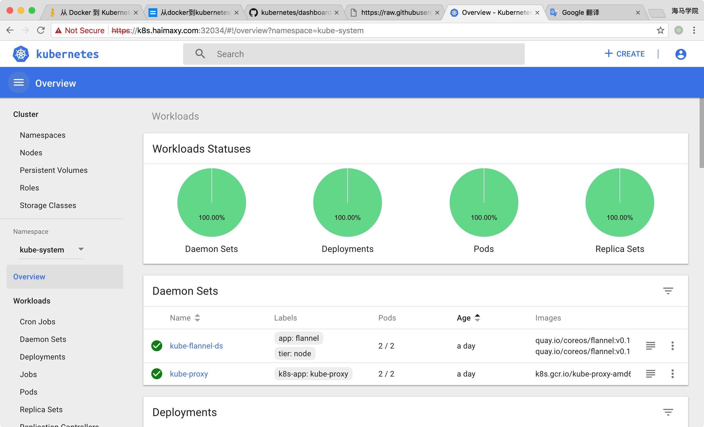

# 17. 安装 Dashboard 插件
Kubernetes Dashboard 是 k8s集群的一个 WEB UI管理工具，代码托管在 github 上，地址：[https://github.com/kubernetes/dashboard](https://github.com/kubernetes/dashboard)

## 安装：
直接使用官方的配置文件安装即可：
```shell
$ wget https://raw.githubusercontent.com/kubernetes/dashboard/master/src/deploy/recommended/kubernetes-dashboard.yaml
```

为了测试方便，我们将`Service`改成`NodePort`类型，然后直接部署新版本的`dashboard`即可。
```shell
$ kubectl create -f kubernetes-dashboard.yaml
```

然后我们可以查看 dashboard 的外网访问端口：
```shell
$ kubectl get svc kubernetes-dashboard -n kube-system
NAME                   TYPE        CLUSTER-IP       EXTERNAL-IP   PORT(S)             AGE
haproxy                ClusterIP   10.254.125.90    <none>        8440/TCP,8442/TCP   2d
kubernetes-dashboard   NodePort    10.254.122.185   <none>        443:31694/TCP       10s
```

然后直接访问集群中的任何一个节点 IP 加上上面的**31694**端口即可打开 dashboard 页面了

> 由于 dashboard 默认是自建的 https 证书，该证书是不受浏览器信任的，所以我们需要强制跳转就可以了。

默认 dashboard 会跳转到登录页面，我们可以看到 dashboard 提供了`Kubeconfig`和`token`两种登录方式，我们可以直接跳过或者使用本地的`Kubeconfig`文件进行登录，可以看到会跳转到如下页面：


这是由于该用户没有对`default`命名空间的访问权限。
​​
## 身份认证
登录 dashboard 的时候支持 Kubeconfig 和token 两种认证方式，Kubeconfig 中也依赖token 字段，所以生成token 这一步是必不可少的。

### 生成token
我们创建一个admin用户并授予admin 角色绑定，使用下面的yaml文件创建admin用户并赋予他管理员权限，然后就可以通过token 登陆dashbaord，这种认证方式本质实际上是通过Service Account 的身份认证加上Bearer token请求 API server 的方式实现，参考 [Kubernetes 中的认证](https://kubernetes.io/docs/admin/authentication/)。
```yaml
kind: ClusterRoleBinding
apiVersion: rbac.authorization.k8s.io/v1beta1
metadata:
  name: admin
  annotations:
    rbac.authorization.kubernetes.io/autoupdate: "true"
roleRef:
  kind: ClusterRole
  name: cluster-admin
  apiGroup: rbac.authorization.k8s.io
subjects:
- kind: ServiceAccount
  name: admin
  namespace: kube-system
  
  ---
  apiVersion: v1
  kind: ServiceAccount
  metadata:
  name: admin
  namespace: kube-system
  labels:
    kubernetes.io/cluster-service: "true"
    addonmanager.kubernetes.io/mode: Reconcile
```

上面的`admin`用户创建完成后我们就可以获取到该用户对应的`token`了，如下命令：
```shell
$ kubectl get secret -n kube-system|grep admin-token
admin-token-d5jsg                  kubernetes.io/service-account-token   3         1d
$ kubectl get secret admin-token-d5jsg -o jsonpath={.data.token} -n kube-system |base64 -d# 会生成一串很长的base64后的字符串
```

然后在 dashboard 登录页面上直接使用上面得到的 token 字符串即可登录，这样就可以拥有管理员权限操作整个 kubernetes 集群的对象，当然你也可以为你的登录用户新建一个指定操作权限的用户。​​

