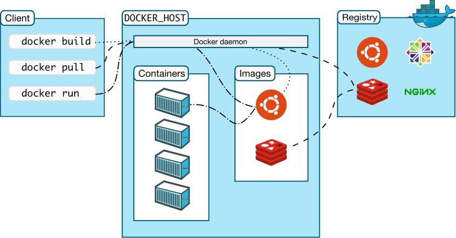

# 2. Docker 简介

## 什么是 Docker？
`Docker`的英文翻译是“搬运工”的意思，他搬运的东西就是我们常说的集装箱`Container`，Container 里面装的是任意类型的 App，我们的开发人员可以通过 Docker 将App 变成一种标准化的、可移植的、自管理的组件，我们可以在任何主流的操作系统中开发、调试和运行。

从概念上来看 Docker 和我们传统的虚拟机比较类似，只是更加轻量级，更加方便使，Docker 和虚拟机最主要的区别有一下几点：

* 虚拟化技术依赖的是物理CPU和内存，是硬件级别的；而我们的 Docker 是构建在操作系统层面的，利用操作系统的容器化技术，所以 Docker 同样的可以运行在虚拟机上面。
* 我们知道虚拟机中的系统就是我们常说的操作系统镜像，比较复杂；而 Docker 比较轻量级，我们的可以用 Docker 部署一个独立的 Redis，就类似于在虚拟机当中安装一个 Redis 应用，但是我们用 Docker 部署的应用是完全隔离的。
* 我们都知道传统的虚拟化技术是通过快照来保存状态的；而 Docker 引入了类似于源码管理的机制，将容器的快照历史版本一一记录下来，切换成本非常之低。
* 传统虚拟化技术在构建系统的时候非常复杂；而 Docker 可以通过一个简单的 Dockerfile 文件来构建整个容器，更重要的是 Dockerfile 可以手动编写，这样应用程序开发人员可以通过发布 Dockerfile 来定义应用的环境和依赖，这样对于持续交付非常有利。

​​​​
 
## 为啥要用容器?
应用容器是个啥样子呢，一个做好的应用容器长得就像一个装好了一组特定应用的虚拟机一样，比如我现在想用 Redis，那我就找个装好了 Redis 的容器就可以了，然后运行起来，我就能直接使用了。
 
那为什么不能直接安装一个 Redis 呢？肯定是可行的，但是有的时候根据每个人电脑的不同，在安装的时候可能会报出各种各样的错误，万一你的机器中毒了，你的电脑挂了，你所有的服务都需要重新安装。但是有了 Docker 或者说有了容器就不一样了，你就相当于有了一个可以运行起来的虚拟机，只要你能运行容器，Redis 的配置就省了。而且如果你想换个电脑，没问题，很简单，直接把容器”端过来”就可以使用容器里面的服务了。

## Docker Engine
`Docker Engine`是一个**C/S**架构的应用程序，主要包含下面几个组件：

* 常驻后台进程`Dockerd`
* 一个用来和 Dockerd 交互的 REST API Server
* 命令行`CLI`接口，通过和 REST API 进行交互（我们经常使用的 docker 命令）


​​

## Docker 架构
Docker 使用 C/S （客户端/服务器）体系的架构，Docker 客户端与 Docker 守护进程通信，Docker 守护进程负责构建，运行和分发 Docker 容器。Docker 客户端和守护进程可以在同一个系统上运行，也可以将 Docker 客户端连接到远程 Docker 守护进程。Docker 客户端和守护进程使用 REST API 通过`UNIX`套接字或网络接口进行通信。

​​
* Docker Damon：dockerd，用来监听 Docker API 的请求和管理 Docker 对象，比如镜像、容器、网络和 Volume。
* Docker Client：docker，docker client 是我们和 Docker 进行交互的最主要的方式方法，比如我们可以通过 docker run 命令来运行一个容器，然后我们的这个 client 会把命令发送给上面的 Dockerd，让他来做真正事情。
* Docker Registry：用来存储 Docker 镜像的仓库，Docker Hub 是 Docker 官方提供的一个公共仓库，而且 Docker 默认也是从 Docker Hub 上查找镜像的，当然你也可以很方便的运行一个私有仓库，当我们使用 docker pull 或者 docker run 命令时，就会从我们配置的 Docker 镜像仓库中去拉取镜像，使用 docker push 命令时，会将我们构建的镜像推送到对应的镜像仓库中。
* Images：镜像，镜像是一个只读模板，带有创建 Docker 容器的说明，一般来说的，镜像会基于另外的一些基础镜像并加上一些额外的自定义功能。比如，你可以构建一个基于 Centos 的镜像，然后在这个基础镜像上面安装一个 Nginx 服务器，这样就可以构成一个属于我们自己的镜像了。
* Containers：容器，容器是一个镜像的可运行的实例，可以使用 Docker REST API 或者 CLI 来操作容器，容器的实质是进程，但与直接在宿主执行的进程不同，容器进程运行于属于自己的独立的[命名空间](https://en.wikipedia.org/wiki/Linux_namespaces)。因此容器可以拥有自己的 **root 文件系统、自己的网络配置、自己的进程空间，甚至自己的用户 ID 空间**。容器内的进程是运行在一个隔离的环境里，使用起来，就好像是在一个独立于宿主的系统下操作一样。这种特性使得容器封装的应用比直接在宿主运行更加安全。
* 底层技术支持：Namespaces（做隔离）、CGroups（做资源限制）、UnionFS（镜像和容器的分层） the-underlying-technology  Docker 底层架构分析


## 安装
直接前往[官方文档](https://docs.docker.com/install/)选择合适的平台安装即可，比如我们这里想要在`centos`系统上安装 Docker，这前往地址[https://docs.docker.com/install/linux/docker-ce/centos/](https://docs.docker.com/install/linux/docker-ce/centos/)根据提示安装即可。

安装依赖软件包：
```shell
$ sudo yum install -y yum-utils device-mapper-persistent-data lvm2
```

添加软件仓库，我们这里使用稳定版 Docker，执行下面命令添加 yum 仓库地址：
```shell
$ sudo yum-config-manager \
    --add-repo \
    https://download.docker.com/linux/centos/docker-ce.repo
```

然后直接安装即可：
```shell
$ sudo yum install docker-ce
```

如果要安装指定的版本，可以使用 yum list 列出可用的版本：
```shell
$ yum list docker-ce --showduplicates | sort -r
docker-ce.x86_64            18.03.0.ce-1.el7.centos             docker-ce-stable
```

比如这里可以安装**18.03.0.ce**版本：
```shell
$ sudo yum install docker-ce-18.03.0.ce
```

要启动 Docker 也非常简单：
```shell
$ sudo systemctl enable docker
$ sudo systemctl start docker
```

另外一种安装方式是可以直接下载指定的软件包直接安装即可，前往地址：[https://download.docker.com/linux/centos/7/x86_64/stable/Packages/](https://download.docker.com/linux/centos/7/x86_64/stable/Packages/) 找到合适的`.rpm`包下载，然后安装即可：
```shell
$ sudo yum install /path/to/package.rpm
```