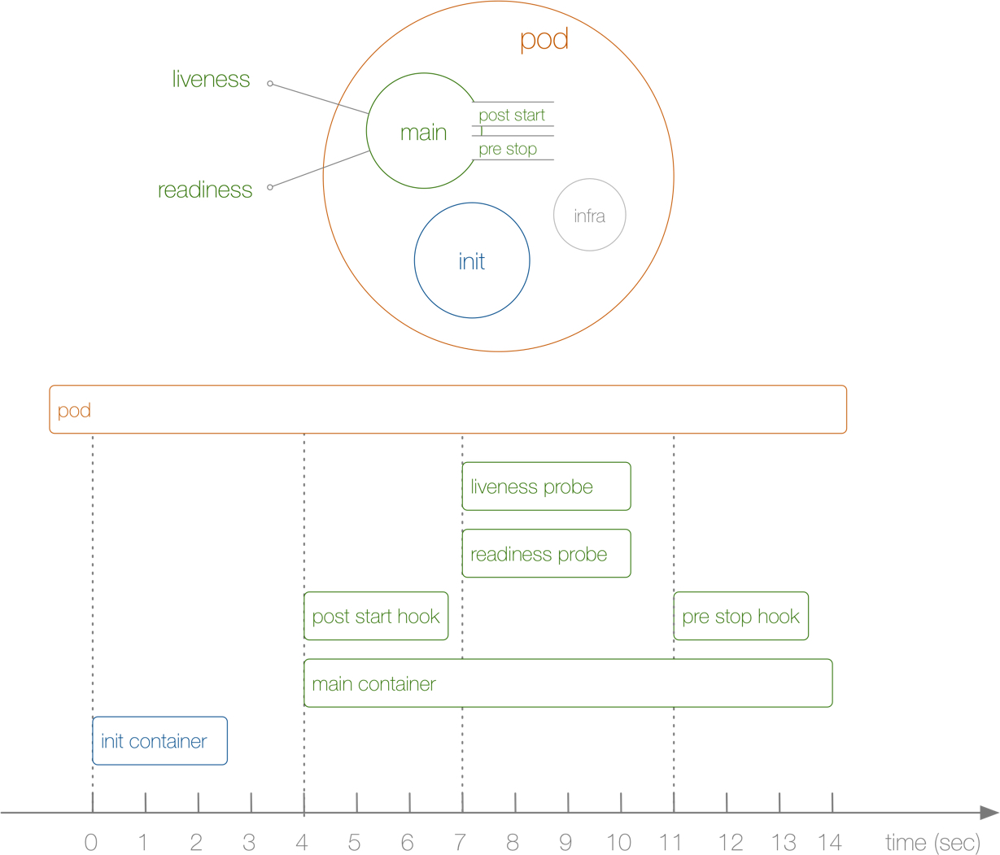

## 22. 初始化容器

上节课我们学习了容器的健康检查的两个探针：`liveness probe`（存活探针）和`readiness probe`（可读性探针）的使用方法，我们说在这两个探针是可以影响容器的生命周期的，包括我们之前提到的容器的两个钩子函数`PostStart`和`PreStop`。我们今天要给大家介绍的是`Init Container`（初始化容器）。

`Init Container`就是用来做初始化工作的容器，可以是一个或者多个，如果有多个的话，这些容器会按定义的顺序依次执行，只有所有的`Init Container`执行完后，主容器才会被启动。我们知道一个`Pod`里面的所有容器是共享数据卷和网络命名空间的，所以`Init Container`里面产生的数据可以被主容器使用到的。

是不是感觉`Init Container`和之前的钩子函数有点类似啊，只是是在容器执行前来做一些工作，是吧？从直观的角度看上去的话，初始化容器的确有点像`PreStart`，但是钩子函数和我们的`Init Container`是处在不同的阶段的，我们可以通过下面的图来了解下：


从上面这张图我们可以直观的看到`PostStart`和`PreStop`包括`liveness`和`readiness`是属于主容器的生命周期范围内的，而`Init Container`是独立于主容器之外的，当然他们都属于`Pod`的生命周期范畴之内的，现在我们应该明白`Init Container`和钩子函数之类的区别了吧。

另外我们可以看到上面我们的`Pod`右边还有一个`infra`的容器，这是一个什么容器呢？我们可以在集群环境中去查看下人任意一个`Pod`对应的运行的`Docker`容器，我们可以发现每一个`Pod`下面都包含了一个`pause-amd64`的镜像，这个就是我们的`infra`镜像，我们知道`Pod`下面的所有容器是共享同一个网络命名空间的，这个镜像就是来做这个事情的，所以每一个`Pod`当中都会包含一个这个镜像。

> 很多同学最开始 Pod 启动不起来就是因为这个 infra 镜像没有被拉下来，因为默认该镜像是需要到谷歌服务器上拉取的，所以需要提前拉取到节点上面。

我们说`Init Container`主要是来做初始化容器工作的，那么他有哪些应用场景呢？

* 等待其他模块Ready：这个可以用来解决服务之间的依赖问题，比如我们有一个 Web 服务，该服务又依赖于另外一个数据库服务，但是在我们启动这个 Web 服务的时候我们并不能保证依赖的这个数据库服务就已经启动起来了，所以可能会出现一段时间内 Web 服务连接数据库异常。要解决这个问题的话我们就可以在 Web 服务的 Pod 中使用一个 InitContainer，在这个初始化容器中去检查数据库是否已经准备好了，准备好了过后初始化容器就结束退出，然后我们的主容器 Web 服务被启动起来，这个时候去连接数据库就不会有问题了。
* 做初始化配置：比如集群里检测所有已经存在的成员节点，为主容器准备好集群的配置信息，这样主容器起来后就能用这个配置信息加入集群。
* 其它场景：如将 pod 注册到一个中央数据库、配置中心等。


我们先来给大家演示下服务依赖的场景下初始化容器的使用方法，如下`Pod`的定义方法
```yaml
apiVersion: v1
kind: Pod
metadata:
  name: init-pod1
  labels:
    app: init
spec:
  containers:
  - name: init-container
    image: busybox
    command: ['sh', '-c', 'echo The app is running! && sleep 3600']
  initContainers:
  - name: init-myservice
    image: busybox
    command: ['sh', '-c', 'until nslookup myservice; do echo waiting for myservice; sleep 2; done;']
  - name: init-mydb
    image: busybox
    command: ['sh', '-c', 'until nslookup mydb; do echo waiting for mydb; sleep 2; done;']
```

`Service`的对应`YAML`内容：
```yaml
kind: Service
apiVersion: v1
metadata:
  name: myservice
spec:
  ports:
  - protocol: TCP
    port: 80
    targetPort: 6376
---
kind: Service
apiVersion: v1
metadata:
  name: mydb
spec:
  ports:
  - protocol: TCP
    port: 80
    targetPort: 6377
```

我们可以先创建上面的`Pod`，然后查看下`Pod`的状态，然后再创建下面的`Service`，对比下前后状态。

我们在`Pod`启动过程中，初始化容器会按顺序在网络和数据卷初始化之后启动。每个容器必须在下一个容器启动之前成功退出。如果由于运行时或失败退出，导致容器启动失败，它会根据`Pod`的`restartPolicy`指定的策略进行重试。 然而，如果 Pod 的 restartPolicy 设置为 Always，Init 容器失败时会使用 RestartPolicy 策略。

在所有的初始化容器没有成功之前，`Pod`将不会变成 `Ready`状态。正在初始化中的`Pod`处于`Pending`状态，但应该会将条件`Initializing`设置为 true。


接下来我们再来尝试创建一个做初始化配置工作的`Pod`：
```yaml
apiVersion: v1
kind: Pod
metadata:
  name: init-demo
spec:
  containers:
  - name: nginx
    image: nginx
    ports:
    - containerPort: 80
    volumeMounts:
    - name: workdir
      mountPath: /usr/share/nginx/html
  initContainers:
  - name: install
    image: busybox
    command:
    - wget
    - "-O"
    - "/work-dir/index.html"
    - http://www.baidu.com
    volumeMounts:
    - name: workdir
      mountPath: "/work-dir"
  volumes:
  - name: workdir
    emptyDir: {}
```

我们可以看到这里又出现了`volumes`，`spec.volumes`指的是`Pod`中的卷，`spec.containers.volumeMounts`，是将指定的卷 mount 到容器指定的位置，相当于docker里面的`-v 宿主机目录：容器目录`，我们前面用到过`hostPath`，我们这里使用的是`emptyDir{}`，这个就相当于一个共享卷，是一个临时的目录，生命周期等同于`Pod`的生命周期。

初始化容器执行完，会下载一个 html 文件映射到emptyDir{}，而主容器也是和 spec.volumes 里的emptyDir{} 进行映射，所以`nginx容器的`/usr/share/nginx/html`目录下会映射 index.html 文件。


我们来创建下该`Pod`，然后验证nginx容器是否运行:
```shell
$ kubectl get pod init-demo
```
输出显示了nginx容器正在运行：
```shell
NAME      READY     STATUS    RESTARTS   AGE
nginx     1/1       Running   0          43m
```
在 init-demo 容器里的 nginx 容器打开一个 shell：
```shell
$ kubectl exec -it init-demo -- /bin/bash
```
在Shell里，直接查看下 index.html 的内容：

```shell
root@nginx:~# cat /usr/share/nginx/html/index.html
```

如果我们看到有**百度**相关的信息那么证明我们上面的初始化的工作就完成了。

这就是我们初始化容器的使用方法，到这里我们就把`Pod`的整个生命周期当中的几个主要阶段讲完了，第一个是容器的两个钩子函数：`PostStart`和`PreStop`，还有就是容器健康检查的两个探针：`liveness probe`和`readiness probe`，以及这节课的`Init Container`。下节课开始我们来讲解一些常用的控制器和`Pod`的结合。
```