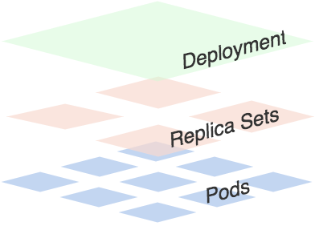

## Deployment的使用

前面的课程中我们学习了`Replication Controller`和`Replica Set`两种资源对象，`RC`和`RS`的功能基本上是差不多的，唯一的区别就是`RS`支持集合的`selector`。我们也学习到了用`RC`/`RS`来控制`Pod`副本的数量，也实现了滚动升级`Pod`的功能。现在看上去似乎一切都比较完美的运行着，但是我们上节课最后也提到了现在我们推荐使用`Deployment`这种控制器了，而不是我们之前的`RC`或者`RS`，这是为什么呢？

没有对比就没有伤害对吧，我们来对比下二者之间的功能吧，首先`RC`是`Kubernetes`的一个核心概念，当我们把应用部署到集群之后，需要保证应用能够持续稳定的运行，`RC`就是这个保证的关键，主要功能如下：

* 确保`Pod`数量：它会确保`Kubernetes`中有指定数量的`Pod`在运行，如果少于指定数量的`Pod`，`RC`就会创建新的，反之这会删除多余的，保证`Pod`的副本数量不变。
* 确保`Pod`健康：当`Pod`不健康，比如运行出错了，总之无法提供正常服务时，`RC`也会杀死不健康的`Pod`，重新创建新的。
* 弹性伸缩：在业务高峰或者低峰的时候，可以用过`RC`来动态的调整`Pod`数量来提供资源的利用率，当然我们也提到过如果使用`HPA`这种资源对象的话可以做到自动伸缩。
* 滚动升级：滚动升级是一种平滑的升级方式，通过逐步替换的策略，保证整体系统的稳定性，这个我们上节课已经给大家演示过了。

`Deployment`同样也是`Kubernetes`系统的一个核心概念，主要职责和`RC`一样的都是保证`Pod`的数量和健康，二者大部分功能都是完全一致的，我们可以看成是一个升级版的`RC`控制器，那`Deployment`又具备那些新特性呢？

* `RC`的全部功能：`Deployment`具备上面描述的`RC`的全部功能
* 事件和状态查看：可以查看`Deployment`的升级详细进度和状态
* 回滚：当升级`Pod`的时候如果出现问题，可以使用回滚操作回滚到之前的任一版本
* 版本记录：每一次对`Deployment`的操作，都能够保存下来，这也是保证可以回滚到任一版本的基础
* 暂停和启动：对于每一次升级都能够随时暂停和启动

作为对比，我们知道`Deployment`作为新一代的`RC`，不仅在功能上更为丰富了，同时我们也说过现在官方也都是推荐使用`Deployment`来管理`Pod`的，比如一些官方组件`kube-dns`、`kube-proxy`也都是使用的`Deployment`来管理的，所以当大家在使用的使用也最好使用`Deployment`来管理`Pod`。


### 创建

可以看出一个Deployment拥有多个Replica Set，而一个Replica Set拥有一个或多个Pod。一个Deployment控制多个rs主要是为了支持回滚机制，每当Deployment操作时，Kubernetes会重新生成一个Replica Set并保留，以后有需要的话就可以回滚至之前的状态。
下面创建一个Deployment，它创建了一个Replica Set来启动3个nginx pod，yaml文件如下：
```yaml
apiVersion: apps/v1beta1
kind: Deployment
metadata:
  name: nginx-deploy
  labels:
    k8s-app: nginx-demo
spec:
  replicas: 3
  template:
    metadata:
      labels:
        app: nginx
    spec:
      containers:
      - name: nginx
        image: nginx:1.7.9
        ports:
        - containerPort: 80
```
将上面内容保存为: nginx-deployment.yaml，执行命令:
```shell
$ kubectl create -f nginx-deployment.yaml
deployment "nginx-deploy" created
```

然后执行一下命令查看刚刚创建的Deployment:
```shell
$ kubectl get deployments
NAME           DESIRED   CURRENT   UP-TO-DATE   AVAILABLE   AGE
nginx-deploy   3         0         0            0           1s
```
隔一会再次执行上面命令：
```shell
$ kubectl get deployments
NAME           DESIRED   CURRENT   UP-TO-DATE   AVAILABLE   AGE
nginx-deploy   3         3         3            3           4m
```
我们可以看到Deployment已经创建了1个Replica Set了，执行下面的命令查看rs和pod:
```shell
$ kubectl get rs
NAME                     DESIRED   CURRENT   READY     AGE
nginx-deploy-431080787   3         3         3         6m
```
```shell
$ kubectl get pod --show-labels
NAME                           READY     STATUS    RESTARTS   AGE       LABELS
nginx-deploy-431080787-53z8q   1/1       Running   0          7m        app=nginx,pod-template-hash=431080787
nginx-deploy-431080787-bhhq0   1/1       Running   0          7m        app=nginx,pod-template-hash=431080787
nginx-deploy-431080787-sr44p   1/1       Running   0          7m        app=nginx,pod-template-hash=431080787
```
上面的Deployment的yaml文件中的`replicas:3`将会保证我们始终有3个POD在运行。

由于`Deployment`和`RC`的功能大部分都一样的，我们上节课已经和大家演示了大部分功能了，我们这里重点给大家演示下`Deployment`的滚动升级和回滚功能。

### 滚动升级

现在我们将刚刚保存的yaml文件中的nginx镜像修改为`nginx:1.13.3`，然后在spec下面添加滚动升级策略：
```yaml
minReadySeconds: 5
strategy:
  # indicate which strategy we want for rolling update
  type: RollingUpdate
  rollingUpdate:
    maxSurge: 1
    maxUnavailable: 1
```

* minReadySeconds:
  * Kubernetes在等待设置的时间后才进行升级
  * 如果没有设置该值，Kubernetes会假设该容器启动起来后就提供服务了
  * 如果没有设置该值，在某些极端情况下可能会造成服务服务正常运行
* maxSurge:
  * 升级过程中最多可以比原先设置多出的POD数量
  * 例如：maxSurage=1，replicas=5,则表示Kubernetes会先启动1一个新的Pod后才删掉一个旧的POD，整个升级过程中最多会有5+1个POD。
* maxUnavaible:
  * 升级过程中最多有多少个POD处于无法提供服务的状态
  * 当`maxSurge`不为0时，该值也不能为0
  * 例如：maxUnavaible=1，则表示Kubernetes整个升级过程中最多会有1个POD处于无法服务的状态。


 然后执行命令：
```shell
$ kubectl apply -f nginx-deployment.yaml
deployment "nginx-deploy" configured
```

然后我们可以使用`rollout`命令：

* 查看状态：
```shell
$ kubectl rollout status deployment/nginx-deploy
Waiting for rollout to finish: 1 out of 3 new replicas have been updated..
deployment "nginx-deploy" successfully rolled out
```

* 暂停升级
```shell
$ kubectl rollout pause deployment <deployment>
```

* 继续升级
```shell
$ kubectl rollout resume deployment <deployment>
```

升级结束后，继续查看rs的状态：
```shell
$ kubectl get rs
NAME                      DESIRED   CURRENT   READY     AGE
nginx-deploy-2078889897   0         0         0         47m
nginx-deploy-3297445372   3         3         3         42m
nginx-deploy-431080787    0         0         0         1h
```
根据AGE我们可以看到离我们最近的当前状态是：3，和我们的yaml文件是一致的，证明升级成功了。用`describe`命令可以查看升级的全部信息：
```shell
Name:     nginx-deploy
Namespace:    default
CreationTimestamp:  Wed, 18 Oct 2017 16:58:52 +0800
Labels:     k8s-app=nginx-demo
Annotations:    deployment.kubernetes.io/revision=3
      kubectl.kubernetes.io/last-applied-configuration={"apiVersion":"apps/v1beta1","kind":"Deployment","metadata":{"annotations":{},"labels":{"k8s-app":"nginx-demo"},"name":"nginx-deploy","namespace":"defa...
Selector:   app=nginx
Replicas:   3 desired | 3 updated | 3 total | 3 available | 0 unavailable
StrategyType:   RollingUpdate
MinReadySeconds:  0
RollingUpdateStrategy:  25% max unavailable, 25% max surge
Pod Template:
  Labels: app=nginx
  Containers:
   nginx:
    Image:    nginx:1.13.3
    Port:   80/TCP
    Environment:  <none>
    Mounts:   <none>
  Volumes:    <none>
Conditions:
  Type    Status  Reason
  ----    ------  ------
  Progressing   True  NewReplicaSetAvailable
  Available   True  MinimumReplicasAvailable
OldReplicaSets: <none>
NewReplicaSet:  nginx-deploy-3297445372 (3/3 replicas created)
Events:
  FirstSeen LastSeen  Count From      SubObjectPath Type    Reason      Message
  --------- --------  ----- ----      ------------- --------  ------      -------
  50m   50m   1 deployment-controller     Normal    ScalingReplicaSet Scaled up replica set nginx-deploy-2078889897 to 1
  45m   45m   1 deployment-controller     Normal    ScalingReplicaSet Scaled down replica set nginx-deploy-2078889897 to 0
  45m   45m   1 deployment-controller     Normal    ScalingReplicaSet Scaled up replica set nginx-deploy-3297445372 to 1
  39m   39m   1 deployment-controller     Normal    ScalingReplicaSet Scaled down replica set nginx-deploy-431080787 to 2
  39m   39m   1 deployment-controller     Normal    ScalingReplicaSet Scaled up replica set nginx-deploy-3297445372 to 2
  38m   38m   1 deployment-controller     Normal    ScalingReplicaSet Scaled down replica set nginx-deploy-431080787 to 1
  38m   38m   1 deployment-controller     Normal    ScalingReplicaSet Scaled up replica set nginx-deploy-3297445372 to 3
  38m   38m   1 deployment-controller     Normal    ScalingReplicaSet Scaled down replica set nginx-deploy-431080787 to 0
```

### 回滚Deployment
我们已经能够滚动平滑的升级我们的Deployment了，但是如果升级后的POD出了问题该怎么办？我们能够想到的最好最快的方式当然是回退到上一次能够提供正常工作的版本，Deployment就为我们提供了回滚机制。

首先，查看Deployment的升级历史：
```shell
$ kubectl rollout history deployment nginx-deploy
deployments "nginx-deploy"
REVISION  CHANGE-CAUSE
1   <none>
2   <none>
3   kubectl apply --filename=Desktop/nginx-deployment.yaml --record=true
```

从上面的结果可以看出在执行`Deployment`升级的时候最好带上`record`参数，便于我们查看历史版本信息。

默认情况下，所有通过`kubectl xxxx --record`都会被`kubernetes`记录到`etcd`进行持久化，这无疑会占用资源，最重要的是，时间久了，当你`kubectl get rs`时，会有成百上千的垃圾`RS`返回给你，那时你可能就眼花缭乱了。

上生产时，我们最好通过设置Deployment的`.spec.revisionHistoryLimit`来限制最大保留的`revision number`，比如15个版本，回滚的时候一般只会回滚到最近的几个版本就足够了。其实`rollout history`中记录的`revision`都和`ReplicaSets`一一对应。如果手动`delete`某个ReplicaSet，对应的`rollout history`就会被删除，也就是还说你无法回滚到这个`revison`了。

`roolout history`和`ReplicaSet`的对应关系，可以在`kubectl describe rs $RSNAME`返回的`revision`字段中得到，这里的`revision`就对应着`roolout history`返回的`revison`。


同样我们可以使用下面的命令查看单个`revison`的信息：

```shell
$ kubectl rollout history deployment nginx-deploy --revision=3
deployments "nginx-deploy" with revision #3
Pod Template:
  Labels: app=nginx
  pod-template-hash=3297445372
  Annotations:  kubernetes.io/change-cause=kubectl apply --filename=nginx-deployment.yaml --record=true
  Containers:
   nginx:
    Image:  nginx:1.13.3
    Port: 80/TCP
    Environment:  <none>
    Mounts: <none>
  Volumes:  <none>
```

假如现在要直接回退到当前版本的前一个版本：
```shell
$ kubectl rollout undo deployment nginx-deploy
deployment "nginx-deploy" rolled back
```

当然也可以用`revision`回退到指定的版本：
```shell
$ kubectl rollout undo deployment nginx-deploy --to-revision=2
deployment "nginx-deploy" rolled back
```

现在可以用命令查看Deployment现在的状态了。