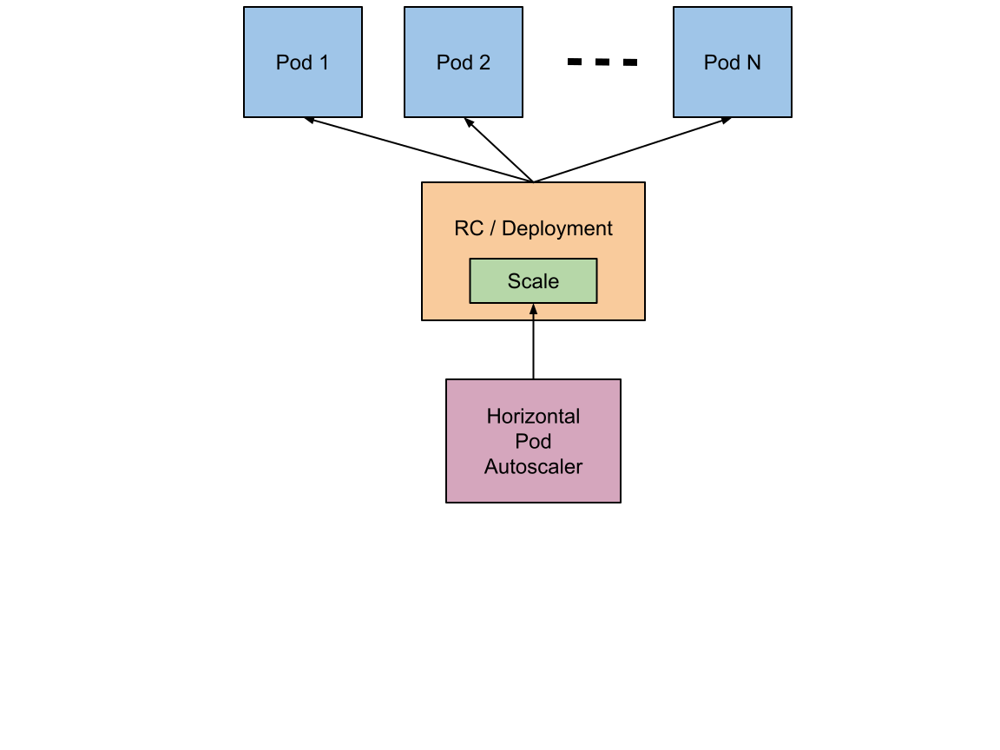

# Pod 自动扩缩容
在前面的课程中，我们提到过通过手工执行`kubectl scale`命令和在`Dashboard`上操作可以实现`Pod`的扩缩容，但是这样毕竟需要每次去手工操作一次，而且指不定什么时候业务请求量就很大了，所以如果不能做到自动化的去扩缩容的话，这也是一个很麻烦的事情。如果`Kubernetes`系统能够根据`Pod`当前的负载的变化情况来自动的进行扩缩容就好了，因为这个过程本来就是不固定的，频繁发生的，所以纯手工的方式不是很现实。

幸运的是`Kubernetes`为我们提供了这样一个资源对象：`Horizontal Pod Autoscaling`（Pod水平自动伸缩），简称`HPA`。`HAP`通过监控分析`RC`或者`Deployment`控制的所有`Pod`的负载变化情况来确定是否需要调整`Pod`的副本数量，这是`HPA`最基本的原理。



`HPA`在`kubernetes`集群中被设计成一个`controller`，我们可以简单的通过`kubectl autoscale`命令来创建一个`HPA`资源对象，`HPA Controller`默认30s轮询一次（可通过`kube-controller-manager`的标志`--horizontal-pod-autoscaler-sync-period`进行设置），查询指定的资源（RC或者Deployment）中`Pod`的资源使用率，并且与创建时设定的值和指标做对比，从而实现自动伸缩的功能。

当你创建了`HPA`后，`HPA`会从`Heapster`或者用户自定义的`RESTClient`端获取每一个一个`Pod`利用率或原始值的平均值，然后和`HPA`中定义的指标进行对比，同时计算出需要伸缩的具体值并进行相应的操作。目前，`HPA`可以从两个地方获取数据：

* Heapster：仅支持`CPU`使用率
* 自定义监控：我们到后面的监控的课程中再给大家讲解这部分的使用方法


我们这节课来给大家介绍从`Heapster`获取监控数据来进行自动扩缩容的方法，所以首先我们得安装`Heapster`，前面我们在`kubeadm`搭建集群的课程中，实际上我们已经默认把`Heapster`相关的镜像都已经拉取到节点上了，所以接下来我们只需要部署即可，我们这里使用的是`Heapster` 1.4.2 版本的，前往`Heapster`的`github`页面：

[https://github.com/kubernetes/heapster](https://github.com/kubernetes/heapster/tree/v1.4.2/deploy/kube-config/influxdb)

我们将该目录下面的`yaml`文件保存到我们的集群上，然后使用`kubectl`命令行工具创建即可，另外创建完成后，如果需要在`Dashboard`当中看到监控图表，我们还需要在`Dashboard`中配置上我们的`heapster-host`。


同样的，我们来创建一个`Deployment`管理的`Nginx` Pod，然后利用`HPA`来进行自动扩缩容。定义`Deployment`的`YAML`文件如下：（hap-deploy-demo.yaml）
```yaml
---
apiVersion: apps/v1beta1
kind: Deployment
metadata:
  name: hpa-nginx-deploy
  labels:
    app: nginx-demo
spec:
  revisionHistoryLimit: 15
  template:
    metadata:
      labels:
        app: nginx
    spec:
      containers:
      - name: nginx
        image: nginx
        ports:
        - containerPort: 80
```

然后创建`Deployment`：
```shell
$ kubectl create -f hpa-deploy-demo.yaml
```

现在我们来创建一个`HPA`，可以使用`kubectl autoscale`命令来创建：
```shell
$ kubectl autoscale deployment hpa-nginx-deploy --cpu-percent=10 --min=1 --max=10
deployment "hpa-nginx-deploy" autoscaled
···
$ kubectl get hpa                                                         
NAME        REFERENCE              TARGET    CURRENT   MINPODS   MAXPODS   AGE
hpa-nginx-deploy   Deployment/hpa-nginx-deploy   10%       0%        1         10        13s
```
此命令创建了一个关联资源 hpa-nginx-deploy 的`HPA`，最小的 pod 副本数为1，最大为10。`HPA`会根据设定的 cpu使用率（10%）动态的增加或者减少pod数量。

当然出来使用`kubectl autoscale`命令来创建外，我们依然可以通过创建`YAML`文件的形式来创建`HPA`资源对象。如果我们不知道怎么编写的话，可以查看上面命令行创建的`HPA`的`YAML`文件：
```shell
$ kubectl get hpa hpa-nginx-deploy -o yaml
apiVersion: autoscaling/v1
kind: HorizontalPodAutoscaler
metadata:
  creationTimestamp: 2017-06-29T08:04:08Z
  name: nginxtest
  namespace: default
  resourceVersion: "951016361"
  selfLink: /apis/autoscaling/v1/namespaces/default/horizontalpodautoscalers/nginxtest
  uid: 86febb63-5ca1-11e7-aaef-5254004e79a3
spec:
  maxReplicas: 5 //资源最大副本数
  minReplicas: 1 //资源最小副本数
  scaleTargetRef:
    apiVersion: extensions/v1beta1
    kind: Deployment //需要伸缩的资源类型
    name: nginxtest  //需要伸缩的资源名称
  targetCPUUtilizationPercentage: 50 //触发伸缩的cpu使用率
status:
  currentCPUUtilizationPercentage: 48 //当前资源下pod的cpu使用率
  currentReplicas: 1 //当前的副本数
  desiredReplicas: 2 //期望的副本数
  lastScaleTime: 2017-07-03T06:32:19Z
```
好，现在我们根据上面的`YAML`文件就可以自己来创建一个基于`YAML`的`HPA`描述文件了。

现在我们来增大负载进行测试，我们来创建一个`busybox`，并且循环访问上面创建的服务。
```shell
$ kubectl run -i --tty load-generator --image=busybox /bin/sh
If you don't see a command prompt, try pressing enter.
/ # while true; do wget -q -O- http://172.16.255.60:4000; done
```

下图可以看到，HPA已经开始工作。
```shell
$ kubectl get hpa
NAME        REFERENCE              TARGET    CURRENT   MINPODS   MAXPODS   AGE
hpa-nginx-deploy   Deployment/hpa-nginx-deploy   10%       29%        1         10        27m
```

同时我们查看相关资源hpa-nginx-deploy的副本数量，副本数量已经从原来的1变成了3。
```
$ kubectl get deployment hpa-nginx-deploy
NAME        DESIRED   CURRENT   UP-TO-DATE   AVAILABLE   AGE
hpa-nginx-deploy   3         3         3            3           4d
```

同时再次查看`HPA`，由于副本数量的增加，使用率也保持在了10%左右。
```shell
$ kubectl get hpa
NAME        REFERENCE              TARGET    CURRENT   MINPODS   MAXPODS   AGE
hpa-nginx-deploy   Deployment/hpa-nginx-deploy   10%       9%        1         10        35m
```

同样的这个时候我们来关掉`busybox`来减少负载，然后等待一段时间观察下`HPA`和`Deployment`对象

```shell
$ kubectl get hpa     
NAME        REFERENCE              TARGET    CURRENT   MINPODS   MAXPODS   AGE
hpa-nginx-deploy   Deployment/hpa-nginx-deploy   10%       0%        1         10        48m
$ kubectl get deployment hpa-nginx-deploy
NAME        DESIRED   CURRENT   UP-TO-DATE   AVAILABLE   AGE
hpa-nginx-deploy   1         1         1            1           4d
```

可以看到副本数量已经由3变为1。


不过当前的`HPA`只有`CPU`使用率这一个指标，还不是很灵活的，在后面的课程中我们来根据我们自定义的监控来自动对`Pod`进行扩缩容。
