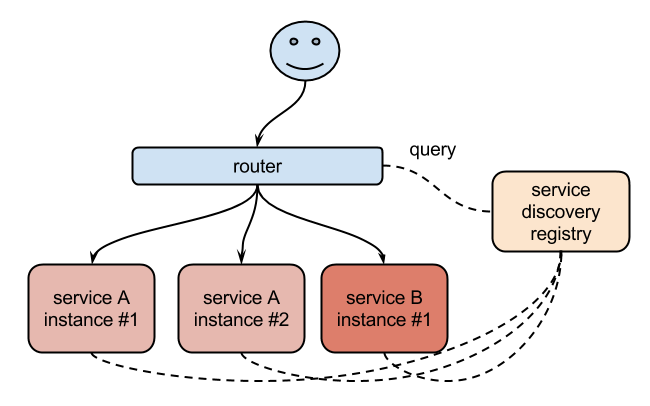
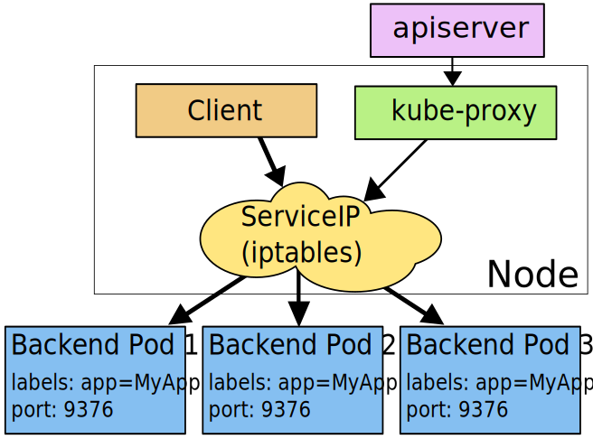

# Service

我们前面的课程中学习了`Pod`的基本用法，我们也了解到`Pod`的生命是有限的，死亡过后不会复活了。我们后面学习到的`RC`和`Deployment`可以用来动态的创建和销毁`Pod`。尽管每个`Pod`都有自己的`IP`地址，但是如果`Pod`重新启动了的话那么他的`IP`很有可能也就变化了。这就会带来一个问题：比如我们有一些后端的`Pod`的集合为集群中的其他前端的`Pod`集合提供`API`服务，如果我们在前端的`Pod`中把所有的这些后端的`Pod`的地址都写死，然后去某种方式去访问其中一个`Pod`的服务，这样看上去是可以工作的，对吧？但是如果这个`Pod`挂掉了，然后重新启动起来了，是不是`IP`地址非常有可能就变了，这个时候前端就极大可能访问不到后端的服务了。

遇到这样的问题该怎么解决呢？在没有使用`Kubernetes`之前，我相信可能很多同学都遇到过这样的问题，不一定是`IP`变化的问题，比如我们在部署一个`WEB`服务的时候，前端一般部署一个`Nginx`作为服务的入口，然后`Nginx`后面肯定就是挂载的这个服务的大量后端，很早以前我们可能是去手动更改`Nginx`配置中的`upstream`选项，来动态改变提供服务的数量，到后面出现了一些`服务发现`的工具，比如`Consul`、`ZooKeeper`还有我们熟悉的`etcd`等工具，有了这些工具过后我们就可以只需要把我们的服务注册到这些服务发现中心去就可以，然后让这些工具动态的去更新`Nginx`的配置就可以了，我们完全不用去手工的操作了，是不是非常方便。


同样的，要解决我们上面遇到的问题是不是实现一个服务发现的工具也可以解决啊？没错的，当我们`Pod`被销毁或者新建过后，我们可以把这个`Pod`的地址注册到这个服务发现中心去就可以，但是这样的话我们的前端的`Pod`结合就不能直接去连接后台的`Pod`集合了是吧，应该连接到一个能够做服务发现的中间件上面，对吧？

没错，`Kubernetes`集群就为我们提供了这样的一个对象 - `Service`，`Service`是一种抽象的对象，它定义了一组`Pod`的逻辑集合和一个用于访问它们的策略，其实这个概念和微服务非常类似。一个`Serivce`下面包含的`Pod`集合一般是由`Label Selector`来决定的。

比如我们上面的例子，假如我们后端运行了3个副本，这些副本都是可以替代的，因为前端并不关心它们使用的是哪一个后端服务。尽管由于各种原因后端的`Pod`集合会发送变化，但是前端却不需要知道这些变化，也不需要自己用一个列表来记录这些后端的服务，`Service`的这种抽象就可以帮我们达到这种解耦的目的。


## 三种IP
在继续往下学习`Service`之前，我们需要先弄明白`Kubernetes`系统中的三种IP这个问题，因为经常有同学混乱。

* Node IP：`Node`节点的`IP`地址
* Pod IP: `Pod`的IP地址
* Cluster IP: `Service`的`IP`地址

首先，`Node IP`是`Kubernetes`集群中节点的物理网卡`IP`地址(一般为内网)，所有属于这个网络的服务器之间都可以直接通信，所以`Kubernetes`集群外要想访问`Kubernetes`集群内部的某个节点或者服务，肯定得通过`Node IP`进行通信（这个时候一般是通过外网`IP`了）

然后`Pod IP`是每个`Pod`的`IP`地址，它是`Docker Engine`根据`docker0`网桥的`IP`地址段进行分配的（我们这里使用的是`flannel`这种网络插件保证所有节点的`Pod IP`不会冲突）

最后`Cluster IP`是一个虚拟的`IP`，仅仅作用于`Kubernetes Service`这个对象，由`Kubernetes`自己来进行管理和分配地址，当然我们也无法`ping`这个地址，他没有一个真正的实体对象来响应，他只能结合`Service Port`来组成一个可以通信的服务。


## 定义Service

定义`Service`的方式和我们前面定义的各种资源对象的方式类型，例如，假定我们有一组`Pod`服务，它们对外暴露了 8080 端口，同时都被打上了`app=myapp`这样的标签，那么我们就可以像下面这样来定义一个`Service`对象：

```yaml
apiVersion: v1
kind: Service
metadata: 
  name: myservice
spec:
  selector:
    app: myapp
  ports:
  - protocol: TCP
    port: 80
    targetPort: 8080
    name: myapp-http
```
然后通过的使用`kubectl create -f myservice.yaml`就可以创建一个名为`myservice`的`Service`对象，它会将请求代理到使用 TCP 端口为 8080，具有标签`app=myapp`的`Pod`上，这个`Service`会被系统分配一个我们上面说的`Cluster IP`，该`Service`还会持续的监听`selector`下面的`Pod`，会把这些`Pod`信息更新到一个名为`myservice`的`Endpoints`对象上去，这个对象就类似于我们上面说的`Pod`集合了。

需要注意的是，`Service`能够将一个接收端口映射到任意的`targetPort`。 默认情况下，`targetPort`将被设置为与`port`字段相同的值。 可能更有趣的是，targetPort 可以是一个字符串，引用了 backend Pod 的一个端口的名称。 因实际指派给该端口名称的端口号，在每个 backend Pod 中可能并不相同，所以对于部署和设计 Service ，这种方式会提供更大的灵活性。 

另外`Service`能够支持 TCP 和 UDP 协议，默认是 TCP 协议。


## kube-proxy

前面我们讲到过，在`Kubernetes`集群中，每个`Node`会运行一个`kube-proxy`进程, 负责为`Service`实现一种 VIP（虚拟 IP，就是我们上面说的`clusterIP`）的代理形式，现在的`Kubernetes`中默认是使用的`iptables`这种模式来代理。这种模式，`kube-proxy`会监视`Kubernetes master`对 Service 对象和 Endpoints 对象的添加和移除。 对每个 Service，它会添加上 iptables 规则，从而捕获到达该 Service 的 clusterIP（虚拟 IP）和端口的请求，进而将请求重定向到 Service 的一组 backend 中的某一个个上面。 对于每个 Endpoints 对象，它也会安装 iptables 规则，这个规则会选择一个 backend Pod。

默认的策略是，随机选择一个 backend。 我们也可以实现基于客户端 IP 的会话亲和性，可以将 `service.spec.sessionAffinity` 的值设置为 "ClientIP" （默认值为 "None"）。

另外需要了解的是如果最开始选择的 Pod 没有响应，iptables 代理能够自动地重试另一个 Pod，所以它需要依赖 readiness probes。




## Service 类型

我们在定义`Service`的时候可以指定一个自己需要的类型的`Service`，如果不指定的话默认是`ClusterIP`类型。

我们可以使用的服务类型如下：

* ClusterIP：通过集群的内部 IP 暴露服务，选择该值，服务只能够在集群内部可以访问，这也是默认的ServiceType。

* NodePort：通过每个 Node 节点上的 IP 和静态端口（NodePort）暴露服务。NodePort 服务会路由到 ClusterIP 服务，这个 ClusterIP 服务会自动创建。通过请求 <NodeIP>:<NodePort>，可以从集群的外部访问一个 NodePort 服务。
* LoadBalancer：使用云提供商的负载局衡器，可以向外部暴露服务。外部的负载均衡器可以路由到 NodePort 服务和 ClusterIP 服务，这个需要结合具体的云厂商进行操作。
* ExternalName：通过返回 CNAME 和它的值，可以将服务映射到 externalName 字段的内容（例如， foo.bar.example.com）。没有任何类型代理被创建，这只有 Kubernetes 1.7 或更高版本的 kube-dns 才支持。

### NodePort 类型

如果设置 type 的值为 "NodePort"，Kubernetes master 将从给定的配置范围内（默认：30000-32767）分配端口，每个 Node 将从该端口（每个 Node 上的同一端口）代理到 Service。该端口将通过 Service 的 spec.ports[*].nodePort 字段被指定，如果不指定的话会自动生成一个端口。

需要注意的是，Service 将能够通过 <NodeIP>:spec.ports[*].nodePort 和 spec.clusterIp:spec.ports[*].port 而对外可见。

接下来我们来给大家创建一个`NodePort`的服务来访问我们前面的`Nginx`服务：(保存为service-demo.yaml)
```yaml
apiVersion: v1
kind: Service
metadata: 
  name: myservice
spec:
  selector:
    app: myapp
  type: NodePort
  ports:
  - protocol: TCP
    port: 80
    targetPort: 80
    name: myapp-http
```

创建该`Service`:
```
$ kubectl create -f service-demo.yaml
```

然后我们可以查看`Service`对象信息：
```
$ kubectl get svc
NAME         TYPE        CLUSTER-IP      EXTERNAL-IP   PORT(S)        AGE
kubernetes   ClusterIP   10.96.0.1       <none>        443/TCP        27d
myservice    NodePort    10.104.57.198   <none>        80:32560/TCP   14h
```
我们可以看到`myservice`的 TYPE 类型已经变成了`NodePort`，后面的`PORT(S)`部分也多了一个 32560 的映射端口。

### ExternalName

`ExternalName` 是 Service 的特例，它没有 selector，也没有定义任何的端口和 Endpoint。 对于运行在集群外部的服务，它通过返回该外部服务的别名这种方式来提供服务。
```yaml
kind: Service
apiVersion: v1
metadata:
  name: my-service
  namespace: prod
spec:
  type: ExternalName
  externalName: my.database.example.com
```

当查询主机 my-service.prod.svc.cluster.local （后面服务发现的时候我们会再深入讲解）时，集群的 DNS 服务将返回一个值为 my.database.example.com 的 CNAME 记录。 访问这个服务的工作方式与其它的相同，唯一不同的是重定向发生在 DNS 层，而且不会进行代理或转发。 如果后续决定要将数据库迁移到 Kubernetes 集群中，可以启动对应的 Pod，增加合适的 Selector 或 Endpoint，修改 Service 的 type，完全不需要修改调用的代码，这样就完全解耦了。

