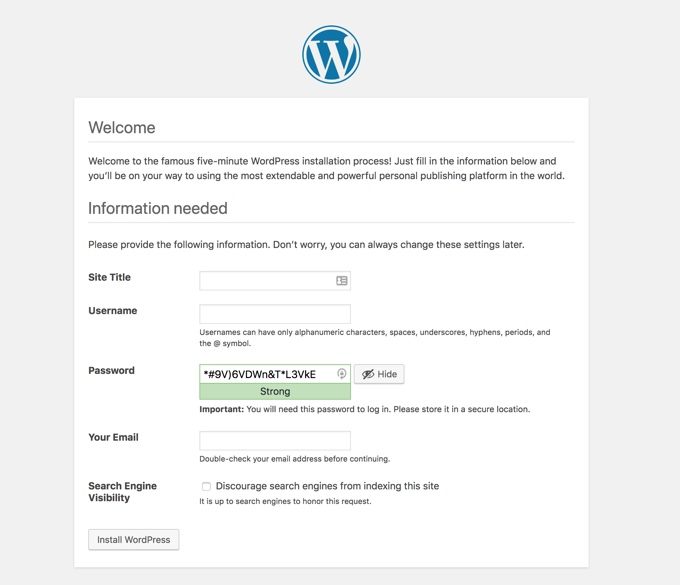

# 部署 Wordpress 示例

前面的课程中我们基本上了解了`Kubernetes`当中常见的一些对象资源，这节课我们就来利用前面学习的知识点来部署一个实际的应用 - 将`Wordpress`应用部署到我们的集群当中，我们前面是不是已经用`docker-compose`的方式部署过了，我们可以了解到要部署一个`Wordpress`应用主要涉及到两个镜像：`wordpress`和`mysql`，`wordpress`是应用的核心程序，`mysql`是用于数据存储的。

现在我们来看看如何来部署我们的这个`wordpress`应用


### 一个Pod
我们知道一个`Pod`中可以包含多个容器，那么很明显我们这里是不是就可以将`wordpress`部署成一个独立的`Pod`？我们将我们的应用都部署到`blog`这个命名空间下面，所以先创建一个命名空间：
```shell
$ kubectl create namespace blog
namespace "blog" created
```

然后来编写`YAML`文件：（wordpress-pod.yaml）
```yaml
apiVersion: v1
kind: Pod
metadata:
  name: wordpress
  namespace: blog
spec:
  containers:
  - name: wordpress
    image: wordpress
    ports:
    - containerPort: 80
      name: wdport
    env:
    - name: WORDPRESS_DB_HOST
      value: localhost: 3306
    - name: WORDPRESS_DB_USER
      value: wordpress
    - name: WORDPRESS_DB_PASSWORD
      value: wordpress
  - name: mysql
    image: mysql:5.7
    imagePullPolicy: IfNotPresent
    ports:
    - containerPort: 3306
      name: dbport
    env:
    - name: MYSQL_ROOT_PASSWORD
      value: rootPassW0rd
    - name: MYSQL_DATABASE
      value: wordpress
    - name: MYSQL_USER
      value: wordpress
    - name: MYSQL_PASSWORD
      value: wordpress
    volumeMounts:
    - name: db
      mountPath: /var/lib/mysql
  volumes:
  - name: db
    hostPath:
      path: /var/lib/mysql
```

要注意这里针对`mysql`这个容器我们做了一个数据卷的挂载，这是为了能够将`mysql`的数据能够持久化到节点上，这样下次`mysql`容器重启过后数据不至于丢失。
然后创建上面的`Pod`:
```shell
$ kubectl create -f wrodpress-pod.yaml
pod "wordpress" created
```

接下来就是等待拉取镜像，启动容器，同样我们可以使用`describe`指令查看详细信息：
```shell
$ kubectl describe pod wordpress -n blog
```

大家可以看看我们现在这种单一`Pod`的方式有什么缺点？假如我们现在需要部署3个`Wordpress`的副本，该怎么办？是不是我们只需要在上面的`YAML`文件中加上`replicas: 3`这个属性就可以了啊？但是有个什么问题呢？是不是不仅仅是`Wordpress`这个容器会被部署成3份，连我们的`MySQL`数据库也会被部署成3份了呢？`MySQL`数据库单纯的部署成3份他们能联合起来使用吗？不能，如果真的这么简单的话就不需要各种数据库集群解决方案了，所以我们这里部署3个`Pod`实例，实际上他们互相之间是独立的，因为数据不想通，明白吧？所以该怎么办？拆分呗，把`wordpress`和`mysql`这两个容器部署成独立的`Pod`是不是就可以了。

另外一个问题是我们的`wordpress`容器需要去连接`mysql`数据库吧，现在我们这里放在一起能保证`mysql`先启动起来吗？貌似没有特别的办法，前面学习的`InitContainer`也是针对`Pod`来的，所以无论如何，我们都需要将他们进行拆分。


### 两个Pod
现在来把上面的一个`Pod`拆分成两个`Pod`，我们前面也反复强调过要使用`Deployment`来管理我们的`Pod`，上面只是为了单纯给大家说明怎么来把前面的`Docker`环境下的`wordpress`转换成`Kubernetes`环境下面的`Pod`，有了上面的`Pod`模板，我们现在来转换成`Deployment`很容易了吧。

第一步，创建一个`MySQL`的`Deployment`对象：(wordpress-db.yaml)
```yaml
---
apiVersion: apps/v1beta1
kind: Deployment
metadata:
  name: mysql-deploy
  namespace: blog
  labels:
    app: mysql
spec:
  template:
    metadata:
      labels:
        app: mysql
    spec:
      containers:
      - name: mysql
        image: mysql:5.7
        imagePullPolicy: IfNotPresent
        ports:
        - containerPort: 3306
          name: dbport
        env:
        - name: MYSQL_ROOT_PASSWORD
          value: rootPassW0rd
        - name: MYSQL_DATABASE
          value: wordpress
        - name: MYSQL_USER
          value: wordpress
        - name: MYSQL_PASSWORD
          value: wordpress
        volumeMounts:
        - name: db
          mountPath: /var/lib/mysql
      volumes:
      - name: db
        hostPath:
          path: /var/lib/mysql
```
如果我们只创建上面的`Deployment`这个对象，那么我们应该怎样让后面的`Wordpress`来访问呢？貌似没办法是吧，之前在一个`Pod`里面还可以使用`localhost`来进行访问，现在分开了该怎样访问呢？还记得前面的`Service`吗？没错，使用`Service`就可以了，所以我们在上面的`wordpress-db.yaml`文件中添加上`Service`的信息：
```yaml
---
apiVersion: v1
kind: Service
metadata:
  name: mysql
  namespace: blog
spec:
  selector:
    app: mysql
  ports:
  - name: mysqlport
    protocol: TCP
    port: 3306
    targetPort: dbport
```

然后创建上面的`wordpress-db.yaml`文件：
```shell
$ kubectl create -f wordpress-db.yaml
service "mysql" created
deployment.apps "mysql-deploy" created
```

然后我们查看`Service`的详细情况：
```shell
$ kubectl describe svc mysql -n blog
Name:              mysql
Namespace:         blog
Labels:            <none>
Annotations:       <none>
Selector:          app=mysql
Type:              ClusterIP
IP:                10.98.27.19
Port:              mysqlport  3306/TCP
TargetPort:        dbport/TCP
Endpoints:         10.244.2.213:3306
Session Affinity:  None
Events:            <none>
```
可以看到`Endpoints`部分匹配到了一个`Pod`，生成了一个`clusterIP`：`10.98.27.19`，现在我们是不是就可以通过这个`clusterIP`加上定义的3306端口就可以正常访问我们这个`mysql`服务了。


第二步. 创建`Wordpress`服务，将上面的`wordpress`的`Pod`转换成`Deployment`对象：（wordpress.yaml）
```yaml
apiVersion: apps/v1beta1
kind: Deployment
metadata:
  name: wordpress-deploy
  namespace: blog
  labels:
    app: wordpress
spec:
  template:
    metadata:
      labels:
        app: wordpress
    spec:
      containers:
      - name: wordpress
        image: wordpress
        imagePullPolicy: IfNotPresent
        ports:
        - containerPort: 80
          name: wdport
        env:
        - name: WORDPRESS_DB_HOST
          value: 10.98.27.19:3306
        - name: WORDPRESS_DB_USER
          value: wordpress
        - name: WORDPRESS_DB_PASSWORD
          value: wordpress
```

注意这里的环境变量`WORDPRESS_DB_HOST`的值将之前的`localhost`地址更改成了上面`mysql`服务的`clusterIP`地址了，然后创建上面的`Deployment`对象:
```shell
$ kubectl create -f wordpress.yaml
deployment.apps "wordpress-deploy" created
```

创建完成后，我们可以看看我们创建的`Pod`的状态：
```shell
$ kubectl get pods -n blog
NAME                                READY     STATUS    RESTARTS   AGE
mysql-deploy-86bdcc7484-fv2dj       1/1       Running   0          19m
wordpress-deploy-784cfd6dd4-d9f52   1/1       Running   0          23s
```

可以看到都已经是`Running`状态了，然后我们需要怎么来验证呢？是不是去访问下我们的`wordpress`服务就可以了，要访问，我们就需要建立一个能让外网用户访问的`Service`，前面我们学到过是不是`NodePort`类型的`Service`就可以？所以在上面的`wordpress.yaml`文件中添加上`Service`的信息：
```yaml
---
apiVersion: v1
kind: Service
metadata:
  name: wordpress
  namespace: blog
spec:
  type: NodePort
  selector:
    app: wordpress
  ports:
  - name: wordpressport
    protocol: TCP
    port: 80
    targetPort: wdport
```

注意要添加属性`type: NodePort`，然后重新更新`wordpress.yaml`文件：
```shell
$ kubectl apply -f wordpress.yaml
service "wordpress" created
Warning: kubectl apply should be used on resource created by either kubectl create --save-config or kubectl apply
deployment.apps "wordpress-deploy" configured
```

创建完成后，查看下`svc`：
```shell
$ kubectl get svc -n blog
NAME        TYPE        CLUSTER-IP    EXTERNAL-IP   PORT(S)        AGE
mysql       ClusterIP   10.98.27.19   <none>        3306/TCP       25m
wordpress   NodePort    10.101.7.69   <none>        80:32255/TCP   1m
```

可以看到`wordpress`服务产生了一个32255的端口，现在我们是不是就可以通过任意节点的`NodeIP`加上32255端口，就可以访问我们的`wordpress`应用了，在浏览器中打开，如果看到`wordpress`跳转到了安装页面，证明我们的嗯安装是没有任何问题的了，如果没有出现预期的效果，那么就需要去查看下`Pod`的日志来查看问题了：


然后根据页面提示，填上对应的信息，点击“安装”即可，最终安装成功后，我们就可以看到熟悉的首页界面了：


### 提高稳定性
现在`wordpress`应用已经部署成功了，那么就万事大吉了吗？如果我们的网站访问量突然变大了怎么办，如果我们要更新我们的镜像该怎么办？如果我们的`mysql`服务挂掉了怎么办？

所以要保证我们的网站能够非常稳定的提供服务，我们做得还不够，我们可以通过做些什么事情来提高网站的稳定性呢？

第一. 增加健康检测，我们前面说过`liveness probe`和`rediness probe`是提高应用稳定性非常重要的方法：
```yaml
livenessProbe:
  tcpSocket:
    port: 80
  initialDelaySeconds: 3
  periodSeconds: 3
readinessProbe:
  tcpSocket:
    port: 80
  initialDelaySeconds: 5
  periodSeconds: 10
```
增加上面两个探针，每10s检测一次应用是否可读，每3s检测一次应用是否存活

第二. 增加 HPA，让我们的应用能够自动应对流量高峰期：
```shell
$ kubectl autoscale deployment wordpress-deploy --cpu-percent=10 --min=1 --max=10 -n blog
deployment "wordpress-deploy" autoscaled
```

我们用`kubectl autoscale`命令为我们的`wordpress-deploy`创建一个`HPA`对象，最小的 pod 副本数为1，最大为10，`HPA`会根据设定的 cpu使用率（10%）动态的增加或者减少pod数量。当然最好我们也为`Pod`声明一些资源限制：
```yaml
resources:
  limits:
    cpu: 200m
    memory: 200Mi
  requests:
    cpu: 100m
    memory: 100Mi
```

更新`Deployment`后，我们可以可以来测试下上面的`HPA`是否会生效：
```shell
$ kubectl run -i --tty load-generator --image=busybox /bin/sh
If you don't see a command prompt, try pressing enter.
/ # while true; do wget -q -O- http://10.244.1.62:80; done
```

观察`Deployment`的副本数是否有变化
```shell
$ kubectl get deployment wordpress-deploy
NAME        DESIRED   CURRENT   UP-TO-DATE   AVAILABLE   AGE
wordpress-deploy   3         3         3            3           4d
```

第三. 增加滚动更新策略，这样可以保证我们在更新应用的时候服务不会被中断：
```yaml
replicas: 2
revisionHistoryLimit: 10
minReadySeconds: 5
strategy:
  type: RollingUpdate
  rollingUpdate:
    maxSurge: 1
    maxUnavailable: 1
```

第四. 我们知道如果`mysql`服务被重新创建了的话，它的`clusterIP`非常有可能就变化了，所以上面我们环境变量中的`WORDPRESS_DB_HOST`的值就会有问题，就会导致访问不了数据库服务了，这个地方我们可以直接使用`Service`的名称来代替`host`，这样即使`clusterIP`变化了，也不会有任何影响，这个我们会在后面的服务发现的章节和大家深入讲解的：
```yaml
env:
- name: WORDPRESS_DB_HOST
  value: mysql:3306
```

第五. 我们在部署`wordpress`服务的时候，`mysql`服务以前启动起来了吗？如果没有启动起来是不是我们也没办法连接数据库了啊？该怎么办，是不是在启动`wordpress`应用之前应该去检查一下`mysql`服务，如果服务正常的话我们就开始部署应用了，这是不是就是`InitContainer`的用法：
```yaml
initContainers:
- name: init-db
  image: busybox
  command: ['sh', '-c', 'until nslookup mysql; do echo waiting for mysql service; sleep 2; done;']
```

直到`mysql`服务创建完成后，`initContainer`才结束，结束完成后我们才开始下面的部署。


最后，我们把部署的应用整合到一个`YAML`文件中来：（wordpress-all.yaml）
```yaml
---
apiVersion: apps/v1beta1
kind: Deployment
metadata:
  name: mysql-deploy
  namespace: blog
  labels:
    app: mysql
spec:
  template:
    metadata:
      labels:
        app: mysql
    spec:
      containers:
      - name: mysql
        image: mysql:5.7
        ports:
        - containerPort: 3306
          name: dbport
        env:
        - name: MYSQL_ROOT_PASSWORD
          value: rootPassW0rd
        - name: MYSQL_DATABASE
          value: wordpress
        - name: MYSQL_USER
          value: wordpress
        - name: MYSQL_PASSWORD
          value: wordpress
        volumeMounts:
        - name: db
          mountPath: /var/lib/mysql
      volumes:
      - name: db
        hostPath:
          path: /var/lib/mysql

---
apiVersion: v1
kind: Service
metadata:
  name: mysql
  namespace: blog
spec:
  selector:
    app: mysql
  ports:
  - name: mysqlport
    protocol: TCP
    port: 3306
    targetPort: dbport


---
apiVersion: apps/v1beta1
kind: Deployment
metadata:
  name: wordpress-deploy
  namespace: blog
  labels:
    app: wordpress
spec:
  revisionHistoryLimit: 10
  minReadySeconds: 5
  strategy:
    type: RollingUpdate
    rollingUpdate:
      maxSurge: 1
      maxUnavailable: 1
  template:
    metadata:
      labels:
        app: wordpress
    spec:
      initContainers:
      - name: init-db
        image: busybox
        command: ['sh', '-c', 'until nslookup mysql; do echo waiting for mysql service; sleep 2; done;']
      containers:
      - name: wordpress
        image: wordpress
        imagePullPolicy: IfNotPresent
        ports:
        - containerPort: 80
          name: wdport
        env:
        - name: WORDPRESS_DB_HOST
          value: mysql:3306
        - name: WORDPRESS_DB_USER
          value: wordpress
        - name: WORDPRESS_DB_PASSWORD
          value: wordpress
        livenessProbe:
          tcpSocket:
            port: 80
          initialDelaySeconds: 3
          periodSeconds: 3
        readinessProbe:
          tcpSocket:
            port: 80
          initialDelaySeconds: 5
          periodSeconds: 10
        resources:
          limits:
            cpu: 200m
            memory: 200Mi
          requests:
            cpu: 100m
            memory: 100Mi

---
apiVersion: v1
kind: Service
metadata:
  name: wordpress
  namespace: blog
spec:
  selector:
    app: wordpress
  type: NodePort
  ports:
  - name: wordpressport
    protocol: TCP
    port: 80
    nodePort: 32255
    targetPort: wdport

```

我们这里主要是针对的`wordpress`来做的提高稳定性的方法，如何对`mysql`提高一些稳定性呢？大家下去可以试一试，我们接下来会和大家讲解`mysql`这类有状态的应用在`Kubernetes`当中的使用方法。

最后，我们来把前面我们部署的相关服务全部删掉，重新通过上面的`YAML`文件来创建：
```yaml
$ kubectl create -f wordpress-all.yaml
deployment.apps "mysql-deploy" created
service "mysql" created
deployment.apps "wordpress-deploy" created
service "wordpress" created
```
看看最后能不能得到我们的最终成果呢？
