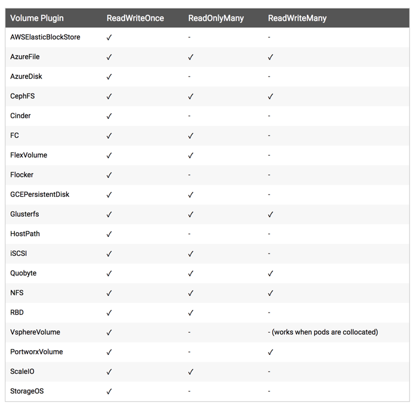

# PV 的使用

前面我们和大家一起学习了一些基本的资源对象的使用方法，前面我们也和大家讲到了有状态的应用和对数据有持久化的应用，我们有通过 hostPath 或者 emptyDir 的方式来持久化我们的数据，但是显然我们还需要更加可靠的存储来保存应用的持久化数据，这样容器在重建后，依然可以使用之前的数据。但是显然存储资源和 CPU 资源以及内存资源有很大不同，为了屏蔽底层的技术实现细节，让用户更加方便的使用，Kubernetes 便引入了 PV 和 PVC 两个重要的资源对象来实现对存储的管理。这也是我们这节课需要和大家讲解的核心：PV 和 PVC。


## 概念
PV 的全称是：PersistentVolume（持久化卷），是对底层的共享存储的一种抽象，PV 由管理员进行创建和配置，它和具体的底层的共享存储技术的实现方式有关，比如 Ceph、GlusterFS、NFS 等，都是通过插件机制完成与共享存储的对接。

PVC 的全称是：PersistentVolumeClaim（持久化卷声明），PVC 是用户存储的一种声明，PVC 和 Pod 比较类似，Pod 消耗的是节点，PVC 消耗的是 PV 资源，Pod 可以请求 CPU 和内存，而 PVC 可以请求特定的存储空间和访问模式。对于真正使用存储的用户不需要关心底层的存储实现细节，只需要直接使用 PVC 即可。

但是通过 PVC 请求到一定的存储空间也很有可能不足以满足应用对于存储设备的各种需求，而且不同的应用程序对于存储性能的要求可能也不尽相同，比如读写速度、并发性能等，为了解决这一问题，Kubernetes 又为我们引入了一个新的资源对象：StorageClass，通过 StorageClass 的定义，管理员可以将存储资源定义为某种类型的资源，比如快速存储、慢速存储等，用户根据 StorageClass 的描述就可以非常直观的知道各种存储资源的具体特性了，这样就可以根据应用的特性去申请合适的存储资源了。

## NFS
我们这里为了演示方便，决定使用相对简单的 NFS 这种存储资源，接下来我们在节点**10.151.30.57**上来安装 NFS 服务，数据目录：/data/k8s/

1. 关闭防火墙
```shell
$ systemctl stop firewalld.service
$ systemctl disable firewalld.service
```

2. 安装配置 nfs
```shell
$ yum -y install nfs-utils rpcbind
```

共享目录设置权限：
```shell
$ chmod 755 /data/k8s/
```

配置 nfs，nfs 的默认配置文件在 /etc/exports 文件下，在该文件中添加下面的配置信息：
```shell
$ vi /etc/exports
/data/k8s  *(rw,sync,no_root_squash) 
```

配置说明：

* /data/k8s：是共享的数据目录
* `*`：表示任何人都有权限连接，当然也可以是一个网段，一个 IP，也可以是域名
* rw：读写的权限
* sync：表示文件同时写入硬盘和内存
* no_root_squash：当登录 NFS 主机使用共享目录的使用者是 root 时，其权限将被转换成为匿名使用者，通常它的 UID 与 GID，都会变成 nobody 身份

当然 nfs 的配置还有很多，感兴趣的同学可以在网上去查找一下。


3. 启动服务
nfs 需要向 rpc 注册，rpc 一旦重启了，注册的文件都会丢失，向他注册的服务都需要重启

> 注意启动顺序，先启动 rpcbind

```shell
$ systemctl start rpcbind.service
$ systemctl enable rpcbind
$ systemctl status rpcbind
● rpcbind.service - RPC bind service
   Loaded: loaded (/usr/lib/systemd/system/rpcbind.service; disabled; vendor preset: enabled)
   Active: active (running) since Tue 2018-07-10 20:57:29 CST; 1min 54s ago
  Process: 17696 ExecStart=/sbin/rpcbind -w $RPCBIND_ARGS (code=exited, status=0/SUCCESS)
 Main PID: 17697 (rpcbind)
    Tasks: 1
   Memory: 1.1M
   CGroup: /system.slice/rpcbind.service
           └─17697 /sbin/rpcbind -w

Jul 10 20:57:29 master systemd[1]: Starting RPC bind service...
Jul 10 20:57:29 master systemd[1]: Started RPC bind service.
```
看到上面的 Started 证明启动成功了。

然后启动 nfs 服务：
```shell
$ systemctl start nfs.service
$ systemctl enable nfs
$ systemctl status nfs
● nfs-server.service - NFS server and services
   Loaded: loaded (/usr/lib/systemd/system/nfs-server.service; enabled; vendor preset: disabled)
  Drop-In: /run/systemd/generator/nfs-server.service.d
           └─order-with-mounts.conf
   Active: active (exited) since Tue 2018-07-10 21:35:37 CST; 14s ago
 Main PID: 32067 (code=exited, status=0/SUCCESS)
   CGroup: /system.slice/nfs-server.service

Jul 10 21:35:37 master systemd[1]: Starting NFS server and services...
Jul 10 21:35:37 master systemd[1]: Started NFS server and services.
```
同样看到 Started 则证明 NFS Server 启动成功了。

另外我们还可以通过下面的命令确认下：
```shell
$ rpcinfo -p|grep nfs
    100003    3   tcp   2049  nfs
    100003    4   tcp   2049  nfs
    100227    3   tcp   2049  nfs_acl
    100003    3   udp   2049  nfs
    100003    4   udp   2049  nfs
    100227    3   udp   2049  nfs_acl
```

查看具体目录挂载权限：
```shell
$ cat /var/lib/nfs/etab
/data/k8s	*(rw,sync,wdelay,hide,nocrossmnt,secure,no_root_squash,no_all_squash,no_subtree_check,secure_locks,acl,no_pnfs,anonuid=65534,anongid=65534,sec=sys,secure,no_root_squash,no_all_squash)
```

到这里我们就把 nfs server 给安装成功了，接下来我们在节点**10.151.30.62**上来安装 nfs 的客户端来验证下 nfs

4. 安装 nfs
当前也需要先关闭防火墙：
```shell
$ systemctl stop firewalld.service
$ systemctl disable firewalld.service
```

然后安装 nfs
```shell
$ yum -y install nfs-utils rpcbind
```

安装完成后，和上面的方法一样，先启动 rpc、然后启动 nfs：
```shell
$ systemctl start rpcbind.service 
$ systemctl enable rpcbind.service 
$ systemctl start nfs.service    
$ systemctl enable nfs.service      
```

5. 挂载数据目录
客户端启动完成后，我们在客户端来挂载下 nfs 测试下：

首先检查下 nfs 是否有共享目录：
```
$ showmount -e 10.151.30.57
Export list for 10.151.30.57:
/data/k8s *
```

然后我们在客户端上新建目录：
```shell
$ mkdir -p /root/course/kubeadm/data
```

将 nfs 共享目录挂载到上面的目录：
```shell
$ mount -t nfs 10.151.30.57:/data/k8s /root/course/kubeadm/data
```

挂载成功后，在客户端上面的目录中新建一个文件，然后我们观察下 nfs 服务端的共享目录下面是否也会出现该文件：

```shell
$ touch /root/course/kubeadm/data/test.txt
```

然后在 nfs 服务端查看：
```shell
$ ls -ls /data/k8s/
total 4
4 -rw-r--r--. 1 root root 4 Jul 10 21:50 test.txt
```
如果上面出现了 test.txt 的文件，那么证明我们的 nfs 挂载成功了。


## PV
有了上面的 NFS 共享存储，下面我们就可以来使用 PV 和 PVC 了。PV 作为存储资源，主要包括存储能力、访问模式、存储类型、回收策略等关键信息，下面我们来新建一个 PV 对象，使用 nfs 类型的后端存储，1G 的存储空间，访问模式为 ReadWriteOnce，回收策略为 Recyle，对应的 YAML 文件如下：(pv1-demo.yaml)
```yaml
apiVersion: v1
kind: PersistentVolume
metadata:
  name:  pv1
spec:
  capacity: 
    storage: 1Gi
  accessModes:
  - ReadWriteOnce
  persistentVolumeReclaimPolicy: Recycle
  nfs:
    path: /data/k8s
    server: 10.151.30.57
```

Kubernetes 支持的 PV 类型有很多，比如常见的 Ceph、GlusterFs、NFS，甚至 HostPath也可以，不过 HostPath 我们之前也说过仅仅可以用于单机测试，更多的支持类型可以前往 [Kubernetes PV 官方文档](https://kubernetes.io/docs/concepts/storage/persistent-volumes/)进行查看，因为每种存储类型都有各自的特点，所以我们在使用的时候可以去查看相应的文档来设置对应的参数。

然后同样的，直接使用 kubectl 创建即可：
```shell
$ kubectl create -f pv1-demo.yaml
persistentvolume "pv1" created
$ kubectl get pv
NAME      CAPACITY   ACCESS MODES   RECLAIM POLICY   STATUS      CLAIM               STORAGECLASS   REASON    AGE
pv1       1Gi        RWO            Recycle          Available                                                12s
```
我们可以看到 pv1 已经创建成功了，状态是 Available，表示 pv1 就绪，可以被 PVC 申请。我们来分别对上面的属性进行一些解读。


### Capacity（存储能力）
一般来说，一个 PV 对象都要指定一个存储能力，通过 PV 的 **capacity**属性来设置的，目前只支持存储空间的设置，就是我们这里的 storage=1Gi，不过未来可能会加入 IOPS、吞吐量等指标的配置。


### AccessModes（访问模式）
AccessModes 是用来对 PV 进行访问模式的设置，用于描述用户应用对存储资源的访问权限，访问权限包括下面几种方式：

* ReadWriteOnce（RWO）：读写权限，但是只能被单个节点挂载
* ReadOnlyMany（ROX）：只读权限，可以被多个节点挂载
* ReadWriteMany（RWX）：读写权限，可以被多个节点挂载

> 注意：一些 PV 可能支持多种访问模式，但是在挂载的时候只能使用一种访问模式，多种访问模式是不会生效的。

下图是一些常用的 Volume 插件支持的访问模式：



### persistentVolumeReclaimPolicy（回收策略）
我这里指定的 PV 的回收策略为 Recycle，目前 PV 支持的策略有三种：

* Retain（保留）- 保留数据，需要管理员手工清理数据
* Recycle（回收）- 清除 PV 中的数据，效果相当于执行 rm -rf /thevoluem/*
* Delete（删除）- 与 PV 相连的后端存储完成 volume 的删除操作，当然这常见于云服务商的存储服务，比如 ASW EBS。


不过需要注意的是，目前只有 NFS 和 HostPath 两种类型支持回收策略。当然一般来说还是设置为 Retain 这种策略保险一点。


### 状态

一个 PV 的生命周期中，可能会处于4中不同的阶段：

* Available（可用）：表示可用状态，还未被任何 PVC 绑定
* Bound（已绑定）：表示 PVC 已经被 PVC 绑定
* Released（已释放）：PVC 被删除，但是资源还未被集群重新声明
* Failed（失败）： 表示该 PV 的自动回收失败

这就是 PV 的声明方法，下节课我们来和大家一起学习下 PVC 的使用方法。
