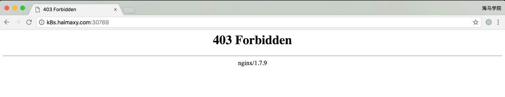
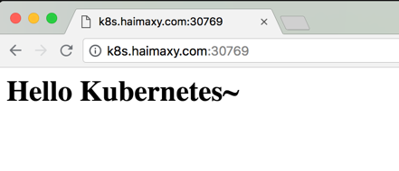

# PVC 的使用
上节课我们学习了 PV 的使用，但是在我们真正使用的时候是使用的 PVC，就类似于我们的服务是通过 Pod 来运行的，而不是 Node，只是 Pod 跑在 Node 上而已，所以这节课我们就来给大家讲解下 PVC 的使用方法。


## 准备工作

在使用 PVC 之前，我们还得把其他节点上的 nfs 客户端给安装上，比如我们这里：
```shell
$ kubectl get nodes
NAME      STATUS    ROLES     AGE       VERSION
master    Ready     master    61d       v1.10.0
node01    Ready     <none>    61d       v1.10.0
node03    Ready     <none>    41d       v1.10.0
```
我们需要在所有节点安装 nfs 客户端程序，安装方法和上节课的安装方法一样的。必须在所有节点都安装 nfs 客户端，否则可能会导致 PV 挂载不上的问题

## 新建 PVC
同样的，我们来新建一个数据卷声明，我们来请求 1Gi 的存储容量，访问模式也是 ReadWriteOnce，YAML 文件如下：(pvc-nfs.yaml)
```yaml
kind: PersistentVolumeClaim
apiVersion: v1
metadata:
  name: pvc-nfs
spec:
  accessModes:
    - ReadWriteOnce
  resources:
    requests:
      storage: 1Gi
```

我们可以看到我们这里的声明方法几乎和新建 PV 是一样的，在新建 PVC 之前，我们可以看下之前创建的 PV 的状态：
```shell
kubectl get pv
NAME      CAPACITY   ACCESS MODES   RECLAIM POLICY   STATUS      CLAIM               STORAGECLASS   REASON    AGE
pv-nfs    1Gi        RWO            Recycle          Available                                                19m
```

我们可以看到当前 pv-nfs 是在 Available 的一个状态，所以这个时候我们的 PVC 可以和这个 PV 进行绑定：
```shell
$ kubectl create -f pvc-nfs.yaml
persistentvolumeclaim "pvc-nfs" created
$ kubectl get pvc
NAME        STATUS    VOLUME    CAPACITY   ACCESS MODES   STORAGECLASS   AGE
pvc-nfs     Bound     pv-nfs    1Gi        RWO                           12s
```

我们可以看到 pvc-nfs 创建成功了，状态是 Bound 状态了，这个时候我们再看下 PV 的状态呢：
```shell
$ kubectl get pv
NAME      CAPACITY   ACCESS MODES   RECLAIM POLICY   STATUS    CLAIM               STORAGECLASS   REASON    AGE
pv-nfs    1Gi        RWO            Recycle          Bound     default/pvc-nfs                              23m
```
同样我们可以看到 PV 也是 Bound 状态了，对应的声明是 default/pvc-nfs，就是 default 命名空间下面的 pvc-nfs，证明我们刚刚新建的 pvc-nfs 和我们的 pv-nfs 绑定成功了。

有的同学可能会觉得很奇怪，我们并没有在 pvc-nfs 中指定关于 pv 的什么标志，它们之间是怎么就关联起来了的呢？其实这是系统自动帮我们去匹配的，他会根据我们的声明要求去查找处于 Available 状态的 PV，如果没有找到的话那么我们的 PVC 就会一直处于 Pending 状态，找到了的话当然就会把当前的 PVC 和目标 PV 进行绑定，这个时候状态就会变成 Bound 状态了。比如我们新建一个 PVC，如下：(pvc2-nfs.yaml)
```yaml
kind: PersistentVolumeClaim
apiVersion: v1
metadata:
  name: pvc2-nfs
spec:
  accessModes:
    - ReadWriteOnce
  resources:
    requests:
      storage: 2Gi
  selector:
    matchLabels:
      app: nfs
```

我们这里声明一个 PV 资源的请求，邀请访问模式是 ReadWriteOnce，存储容量是 2Gi，最后我们还要求匹配具有标签 app=nfs 的 PV，这样要求的 PV 有吗？我们先查看下当前系统的所有 PV：
```shell
$ kubectl get pv
NAME      CAPACITY   ACCESS MODES   RECLAIM POLICY   STATUS    CLAIM               STORAGECLASS   REASON    AGE
pv-nfs    1Gi        RWO            Recycle          Bound     default/pvc-nfs                              43m
pv001     1Gi        RWO            Recycle          Bound     default/www-web-0                            13d
pv002     1Gi        RWO            Recycle          Bound     default/www-web-1                            13d
```

都是 Bound 状态，并没有 Available 状态的 PV，所以我们可以想象到我们上面新建的 PVC 是没办法选择到合适的 PV 的，我们创建一下看看：
```shell
$ kubectl create -f pvc2-nfs.yaml
persistentvolumeclaim "pvc2-nfs" created
$ kubectl get pvc
NAME        STATUS    VOLUME    CAPACITY   ACCESS MODES   STORAGECLASS   AGE
pvc-nfs     Bound     pv-nfs    1Gi        RWO                           23m
pvc2-nfs    Pending                                                      14s
```

很显然是 Pending 状态，因为并没有合适的 PV 给你使用，现在我们来新建一个 PV，让上面的 PVC 有合适的 PV 使用：（pv2-nfs.yaml）
```yaml
apiVersion: v1
kind: PersistentVolume
metadata:
  name: pv2-nfs
  labels:
    app: nfs
spec:
  capacity:
    storage: 2Gi
  accessModes:
  - ReadWriteOnce
  persistentVolumeReclaimPolicy: Recycle
  nfs:
    server: 10.151.30.57
    path: /data/k8s
```

我们这里新建一个名为 pv2-nfs 的 PV，具有标签 app=nfs，容量也是 2Gi，访问模式是 ReadWraiteOnce，看上去这一切都很适合上面的 PVC，新建试一试：
```shell
$ kubectl create -f pv2-nfs.yaml
persistentvolume "pv2-nfs" created
$ kubectl get pv
NAME      CAPACITY   ACCESS MODES   RECLAIM POLICY   STATUS    CLAIM               STORAGECLASS   REASON    AGE
pv-nfs    1Gi        RWO            Recycle          Bound     default/pvc-nfs                              51m
pv2-nfs   2Gi        RWO            Recycle          Bound     default/pvc2-nfs                             12s
```

创建完 pv2-nfs 后，是不是很快就发现该 PV 是 Bound 状态了，对应的 PVC 是 default/pvc2-nfs，证明上面的 pvc2-nfs 终于找到合适的 PV 进行绑定上了：
```shell
$ kubectl get pvc
kubectl get pvc
NAME        STATUS    VOLUME    CAPACITY   ACCESS MODES   STORAGECLASS   AGE
pvc-nfs     Bound     pv-nfs    1Gi        RWO                           30m
pvc2-nfs    Bound     pv2-nfs   2Gi        RWO                           7m
```

成功了，对吧！有的同学可能又会说了，我们的 pv2-nfs 声明的容量是 2Gi，如果我 pvc2-nfs 这里声明的容量是 1Gi 的话呢？还能正常绑定吗？如果可以正常绑定的话，那剩下的 1Gi 容量还能使用吗？其实我也不清楚，怎么办？我们去实际测试下就知道了吧，先删除上面的 pvc2-nfs，然后我们把该 PVC 里面的容量改成 1Gi，再新建试一试呢：
```shell
$ kubectl delete pvc pvc2-nfs
persistentvolumeclaim "pvc2-nfs" deleted
$ cat pvc2-nfs.yaml
...
  resources:
    requests:
      storage: 1Gi
...
$ kubectl create -f pvc2-nfs.yaml
persistentvolumeclaim "pvc2-nfs" created
$ kubectl get pvc
NAME        STATUS    VOLUME    CAPACITY   ACCESS MODES   STORAGECLASS   AGE
pvc2-nfs    Bound     pv2-nfs   2Gi        RWO                           7s
```

我们可以看到上面的 PVC 依然可以正常的绑定，仔细看 CAPACITY 这一列的数据：2Gi，也就是说我们声明的 1Gi 是没什么用的，我 PV 是 2Gi，你这里声明 1Gi 是不行的，你必须得使用 2Gi。

> 如果我们这里容量声明是 3Gi 呢？还可以正常绑定吗？大家可以思考一下，如果声明的容量大于了 PV 里面的容量的话，是没办法进行绑定的，大家可以下去自己测试一下。


## 使用 PVC

上面我们已经知道怎么创建 PV 和 PVC 了，现在我们就来使用下我们的 PVC，这里我们同样使用之前的 nginx 的镜像来测试下：(nfs-pvc-deploy.yaml)
```yaml
apiVersion: extensions/v1beta1
kind: Deployment
metadata:
  name: nfs-pvc
spec:
  replicas: 3
  template:
    metadata:
      labels:
        app: nfs-pvc
    spec:
      containers:
      - name: nginx
        image: nginx:1.7.9
        imagePullPolicy: IfNotPresent
        ports:
        - containerPort: 80
          name: web
        volumeMounts:
        - name: www
          mountPath: /usr/share/nginx/html
      volumes:
      - name: www
        persistentVolumeClaim:
          claimName: pvc2-nfs

---

apiVersion: v1
kind: Service
metadata:
  name: nfs-pvc
  labels:
    app: nfs-pvc
spec:
  type: NodePort
  ports:
  - port: 80
    targetPort: web
  selector:
    app: nfs-pvc
```

我们这里使用 nginx 镜像，将容器的 /usr/share/nginx/html 目录通过 volume 挂载到名为 pvc2-nfs 的 PVC 上面，然后创建一个 NodePort 类型的 Service 来暴露服务：
```shell
$ kubectl create -f nfs-pvc-deploy.yaml
deployment.extensions "nfs-pvc" created
service "nfs-pvc" created
$ kubectl get pods
kubectl get pods
NAME                                             READY     STATUS     RESTARTS   AGE
...
nfs-pvc-57c9945bd9-5r4r6                         1/1       Running    0          19s
nfs-pvc-57c9945bd9-gz6p9                         1/1       Running    0          19s
nfs-pvc-57c9945bd9-x6mvc                         1/1       Running    0          19s
...
$ kubectl get svc
kubectl get svc
NAME         TYPE        CLUSTER-IP      EXTERNAL-IP   PORT(S)        AGE
...
nfs-pvc      NodePort    10.98.246.155   <none>        80:30769/TCP   1m
...
```

然后我们就可以通过任意节点的 IP:30769 端口来访问我们这里的 Nginx 服务了，但是这个时候我们来访问会出现**403**，这是为什么？我们再去看看 nfs 共享数据目录下面有没有数据呢？


```shell
$ ls /data/k8s
```
我们发现并没有任何数据，这是因为我们把容器目录**/user/share/nginx/html**和挂载到了**pvc2-nfs**这个 PVC 上面，这个 PVC 就是对应着我们上面的 nfs 的共享数据目录的，该目录下面还没有任何数据，所以我们访问就出现了403，现在我们在**/data/k8s**这个目录下面新建一个 index.html 的文件：
```shell
$ echo "<h1>Hello Kubernetes~</h1>" >> /data/k8s/index.html
$ ls /data/k8s/
index.html
```

我们可以看到共享数据目录中已经有一个 index.html 的文件了，由于我们挂载了 pvc2-nfs 到上面的 nginx 容器中去，是不是这个时候容器目录**/user/share/nginx/html**下面也有**index.html**这个文件了啊？所以这个时候我们再来访问下服务，任一节点IP:30769：



现在是不是正常了啊，但是我们可以看到我们容器中的数据是直接放到共享数据目录根目录下面的，如果以后我们又有一个新的 nginx 容器也做了数据目录的挂载，是不是就会有冲突了啊，所以这个时候就不太好区分了，这个时候我们可以在 Pod 中使用一个新的属性：subPath，该属性可以来解决这个问题，我们只需要更改上面的 Pod 的 YAML 文件即可：
```yaml
...
volumeMounts:
- name: www
  subPath: nginxpvc-test
  mountPath: /usr/share/nginx/html
...
```

更改完 YAML 文件后，我们重新更新即可：
```shell
$ kubectl apply -f nfs-pvc-deploy.yaml
Warning: kubectl apply should be used on resource created by either kubectl create --save-config or kubectl apply
deployment.extensions "nfs-pvc" configured
Warning: kubectl apply should be used on resource created by either kubectl create --save-config or kubectl apply
service "nfs-pvc" configured
```

更新完后，我们再去看看 nfs 的数据共享目录：
```shell
$ ls /data/k8s/
index.html  nginxpvc-test
$ ls /data/k8s/nginxpvc-test/
```

我们可以预想到现在我们访问上面的服务，是不是又会得到**403**的结果啊，因为**nginxpvc-test**目录下面还没有任何文件呢，我们把根目录下面的 index.html 文件一到到 nginxpvc-test 目录下面去是不是又可以访问了：
```shell
$ mv /data/k8s/index.html /data/k8s/nginxpvc-test/
```
现在快去验证下吧，看看能不能得到正确结果。


到这里我们就算完整的使用了一次 PVC 了，现在我们再来验证下我们的数据是否会丢失，怎么验证？首先我们把上面的 Deployment 删除掉，这样是不是他下面管理的3个 Pod 也会被一起删除掉啊：
```shell
$ kubectl delete deployment nfs-pvc
deployment.extensions "nfs-pvc" deleted
```

Deployment 被删除掉了，但是 nfs 的数据共享目录下面的数据呢？
```shell
$ ls /data/k8s/nginxpvc-test/
index.html
```

还在吧？当然了如果不在了，我们用他就没有任何意义了吧，现在我们再来重新创建上面的 Deployment，看看访问服务还能得到上面的正常输出结果吗：
```shell
$ kubectl create -f nfs-pvc-deploy.yaml
deployment.extensions "nfs-pvc" created
Error from server (AlreadyExists): error when creating "nfs-pvc-deploy.yaml": services "nfs-pvc" already exists
```

可以看到 nfs-pvc 这个 Deployment 创建成功了，由于 Service 我们之前没有删除掉，所以这里提示已经存在，我们忽略就可以了，现在同样我们用任一节点 IP:30769 来访问我们这里的服务，是不是依然可以在页面上看到**Hello Kubernetes~**这里的输出信息啊，这证明我们的数据持久化是成功的吧！


## 注意事项
上面我们演示了数据持久化，如果这个时候我们把 PV 给删除了，上面持久化的数据还会存在吗？如果是删除的 PVC 呢？在实际使用的工程中，是很有可能出现这种情况的吧？下面我们来实际验证下。

我们先删除上面使用的 PV：
```shell
$ kubectl delete pv pv2-nfs
persistentvolume "pv2-nfs" deleted
```

然后再看看之前创建的 PVC 还会存在吗：
```shell
$ kubectl get pvc
NAME        STATUS    VOLUME    CAPACITY   ACCESS MODES   STORAGECLASS   AGE
...
pvc2-nfs    Bound     pv2-nfs   2Gi        RWO                           1h
...
```
是不是觉得很奇怪，pvc2-nfs 仍然是 Bound 的状态，也就意外着我们还可以正常使用这个 PVC，但是如果我们有一个新的 Pod 来使用这个 PVC 会是怎样的情况呢？大家下去自己验证下

> 如有 Pod 正在使用此 pvc2-nfs 这个 PVC 的话，那么新建的 Pod 则仍可使用，如无 Pod 使用，则创建 Pod 挂载此 PVC 时会出现失败。大家自己去验证下吧


现在我们在恢复到最开始的状态，把 PV 和 PVC 添加回来，如果现在我们把使用 pvc2-nfs 关联的 Pod 都删除，然后再删除该 PVC 的话，那么我们的持久化数据还存在吗？
```shell
$ kubectl delete -f nfs-pvc-deploy.yaml
deployment.extensions "nfs-pvc" deleted
service "nfs-pvc" deleted
$ kubectl get pvc
NAME        STATUS    VOLUME    CAPACITY   ACCESS MODES   STORAGECLASS   AGE
...
pvc2-nfs    Bound     pv2-nfs   2Gi        RWO                           5m
...
$ kubectl delete pvc pvc2-nfs
persistentvolumeclaim "pvc2-nfs" deleted
$ kubectl get pv
NAME      CAPACITY   ACCESS MODES   RECLAIM POLICY   STATUS     CLAIM               STORAGECLASS   REASON    AGE
...
pv2-nfs   2Gi        RWO            Recycle          Released   default/pvc2-nfs                             6m
...
$ ls /data/k8s/
```

我们可以看到 pv2-nfs 这个 PV 的状态已经变成了 Released 状态了，这个状态是不是表示 PVC 已经被释放了，现在可以被重新绑定了，由于我们设置的 PV 的回收策略是 Recycle，所以我们可以很明显的发现 nfs 的共享数据目录下面已经没有了数据了，这是因为我们把 PVC 给删除掉了，然后回收了数据。

> 不过大家要注意，并不是所有的存储后端的表现结果都是这样的，我们这里使用的是 nfs，其他存储后端肯能会有不一样的结果。

大家在使用 PV 和 PVC 的时候一定要注意这些细节，不然一不小心就把数据搞丢了。
