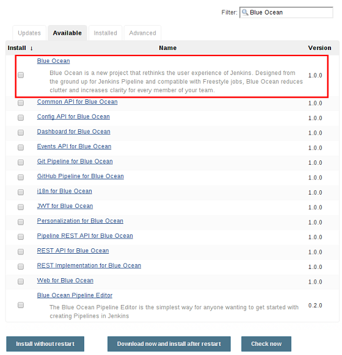
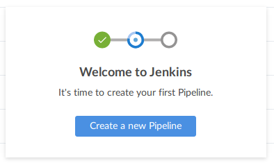
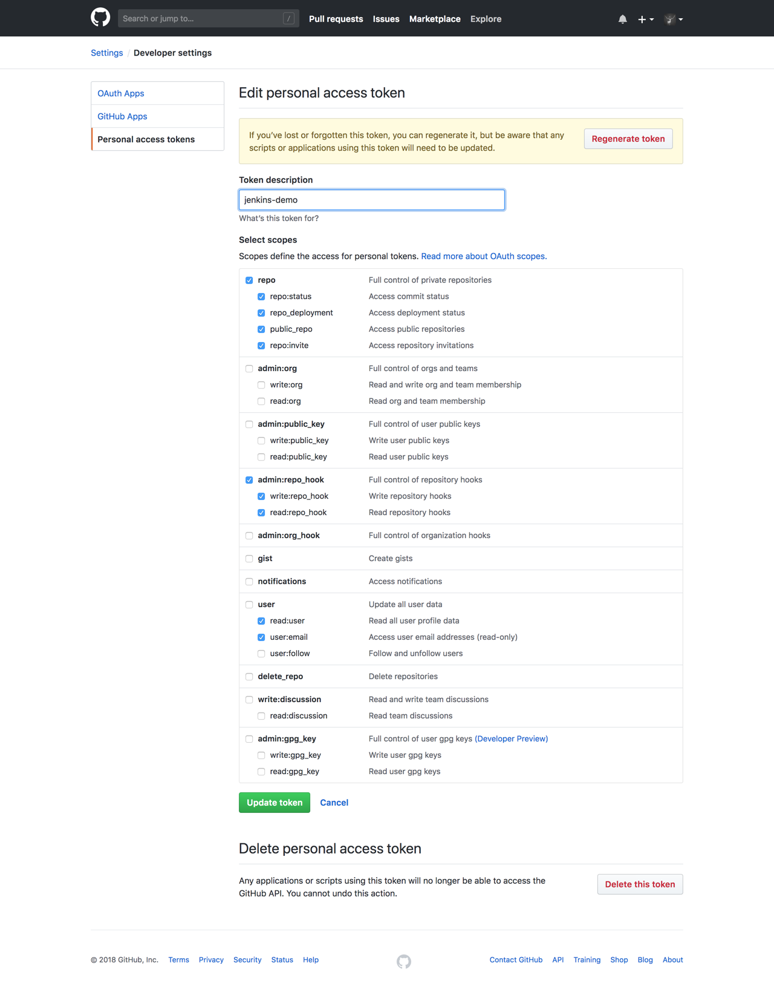
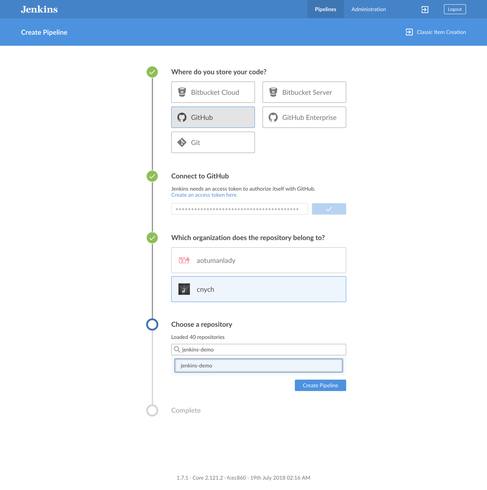
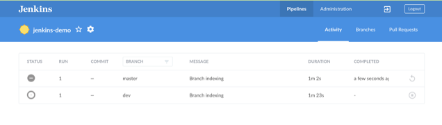
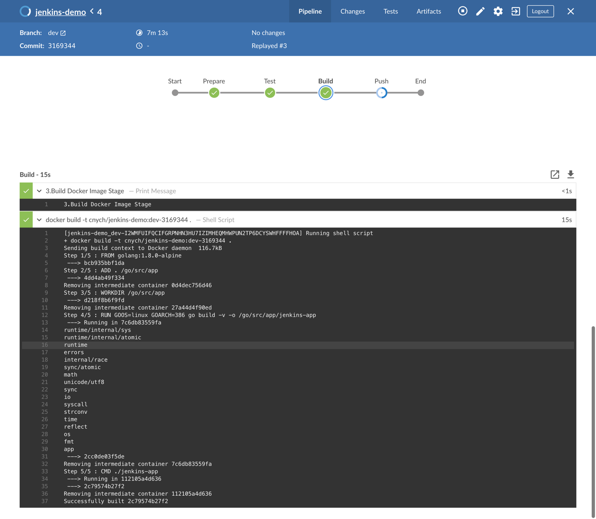
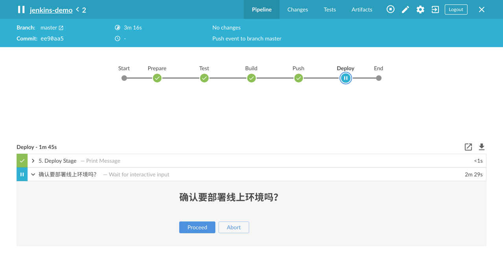

# Jenkins BlueOcean
上节课我们讲解了使用 Jenkins Pipeline 来自动化部署一个 Kubernetes 应用的方法，在实际的项目中，往往一个代码仓库都会有很多分支的，比如开发、测试、线上这些分支都是分开的，一般情况下开发或者测试的分支我们希望提交代码后就直接进行 CI/CD 操作，而线上的话最好增加一个人工干预的步骤，这就需要 Jenkins 对代码仓库有多分支的支持，当然这个特性是被 Jenkins 支持的。

## Jenkinsfile
同样的，我们可以使用上节课的方法直接把要构建的脚本配置在 Jenkins Web UI 界面中就可以，但是我们也提到过最佳的方式是将脚本写入一个名为 Jenkinsfile 的文件中，跟随代码库进行统一的管理。

我们这里在之前的 git 库中新建一个 dev 分支，然后更改 main.go 的代码，打印当前运行的代码分支，通过环境变量注入进去，所以我们我们通过 k8s.yaml 文件的环境变量把当前代码分支注入进去，具体代码可以参考[https://github.com/cnych/jenkins-demo/tree/dev](https://github.com/cnych/jenkins-demo/tree/dev)。

然后新建一个 Jenkinsfile 文件，将上节课的构建脚本拷贝进来，但是我们需要对其做一些修改：(Jenkinsfile)
```shell
node('haimaxy-jnlp') {
    stage('Prepare') {
        echo "1.Prepare Stage"
        checkout scm
        script {
            build_tag = sh(returnStdout: true, script: 'git rev-parse --short HEAD').trim()
            if (env.BRANCH_NAME != 'master') {
                build_tag = "${env.BRANCH_NAME}-${build_tag}"
            }
        }
    }
    stage('Test') {
      echo "2.Test Stage"
    }
    stage('Build') {
        echo "3.Build Docker Image Stage"
        sh "docker build -t cnych/jenkins-demo:${build_tag} ."
    }
    stage('Push') {
        echo "4.Push Docker Image Stage"
        withCredentials([usernamePassword(credentialsId: 'dockerHub', passwordVariable: 'dockerHubPassword', usernameVariable: 'dockerHubUser')]) {
            sh "docker login -u ${dockerHubUser} -p ${dockerHubPassword}"
            sh "docker push cnych/jenkins-demo:${build_tag}"
        }
    }
    stage('Deploy') {
        echo "5. Deploy Stage"
        if (env.BRANCH_NAME == 'master') {
            input "确认要部署线上环境吗？"
        }
        sh "sed -i 's/<BUILD_TAG>/${build_tag}/' k8s.yaml"
        sh "sed -i 's/<BRANCH_NAME>/${env.BRANCH_NAME}/' k8s.yaml"
        sh "kubectl apply -f k8s.yaml --record"
    }
}
```

在第一步中我们增加了**checkout scm**命令，用来检出代码仓库中当前分支的代码，为了避免各个环境的镜像 tag 产生冲突，我们为非 master 分支的代码构建的镜像增加了一个分支的前缀，在第五步中如果是 master 分支的话我们才增加一个确认部署的流程，其他分支都自动部署，并且还需要替换 k8s.yaml 文件中的环境变量的值。

更改完成后，提交 dev 分支到 github 仓库中。


## BlueOcean
我们这里使用 BlueOcean 这种方式来完成此处 CI/CD 的工作，BlueOcean 是 Jenkins 团队从用户体验角度出发，专为 Jenkins Pipeline 重新设计的一套 UI 界面，仍然兼容以前的 fressstyle 类型的 job，BlueOcean 具有以下的一些特性：

* 连续交付（CD）Pipeline 的复杂可视化，允许快速直观的了解 Pipeline 的状态
* 可以通过 Pipeline 编辑器直观的创建 Pipeline
* 需要干预或者出现问题时快速定位，BlueOcean 显示了 Pipeline 需要注意的地方，便于异常处理和提高生产力
* 用于分支和拉取请求的本地集成可以在 GitHub 或者 Bitbucket 中与其他人进行代码协作时最大限度提高开发人员的生产力。

BlueOcean 可以安装在现有的 Jenkins 环境中，也可以使用 Docker 镜像的方式直接运行，我们这里直接在现有的 Jenkins 环境中安装 BlueOcean 插件：登录 Jenkins Web UI -> 点击左侧的 Manage Jenkins -> Manage Plugins -> Available -> 搜索查找 BlueOcean -> 点击下载安装并重启



> 一般来说 Blue Ocean 在安装后不需要额外的配置，现有 Pipeline 和 Job 将继续照常运行。但是，Blue Ocean 在首次创建或添加 Pipeline的时候需要访问您的存储库（Git或GitHub）的权限，以便根据这些存储库创建 Pipeline。

安装完成后，我们可以在 Jenkins Web UI 首页左侧看到会多一个 Open Blue Ocean 的入口，我们点击就可以打开，如果之前没有创建过 Pipeline，则打开 Blue Ocean 后会看到一个**Create a new pipeline**的对话框：



然后我们点击开始创建一个新的 Pipeline，我们可以看到可以选择 Git、Bitbucket、GitHub，我们这里选择 GitHub，可以看到这里需要一个访问我们 GitHub 仓库权限的 token，在 GitHub 的仓库中创建一个 Personal access token:



然后将生成的 token 填入下面的创建 Pipeline 的流程中，然后我们就有权限选择自己的仓库，包括下面需要构建的仓库，比如我们这里需要构建的是 jenkins-demo 这个仓库，然后创建 Pipeline 即可：



Blue Ocean 会自动扫描仓库中的每个分支，会为根文件夹中包含**Jenkinsfile**的每个分支创建一个 Pipeline，比如我们这里有 master 和 dev 两个分支，并且两个分支下面都有 Jenkinsfile 文件，所以创建完成后会生成两个 Pipeline:



我们可以看到有两个任务在运行了，我们可以把 master 分支的任务停止掉，我们只运行 dev 分支即可，然后我们点击 dev 这个 pipeline 就可以进入本次构建的详细页面：



在上面的图中每个阶段我们都可以点击进去查看对应的构建结果，比如我们可以查看 Push 阶段下面的日志信息：
```shell
...
[jenkins-demo_dev-I2WMFUIFQCIFGRPNHN3HU7IZIMHEQMHWPUN2TP6DCYSWHFFFFHOA] Running shell script

+ docker push ****/jenkins-demo:dev-ee90aa5

The push refers to a repository [docker.io/****/jenkins-demo]

...
```
我们可以看到本次构建的 Docker 镜像的 Tag 为**dev-ee90aa5**，是符合我们在 Jenkinsfile 中的定义的吧

现在我们更改下 k8s.yaml 将 环境变量的值的标记改成 BRANCH_NAME，当然 Jenkinsfile 也要对应的更改，然后提交代码到 dev 分支并且 push 到 Github 仓库，我们可以看到 Jenkins Blue Ocean 里面自动触发了一次构建工作，最好同样我们可以看到本次构建能够正常完成，最后我们查看下本次构建的结果：
```shell
$ kubectl get pods
NAME                                      READY     STATUS        RESTARTS   AGE
...
jenkins-demo-648876568d-q5mbx             0/1       Completed     3          57s
...
$ kubectl logs jenkins-demo-648876568d-q5mbx
Hello, Kubernetes！I'm from Jenkins CI！
BRANCH: dev
```
我们可以看到打印了一句 BRANCH: dev ，证明我本次 CI/CD 是正常的。

现在我们来把 dev 分支的代码合并到 master 分支，然后来触发一次自动构建：
```shell
☁  jenkins-demo [dev] git status
On branch dev
nothing to commit, working directory clean
☁  jenkins-demo [dev] git checkout master
Switched to branch 'master'
Your branch is up-to-date with 'origin/master'.
☁  jenkins-demo [master] git merge dev
Updating 50e0401..ee90aa5
Fast-forward
 Jenkinsfile | 29 +++++++++--------------------
 k8s.yaml    |  3 +++
 main.go     |  2 ++
 3 files changed, 14 insertions(+), 20 deletions(-)
☁  jenkins-demo [master] git push origin master
Total 0 (delta 0), reused 0 (delta 0)
To git@github.com:cnych/jenkins-demo.git
   50e0401..ee90aa5  master -> master
```

然后我们回到 Jenkins 的 Blue Ocean 页面中，可以看到一个 master 分支下面的任务被自动触发了，同样我们进入详情页可以查看 Push 阶段下面的日志：
```shell
...
[jenkins-demo_master-XA3VZ5LP4XTCFAHHXIN3G5ZB4XA4J5H6I4DNKOH6JAXZXARF7LYQ] Running shell script

+ docker push ****/jenkins-demo:ee90aa5
...
```

我们可以查看到此处推送的镜像 TAG 为 ee90aa5，没有分支的前缀，是不是和我们前面在 Jenkinsfile 中的定义是一致的，镜像推送完成后，进入 Deploy 阶段的时候我们可以看到出现了一个暂停的操作，让我们选择是否需要部署到线上，我们前面是不是定义的如果是 master 分支的话，在部署的阶段需要我们人工确认：



然后我们点击**Proceed**才会继续后面的部署工作，确认后，我们同样可以去 Kubernetes 环境中查看下部署的结果：
```shell
$ kubectl get pods
NAME                                      READY     STATUS             RESTARTS   AGE
...
jenkins-demo-c69dc6fdf-6ssjf              0/1       Completed   5          4m
...
$ kubectl logs jenkins-demo-c69dc6fdf-6ssjf
Hello, Kubernetes！I'm from Jenkins CI！
BRANCH: master
```

现在我们可以看到打印出来的信息是 master，证明部署是没有问题的。


到这里我们就实现了多分支代码仓库的完整的 CI/CD 流程。

当然我们这里的示例还是太简单，只是单纯为了说明 CI/CD 的步骤，在后面的课程中，我们会结合其他的工具进一步对我们现有的方式进行改造，比如使用 Helm、Gitlab 等等。


另外如果你对声明式的 Pipeline 比较熟悉的话，我们推荐使用这种方式来编写 Jenkinsfile 文件，因为使用声明式的方式编写的 Jenkinsfile 文件在 Blue Ocean 中不但支持得非常好，我们还可以直接在 Blue Ocean Editor 中可视化的对我们的 Pipeline 进行编辑操作，非常方便。

> 我们会在单独的课程中对 Jenkinsfile 的声明式语法进行详细讲解，感兴趣的同学可以关注下。

