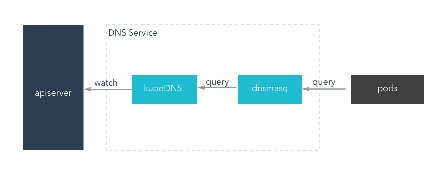

# 内部服务发现
前面我们给大家讲解了 Service 的用法，我们可以通过 Service 生成的 ClusterIP(VIP)来访问 Pod 提供的服务，但是在使用的时候还有一个问题：我们怎么知道某个应用的 VIP 呢？比如我们有两个应用，一个是 api 应用，一个是 db 应用，两个应用都是通过 Deployment 进行管理的，并且都通过 Service 暴露出了端口提供服务。api 需要连接到 db 这个应用，我们只知道 db 应用的名称和 db 对应的 Service 的名称，但是并不知道它的 VIP 地址，我们前面的 Service 课程中是不是学习到我们通过 ClusterIP 就可以访问到后面的 Pod 服务，如果我们知道了 VIP 的地址是不是就行了？

## apiserver
我们知道可以从 apiserver 中直接查询获取到对应 service 的后端 Endpoints信息，所以最简单的办法是从 apiserver 中直接查询，如果偶尔一个特殊的应用，我们通过 apiserver 去查询到 Service 后面的 Endpoints 直接使用是没问题的，但是如果每个应用都在启动的时候去查询依赖的服务，这不但增加了应用的复杂度，这也导致了我们的应用需要依赖 Kubernetes 了，耦合度太高了，不具有通用性。


## 环境变量
为了解决上面的问题，在之前的版本中，Kubernetes 采用了环境变量的方法，每个 Pod 启动的时候，会通过环境变量设置所有服务的 IP 和 port 信息，这样 Pod 中的应用可以通过读取环境变量来获取依赖服务的地址信息，这种方法使用起来相对简单，但是有一个很大的问题就是依赖的服务必须在 Pod 启动之前就存在，不然是不会被注入到环境变量中的。比如我们首先创建一个 Nginx 服务：(test-nginx.yaml)
```yaml
apiVersion: apps/v1beta1
kind: Deployment
metadata:
  name: nginx-deploy
  labels:
    k8s-app: nginx-demo
spec:
  replicas: 2
  template:
    metadata:
      labels:
        app: nginx
    spec:
      containers:
      - name: nginx
        image: nginx:1.7.9
        ports:
        - containerPort: 80

---
apiVersion: v1
kind: Service
metadata:
  name: nginx-service
  labels:
    name: nginx-service
spec:
  ports:
  - port: 5000
    targetPort: 80
  selector:
    app: nginx
```

创建上面的服务：
```shell
$ kubectl create -f test-nginx.yaml
deployment.apps "nginx-deploy" created
service "nginx-service" created
$ kubectl get pods
NAME                                      READY     STATUS    RESTARTS   AGE
...
nginx-deploy-75675f5897-47h4t             1/1       Running   0          53s
nginx-deploy-75675f5897-mmm8w             1/1       Running   0          53s
...
$ kubectl get svc
NAME            TYPE        CLUSTER-IP       EXTERNAL-IP   PORT(S)          AGE
...
nginx-service   ClusterIP   10.107.225.42    <none>        5000/TCP         1m
...
```

我们可以看到两个 Pod 和一个名为 nginx-service 的服务创建成功了，该 Service 监听的端口是 5000，同时它会把流量转发给它代理的所有 Pod（我们这里就是拥有 app: nginx 标签的两个 Pod）。

现在我们再来创建一个普通的 Pod，观察下该 Pod 中的环境变量是否包含上面的 nginx-service 的服务信息：（test-pod.yaml）
```yaml
apiVersion: v1
kind: Pod
metadata:
  name: test-pod
spec:
  containers:
  - name: test-service-pod
    image: busybox
    command: ["/bin/sh", "-c", "env"]
```

然后创建该测试的 Pod：
```yaml
$ kubectl create -f test-pod.yaml
pod "test-pod" created
```

等 Pod 创建完成后，我们查看日志信息：
```shell
$ kubectl logs test-pod
...
KUBERNETES_PORT=tcp://10.96.0.1:443
KUBERNETES_SERVICE_PORT=443
HOSTNAME=test-pod
HOME=/root
NGINX_SERVICE_PORT_5000_TCP_ADDR=10.107.225.42
NGINX_SERVICE_PORT_5000_TCP_PORT=5000
NGINX_SERVICE_PORT_5000_TCP_PROTO=tcp
KUBERNETES_PORT_443_TCP_ADDR=10.96.0.1
PATH=/usr/local/sbin:/usr/local/bin:/usr/sbin:/usr/bin:/sbin:/bin
NGINX_SERVICE_SERVICE_HOST=10.107.225.42
NGINX_SERVICE_PORT_5000_TCP=tcp://10.107.225.42:5000
KUBERNETES_PORT_443_TCP_PORT=443
KUBERNETES_PORT_443_TCP_PROTO=tcp
NGINX_SERVICE_SERVICE_PORT=5000
NGINX_SERVICE_PORT=tcp://10.107.225.42:5000
KUBERNETES_SERVICE_PORT_HTTPS=443
KUBERNETES_PORT_443_TCP=tcp://10.96.0.1:443
KUBERNETES_SERVICE_HOST=10.96.0.1
PWD=/
...
```

我们可以看到打印了很多环境变量处理，其中就包括我们刚刚创建的 nginx-service 这个服务，有 HOST、PORT、PROTO、ADDR 等，也包括其他已经存在的 Service 的环境变量，现在如果我们需要在这个 Pod 里面访问 nginx-service 的服务，我们是不是可以直接通过 NGINX_SERVICE_SERVICE_HOST 和 NGINX_SERVICE_SERVICE_PORT 就可以了，但是我们也知道如果这个 Pod 启动起来的时候如果 nginx-service 服务还没启动起来，在环境变量中我们是无法获取到这些信息的，当然我们可以通过 initContainer 之类的方法来确保 nginx-service 启动后再启动 Pod，但是这种方法毕竟增加了 Pod 启动的复杂性，所以这不是最优的方法。


## KubeDNS
由于上面环境变量这种方式的局限性，我们需要一种更加智能的方案，其实我们可以自己想学一种比较理想的方案：那就是可以直接使用 Service 的名称，因为 Service 的名称不会变化，我们不需要去关心分配的 ClusterIP 的地址，因为这个地址并不是固定不变的，所以如果我们直接使用 Service 的名字，然后对应的 ClusterIP 地址的转换能够自动完成就很好了。我们知道名字和 IP 直接的转换是不是和我们平时访问的网站非常类似啊？他们之间的转换功能通过 DNS 就可以解决了，同样的，Kubernetes 也提供了 DNS 的方案来解决上面的服务发现的问题。

### kubedns 介绍
DNS 服务不是一个独立的系统服务，而是作为一种 addon 插件而存在，也就是说不是 Kubernetes 集群必须安装的，当然我们强烈推荐安装，可以将这个插件看成是一种运行在 Kubernetes 集群上的一直比较特殊的应用，现在比较推荐的两个插件：kube-dns 和 CoreDNS。我们在前面使用 kubeadm 搭建集群的时候直接安装的 kube-dns 插件，如果不记得了可以回头去看一看。当然如果我们想使用 CoreDNS 的话也很方便，只需要执行下面的命令即可：
```shell
$ kubeadm init --feature-gates=CoreDNS=true
```

Kubernetes DNS pod 中包括 3 个容器，可以通过 kubectl 工具查看：
```shell
$ kubectl get pods -n kube-system
NAME                                    READY     STATUS    RESTARTS   AGE
...
kube-dns-5868f69869-zp5kz               3/3       Running   0          19d
...
```

READY 一栏可以看到是 3/3，用如下命令可以很清楚的看到 kube-dns 包含的3个容器：
```shell
$ kubectl describe pod kube-dns-5868f69869-zp5kz -n kube-system
```

kube-dns、dnsmasq-nanny、sidecar 这3个容器分别实现了什么功能?

* kubedns: kubedns 基于 SkyDNS 库，通过 apiserver 监听 Service 和 Endpoints 的变更事件同时也同步到本地 Cache，实现了一个实时的 Kubernetes 集群内 Service 和 Pod 的 DNS服务发现
* dnsmasq: dsnmasq 容器则实现了 DNS 的缓存功能(在内存中预留一块默认大小为 1G 的地方，保存当前最常用的 DNS 查询记录，如果缓存中没有要查找的记录，它会到 kubedns 中查询，并把结果缓存起来)，通过监听 ConfigMap 来动态生成配置
* sider: sidecar 容器实现了可配置的 DNS 探测，并采集对应的监控指标暴露出来供 prometheus 使用



### 对 Pod 的影响

DNS Pod 具有静态 IP 并作为 Kubernetes 服务暴露出来。该静态 IP 被分配后，kubelet 会将使用 `--cluster-dns = <dns-service-ip>`参数配置的 DNS 传递给每个容器。DNS 名称也需要域名，本地域可以使用参数`--cluster-domain = <default-local-domain>`在 kubelet 中配置。

我们说 dnsmasq 容器通过监听 ConfigMap 来动态生成配置，可以自定义存根域和上下游域名服务器。

例如，下面的 ConfigMap 建立了一个 DNS 配置，它具有一个单独的存根域和两个上游域名服务器：
```yaml
apiVersion: v1
kind: ConfigMap
metadata:
  name: kube-dns
  namespace: kube-system
data:
  stubDomains: |
    {"acme.local": ["1.2.3.4"]}
  upstreamNameservers: |
    ["8.8.8.8", "8.8.4.4"]
```
按如上说明，具有**.acme.local**后缀的 DNS 请求被转发到 DNS 1.2.3.4。Google 公共 DNS 服务器 为上游查询提供服务。下表描述了具有特定域名的查询如何映射到它们的目标 DNS 服务器：

| 域名                                 | 响应查询的服务器                      |
| ------------------------------------ | ------------------------------------- |
| kubernetes.default.svc.cluster.local | kube-dns                              |
| foo.acme.local                       | 自定义 DNS (1.2.3.4)                  |
| widget.com                           | 上游 DNS (8.8.8.8, 8.8.4.4，其中之一) |


另外我们还可以为每个 Pod 设置 DNS 策略。 当前 Kubernetes 支持两种 Pod 特定的 DNS 策略：“Default” 和 “ClusterFirst”。 可以通过 dnsPolicy 标志来指定这些策略。

> 注意：**Default** 不是默认的 DNS 策略。如果没有显式地指定**dnsPolicy**，将会使用 **ClusterFirst**

* 如果 dnsPolicy 被设置为 “Default”，则名字解析配置会继承自 Pod 运行所在的节点。自定义上游域名服务器和存根域不能够与这个策略一起使用
* 如果 dnsPolicy 被设置为 “ClusterFirst”，这就要依赖于是否配置了存根域和上游 DNS 服务器
    * 未进行自定义配置：没有匹配上配置的集群域名后缀的任何请求，例如 “www.kubernetes.io”，将会被转发到继承自节点的上游域名服务器。
    * 进行自定义配置：如果配置了存根域和上游 DNS 服务器（类似于 前面示例 配置的内容），DNS 查询将基于下面的流程对请求进行路由：
        * 查询首先被发送到 kube-dns 中的 DNS 缓存层。
        * 从缓存层，检查请求的后缀，并根据下面的情况转发到对应的 DNS 上：
            * 具有集群后缀的名字（例如 “.cluster.local”）：请求被发送到 kubedns。
            * 具有存根域后缀的名字（例如 “.acme.local”）：请求被发送到配置的自定义 DNS 解析器（例如：监听在 1.2.3.4）。
            * 未能匹配上后缀的名字（例如 “widget.com”）：请求被转发到上游 DNS（例如：Google 公共 DNS 服务器，8.8.8.8 和 8.8.4.4）。


### 域名格式
我们前面说了如果我们建立的 Service 如果支持域名形式进行解析，就可以解决我们的服务发现的功能，那么利用 kubedns 可以将 Service 生成怎样的 DNS 记录呢？

* 普通的 Service：会生成 servicename.namespace.svc.cluster.local 的域名，会解析到 Service 对应的 ClusterIP 上，在 Pod 之间的调用可以简写成 servicename.namespace，如果处于同一个命名空间下面，甚至可以只写成 servicename 即可访问
* Headless Service：无头服务，就是把 clusterIP 设置为 None 的，会被解析为指定 Pod 的 IP 列表，同样还可以通过 podname.servicename.namespace.svc.cluster.local 访问到具体的某一个 Pod。

> CoreDNS 实现的功能和 KubeDNS 是一致的，不过 CoreDNS 的所有功能都集成在了同一个容器中，在最新版的1.11.0版本中官方已经推荐使用 CoreDNS了，大家也可以安装 CoreDNS 来代替 KubeDNS，其他使用方法都是一致的：https://coredns.io/

## 测试
现在我们来使用一个简单 Pod 来测试下 Service 的域名访问：
```shell
$ kubectl run --rm -i --tty test-dns --image=busybox /bin/sh
If you don't see a command prompt, try pressing enter.
/ # cat /etc/resolv.conf
nameserver 10.96.0.10
search default.svc.cluster.local svc.cluster.local cluster.local
options ndots:5
/ #
```

我们进入到 Pod 中，查看**/etc/resolv.conf**中的内容，可以看到 nameserver 的地址**10.96.0.10**，该 IP 地址即是在安装 kubedns 插件的时候集群分配的一个固定的静态 IP 地址，我们可以通过下面的命令进行查看：
```shell
$ kubectl get svc kube-dns -n kube-system
NAME       TYPE        CLUSTER-IP   EXTERNAL-IP   PORT(S)         AGE
kube-dns   ClusterIP   10.96.0.10   <none>        53/UDP,53/TCP   62d
```

也就是说我们这个 Pod 现在默认的 nameserver 就是 kubedns 的地址，现在我们来访问下前面我们创建的 nginx-service 服务：
```shell
/ # wget -q -O- nginx-service.default.svc.cluster.local

```

可以看到上面我们使用 wget 命令去访问 nginx-service 服务的域名的时候被 hang 住了，没有得到期望的结果，这是因为上面我们建立 Service 的时候暴露的端口是 5000：
```shell
/ # wget -q -O- nginx-service.default.svc.cluster.local:5000
<!DOCTYPE html>
<html>
<head>
<title>Welcome to nginx!</title>
<style>
    body {
        width: 35em;
        margin: 0 auto;
        font-family: Tahoma, Verdana, Arial, sans-serif;
    }
</style>
</head>
<body>
<h1>Welcome to nginx!</h1>
<p>If you see this page, the nginx web server is successfully installed and
working. Further configuration is required.</p>

<p>For online documentation and support please refer to
<a href="http://nginx.org/">nginx.org</a>.<br/>
Commercial support is available at
<a href="http://nginx.com/">nginx.com</a>.</p>

<p><em>Thank you for using nginx.</em></p>
</body>
</html>
```

加上 5000 端口，就正常访问到服务，再试一试访问：nginx-service.default.svc、nginx-service.default、nginx-service，不出意外这些域名都可以正常访问到期望的结果。

到这里我们是不是就实现了在集群内部通过 Service 的域名形式进行互相通信了，大家下去试着看看访问不同 namespace 下面的服务呢？下节课我们来给大家讲解使用 ingress 来实现集群外部的服务发现功能。
