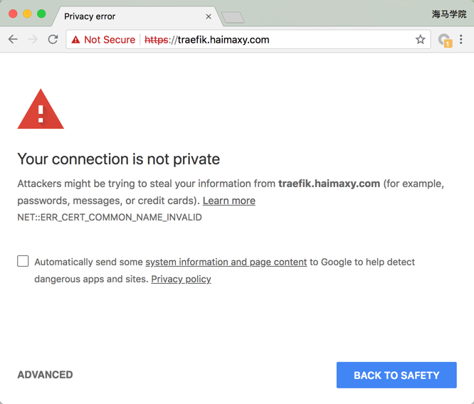
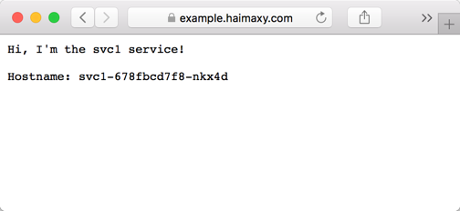

# ingress tls
上节课给大家展示了 traefik 的安装使用以及简单的 ingress 的配置方法，这节课我们来学习一下 ingress tls 以及 path 路径在 ingress 对象中的使用方法。

## TLS 认证
在现在大部分场景下面我们都会使用 https 来访问我们的服务，这节课我们将使用一个自签名的证书，当然你有在一些正规机构购买的 CA 证书是最好的，这样任何人访问你的服务的时候都是受浏览器信任的证书。使用下面的 openssl 命令生成 CA 证书：
```shell
$ openssl req -newkey rsa:2048 -nodes -keyout tls.key -x509 -days 365 -out tls.crt
```

现在我们有了证书，我们可以使用 kubectl 创建一个 secret 对象来存储上面的证书：
```shell
$ kubectl create secret generic traefik-cert --from-file=tls.crt --from-file=tls.key -n kube-system
```

### 配置 Traefik
前面我们使用的是 Traefik 的默认配置，现在我们来配置 Traefik，让其支持 https：
```
defaultEntryPoints = ["http", "https"]

[entryPoints]
  [entryPoints.http]
  address = ":80"
    [entryPoints.http.redirect]
      entryPoint = "https"
  [entryPoints.https]
  address = ":443"
    [entryPoints.https.tls]
      [[entryPoints.https.tls.certificates]]
      CertFile = "/ssl/tls.crt"
      KeyFile = "/ssl/tls.key"
```

上面的配置文件中我们配置了 http 和 https 两个入口，并且配置了将 http 服务强制跳转到 https 服务，这样我们所有通过 traefik 进来的服务都是 https 的，要访问 https 服务，当然就得配置对应的证书了，可以看到我们指定了 CertFile 和 KeyFile 两个文件，由于 traefik pod 中并没有这两个证书，所以我们要想办法将上面生成的证书挂载到 Pod 中去，是不是前面我们讲解过 secret 对象可以通过 volume 形式挂载到 Pod 中？至于上面的 traefik.toml 这个文件我们要怎么让 traefik pod 能够访问到呢？还记得我们前面讲过的 ConfigMap 吗？我们是不是可以将上面的 traefik.toml 配置文件通过一个 ConfigMap 对象挂载到 traefik pod 中去：
```shell
$ kubectl create configmap traefik-conf --from-file=traefik.toml -n kube-system
```

现在就可以更改下上节课的 traefik pod 的 yaml 文件了：
```yaml
kind: Deployment
apiVersion: extensions/v1beta1
metadata:
  name: traefik-ingress-controller
  namespace: kube-system
  labels:
    k8s-app: traefik-ingress-lb
spec:
  replicas: 1
  selector:
    matchLabels:
      k8s-app: traefik-ingress-lb
  template:
    metadata:
      labels:
        k8s-app: traefik-ingress-lb
        name: traefik-ingress-lb
    spec:
      serviceAccountName: traefik-ingress-controller
      terminationGracePeriodSeconds: 60
      volumes:
      - name: ssl
        secret:
          secretName: traefik-cert
      - name: config
        configMap:
          name: traefik-conf
      tolerations:
      - operator: "Exists"
      nodeSelector:
        kubernetes.io/hostname: master
      containers:
      - image: traefik
        name: traefik-ingress-lb
        volumeMounts:
        - mountPath: "/ssl"
          name: "ssl"
        - mountPath: "/config"
          name: "config"
        ports:
        - name: http
          containerPort: 80
          hostPort: 80
        - name: https
          containerPort: 443
          hostPort: 443
        - name: admin
          containerPort: 8080
        args:
        - --configfile=/config/traefik.toml
        - --api
        - --kubernetes
        - --logLevel=INFO
```

和之前的比较，我们增加了 443 的端口配置，以及启动参数中通过 configfile 指定了 traefik.toml 配置文件，这个配置文件是通过 volume 挂载进来的。然后更新下 traefik pod:
```shell
$ kubectl apply -f traefik.yaml
$ kubectl logs -f traefik-ingress-controller-7dcfd9c6df-v58k7 -n kube-system
time="2018-08-26T11:26:44Z" level=info msg="Server configuration reloaded on :80"
time="2018-08-26T11:26:44Z" level=info msg="Server configuration reloaded on :443"
time="2018-08-26T11:26:44Z" level=info msg="Server configuration reloaded on :8080"
```

更新完成后我们查看 traefik pod 的日志，如果出现类似于上面的一些日志信息，证明更新成功了。现在我们去访问 traefik 的 dashboard 会跳转到 https 的地址，并会提示证书相关的报警信息，这是因为我们的证书是我们自建的，并不受浏览器信任，如果你是正规机构购买的证书并不会出现改报警信息，你应该可以看到我们常见的绿色标志：


点击下面的高级，我们可以强制让其跳转，这样我们就可以正常访问 traefik 的 dashboard 了。


### 配置 ingress 

其实上面的 TLS 认证方式已经成功了，接下来我们通过一个实例来说明下 ingress 中 path 的用法，这里我们部署了3个简单的 web 服务，通过一个环境变量来标识当前运行的是哪个服务：（backend.yaml）

```yaml
kind: Deployment
apiVersion: extensions/v1beta1
metadata:
  name: svc1
spec:
  replicas: 1
  template:
    metadata:
      labels:
        app: svc1
    spec:
      containers:
      - name: svc1
        image: cnych/example-web-service
        env:
        - name: APP_SVC
          value: svc1
        ports:
        - containerPort: 8080
          protocol: TCP

---
kind: Deployment
apiVersion: extensions/v1beta1
metadata:
  name: svc2
spec:
  replicas: 1
  template:
    metadata:
      labels:
        app: svc2
    spec:
      containers:
      - name: svc2
        image: cnych/example-web-service
        env:
        - name: APP_SVC
          value: svc2
        ports:
        - containerPort: 8080
          protocol: TCP

---
kind: Deployment
apiVersion: extensions/v1beta1
metadata:
  name: svc3
spec:
  replicas: 1
  template:
    metadata:
      labels:
        app: svc3
    spec:
      containers:
      - name: svc3
        image: cnych/example-web-service
        env:
        - name: APP_SVC
          value: svc3
        ports:
        - containerPort: 8080
          protocol: TCP

---
kind: Service
apiVersion: v1
metadata:
  labels:
    app: svc1
  name: svc1
spec:
  type: ClusterIP
  ports:
  - port: 8080
    name: http
  selector:
    app: svc1

---
kind: Service
apiVersion: v1
metadata:
  labels:
    app: svc2
  name: svc2
spec:
  type: ClusterIP
  ports:
  - port: 8080
    name: http
  selector:
    app: svc2

---
kind: Service
apiVersion: v1
metadata:
  labels:
    app: svc3
  name: svc3
spec:
  type: ClusterIP
  ports:
  - port: 8080
    name: http
  selector:
    app: svc3
```

可以看到上面我们定义了3个 Deployment，分别对应3个 Service：
```shell
$ kubectl create -f backend.yaml
deployment.extensions "svc1" created
deployment.extensions "svc2" created
deployment.extensions "svc3" created
service "svc1" created
service "svc2" created
service "svc3" created
```

然后我们创建一个 ingress 对象来访问上面的3个服务：（example-ingress.yaml）
```yaml
apiVersion: extensions/v1beta1
kind: Ingress
metadata:
  name: example-web-app
  annotations:
    kubernetes.io/ingress.class: "traefik"
spec:
  rules:
  - host: example.haimaxy.com
    http:
      paths:
      - path: /s1
        backend:
          serviceName: svc1
          servicePort: 8080
      - path: /s2
        backend:
          serviceName: svc2
          servicePort: 8080
      - path: /
        backend:
          serviceName: svc3
          servicePort: 8080
```

注意我们这里定义的 ingress 对象和之前有一个不同的地方是我们增加了 path 路径的定义，不指定的话默认是 '/'，创建该 ingress 对象：
```shell
$ kubectl create -f test-ingress.yaml
ingress.extensions "example-web-app" created
$ kubectl get ingress
NAME              HOSTS                 ADDRESS   PORTS     AGE
example-web-app   example.haimaxy.com             80        1m
$ kubectl describe ingress example-web-app
Name:             example-web-app
Namespace:        default
Address:
Default backend:  default-http-backend:80 (<none>)
Rules:
  Host                 Path  Backends
  ----                 ----  --------
  example.haimaxy.com
                       /s1   svc1:8080 (<none>)
                       /s2   svc2:8080 (<none>)
                       /     svc3:8080 (<none>)
Annotations:
  kubernetes.io/ingress.class:  traefik
Events:                         <none>
```

现在我们可以在本地 hosts 里面给域名 example.haimaxy.com 添加对应的 hosts 解析，然后就可以在浏览器中访问，可以看到默认也会跳转到 https 的页面：


我们可以看到访问上面的域名得到的结果是 svc3 service！这是因为上面在 ingress 中我们为域名的跟路径匹配的是 svc3 这个 service，同样的，我们访问http://example.haimaxy.com/s1 得到的应该就是 svc1 这个 service 了：


访问http://example.haimaxy.com/s2 得到的应该就是 svc2 这个 service 了：


> 这里我们需要注意的是根路径`/`必须在 ingress 对象中声明的时候必须放在最后面，不然就都被`/`匹配到拦截到了，大家可以尝试下把`/`这个 path 放在最上面，然后访问下 s1 和 s2 这两个 path，看看得到的结果是怎样的？

有的同学可能有这样的需求，就是不同的 ingress 对象是供不同的域名进行使用的，然后不同的域名的证书还不相同，这样我们想使用上面 traefik 给大家提供的统一的 https 证书就不行了，这个时候我们就可以单独为当前的服务提供单独的证书就可以，同样用证书文件创建一个 secret 对象，然后在 ingress 对象中声明一个 tls 对象即可，比如上面的 example.haimaxy.com 我们可以单独指定一个证书文件：
```yaml
apiVersion: extensions/v1beta1
kind: Ingress
metadata:
  name: example-web-app
  annotations:
    kubernetes.io/ingress.class: "traefik"
spec:
  tls:
    - secretName: traefik-cert
  rules:
  - host:
...
```
