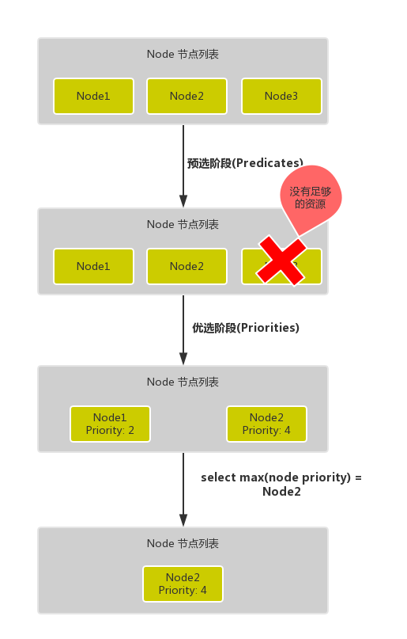
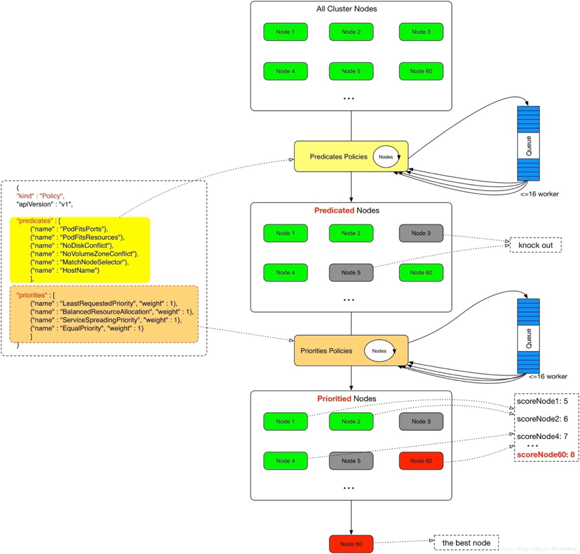

# 50. Kubernetes 调度器介绍
`kube-scheduler`是 kubernetes 系统的核心组件之一，主要负责整个集群资源的调度功能，根据特定的调度算法和策略，将 Pod 调度到最优的工作节点上面去，从而更加合理、更加充分的利用集群的资源，这也是我们选择使用 kubernetes 一个非常重要的理由。如果一门新的技术不能帮助企业节约成本、提供效率，我相信是很难推进的。

## 调度流程
默认情况下，kube-scheduler 提供的默认调度器能够满足我们绝大多数的要求，我们前面和大家接触的示例也基本上用的默认的策略，都可以保证我们的 Pod 可以被分配到资源充足的节点上运行。但是在实际的线上项目中，可能我们自己会比 kubernetes 更加了解我们自己的应用，比如我们希望一个 Pod 只能运行在特定的几个节点上，或者这几个节点只能用来运行特定类型的应用，这就需要我们的调度器能够可控。

`kube-scheduler` 是 kubernetes 的调度器，它的主要作用就是根据特定的调度算法和调度策略将 Pod 调度到合适的 Node 节点上去，是一个独立的二进制程序，启动之后会一直监听 API Server，获取到 PodSpec.NodeName 为空的 Pod，对每个 Pod 都会创建一个 binding。


 
这个过程在我们看来好像比较简单，但在实际的生产环境中，需要考虑的问题就有很多了：

* 如何保证全部的节点调度的公平性？要知道并不是说有节点资源配置都是一样的
* 如何保证每个节点都能被分配资源？
* 集群资源如何能够被高效利用？
* 集群资源如何才能被最大化使用？
* 如何保证 Pod 调度的性能和效率？
* 用户是否可以根据自己的实际需求定制自己的调度策略？

考虑到实际环境中的各种复杂情况，kubernetes 的调度器采用插件化的形式实现，可以方便用户进行定制或者二次开发，我们可以自定义一个调度器并以插件形式和 kubernetes 进行集成。

kubernetes 调度器的源码位于 kubernetes/pkg/scheduler 中，大体的代码目录结构如下所示：(不同的版本目录结构可能不太一样)
```shell
kubernetes/pkg/scheduler  
-- scheduler.go         //调度相关的具体实现              
|-- algorithm
|   |-- predicates      //节点筛选策略
|   |-- priorities      //节点打分策略
|-- algorithmprovider
|   |-- defaults         //定义默认的调度器  
```

其中 Scheduler 创建和运行的核心程序，对应的代码在 pkg/scheduler/scheduler.go，如果要查看`kube-scheduler`的入口程序，对应的代码在 cmd/kube-scheduler/scheduler.go。

调度主要分为以下几个部分：

* 首先是**预选过程**，过滤掉不满足条件的节点，这个过程称为`Predicates`
* 然后是**优选过程**，对通过的节点按照优先级排序，称之为`Priorities`
* 最后从中选择优先级最高的节点，如果中间任何一步骤有错误，就直接返回错误

`Predicates`阶段首先遍历全部节点，过滤掉不满足条件的节点，属于强制性规则，这一阶段输出的所有满足要求的 Node 将被记录并作为第二阶段的输入，如果所有的节点都不满足条件，那么 Pod 将会一直处于 Pending 状态，直到有节点满足条件，在这期间调度器会不断的重试。

> 所以我们在部署应用的时候，如果发现有 Pod 一直处于 Pending 状态，那么就是没有满足调度条件的节点，这个时候可以去检查下节点资源是否可用。

`Priorities`阶段即再次对节点进行筛选，如果有多个节点都满足条件的话，那么系统会按照节点的优先级(priorites)大小对节点进行排序，最后选择优先级最高的节点来部署 Pod 应用。

下面是调度过程的简单示意图：



更详细的流程是这样的：

* 首先，客户端通过 API Server 的 REST API 或者 kubectl 工具创建 Pod 资源
* API Server 收到用户请求后，存储相关数据到 etcd 数据库中
* 调度器监听 API Server 查看为调度(bind)的 Pod 列表，循环遍历地为每个 Pod 尝试分配节点，这个分配过程就是我们上面提到的两个阶段：
    * 预选阶段(Predicates)，过滤节点，调度器用一组规则过滤掉不符合要求的 Node 节点，比如 Pod 设置了资源的 request，那么可用资源比 Pod 需要的资源少的主机显然就会被过滤掉
    * 优选阶段(Priorities)，为节点的优先级打分，将上一阶段过滤出来的 Node 列表进行打分，调度器会考虑一些整体的优化策略，比如把 Deployment 控制的多个 Pod 副本分布到不同的主机上，使用最低负载的主机等等策略
* 经过上面的阶段过滤后选择打分最高的 Node 节点和 Pod 进行 binding 操作，然后将结果存储到 etcd 中
* 最后被选择出来的 Node 节点对应的 kubelet 去执行创建 Pod 的相关操作


其中`Predicates`过滤有一系列的算法可以使用，我们这里简单列举几个：

* PodFitsResources：节点上剩余的资源是否大于 Pod 请求的资源
* PodFitsHost：如果 Pod 指定了 NodeName，检查节点名称是否和 NodeName 匹配
* PodFitsHostPorts：节点上已经使用的 port 是否和 Pod 申请的 port 冲突
* PodSelectorMatches：过滤掉和 Pod 指定的 label 不匹配的节点
* NoDiskConflict：已经 mount 的 volume 和 Pod 指定的 volume 不冲突，除非它们都是只读的
* CheckNodeDiskPressure：检查节点磁盘空间是否符合要求
* CheckNodeMemoryPressure：检查节点内存是否够用

除了这些过滤算法之外，还有一些其他的算法，更多更详细的我们可以查看源码文件：k8s.io/kubernetes/pkg/scheduler/algorithm/predicates/predicates.go。

而`Priorities`优先级是由一系列键值对组成的，键是该优先级的名称，值是它的权重值，同样，我们这里给大家列举几个具有代表性的选项：

* LeastRequestedPriority：通过计算 CPU 和内存的使用率来决定权重，使用率越低权重越高，当然正常肯定也是资源是使用率越低权重越高，能给别的 Pod 运行的可能性就越大
* SelectorSpreadPriority：为了更好的高可用，对同属于一个 Deployment 或者 RC 下面的多个 Pod 副本，尽量调度到多个不同的节点上，当一个 Pod 被调度的时候，会先去查找该 Pod 对应的 controller，然后查看该 controller 下面的已存在的 Pod，运行 Pod 越少的节点权重越高
* ImageLocalityPriority：就是如果在某个节点上已经有要使用的镜像节点了，镜像总大小值越大，权重就越高
* NodeAffinityPriority：这个就是根据节点的亲和性来计算一个权重值，后面我们会详细讲解亲和性的使用方法

除了这些策略之外，还有很多其他的策略，同样我们可以查看源码文件：k8s.io/kubernetes/pkg/scheduler/algorithm/priorities/ 了解更多信息。每一个优先级函数会返回一个0-10的分数，分数越高表示节点越优，同时每一个函数也会对应一个表示权重的值。最终主机的得分用以下公式计算得出：
```shell
finalScoreNode = (weight1 * priorityFunc1) + (weight2 * priorityFunc2) + … + (weightn * priorityFuncn)
```


## 自定义调度
上面就是 kube-scheduler 默认调度的基本流程，除了使用默认的调度器之外，我们也可以自定义调度策略。

### 调度器扩展
`kube-scheduler`在启动的时候可以通过 `--policy-config-file`参数来指定调度策略文件，我们可以根据我们自己的需要来组装`Predicates`和`Priority`函数。选择不同的过滤函数和优先级函数、控制优先级函数的权重、调整过滤函数的顺序都会影响调度过程。

下面是官方的 Policy 文件示例：
```json
{
    "kind" : "Policy",
    "apiVersion" : "v1",
    "predicates" : [
        {"name" : "PodFitsHostPorts"},
        {"name" : "PodFitsResources"},
        {"name" : "NoDiskConflict"},
        {"name" : "NoVolumeZoneConflict"},
        {"name" : "MatchNodeSelector"},
        {"name" : "HostName"}
    ],
    "priorities" : [
        {"name" : "LeastRequestedPriority", "weight" : 1},
        {"name" : "BalancedResourceAllocation", "weight" : 1},
        {"name" : "ServiceSpreadingPriority", "weight" : 1},
        {"name" : "EqualPriority", "weight" : 1}
    ]
}
```

### 多调度器
如果默认的调度器不满足要求，还可以部署自定义的调度器。并且，在整个集群中还可以同时运行多个调度器实例，通过 podSpec.schedulerName 来选择使用哪一个调度器（默认使用内置的调度器）。
```yaml
apiVersion: v1
kind: Pod
metadata:
  name: nginx
  labels:
    app: nginx
spec:
  schedulerName: my-scheduler  # 选择使用自定义调度器 my-scheduler
  containers:
  - name: nginx
    image: nginx:1.10
```

要开发我们自己的调度器也是比较容易的，比如我们这里的 my-scheduler:

* 首先需要通过指定的 API 获取节点和 Pod
* 然后选择`phase=Pending`和`schedulerName=my-scheduler`的pod
* 计算每个 Pod 需要放置的位置之后，调度程序将创建一个`Binding`对象
* 然后根据我们自定义的调度器的算法计算出最适合的目标节点

### 优先级调度
与前面所讲的调度优选策略中的优先级（Priorities）不同，前面所讲的优先级指的是节点优先级，而我们这里所说的优先级 pod priority 指的是 Pod 的优先级，高优先级的 Pod 会优先被调度，或者在资源不足低情况牺牲低优先级的 Pod，以便于重要的 Pod 能够得到资源部署。

要定义 Pod 优先级，就需要先定义`PriorityClass`对象，该对象没有 Namespace 的限制：
```yaml
apiVersion: v1
kind: PriorityClass
metadata:
  name: high-priority
value: 1000000
globalDefault: false
description: "This priority class should be used for XYZ service pods only."
```

其中：

* `value`为 32 位整数的优先级，该值越大，优先级越高
* `globalDefault`用于未配置 PriorityClassName 的 Pod，整个集群中应该只有一个`PriorityClass`将其设置为 true


然后通过在 Pod 的`spec.priorityClassName`中指定已定义的`PriorityClass`名称即可：
```yaml
apiVersion: v1
kind: Pod
metadata:
  name: nginx
  labels:
    app: nginx
spec:
  containers:
  - name: nginx
    image: nginx
    imagePullPolicy: IfNotPresent
  priorityClassName: high-priority
```

另外一个值得注意的是当节点没有足够的资源供调度器调度 Pod，导致 Pod 处于 pending 时，抢占（preemption）逻辑就会被触发。`Preemption`会尝试从一个节点删除低优先级的 Pod，从而释放资源使高优先级的 Pod 得到节点资源进行部署。

现在我们通过下面的图再去回顾下 kubernetes 的调度过程是不是就清晰很多了：


下节课我们再和大家讲解关于 Pod 调度的一些具体使用方法。

