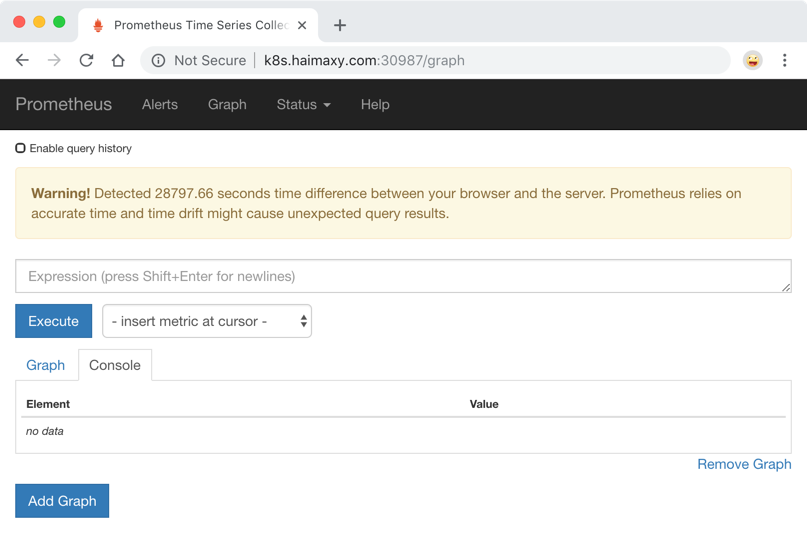
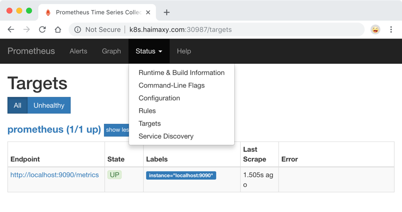
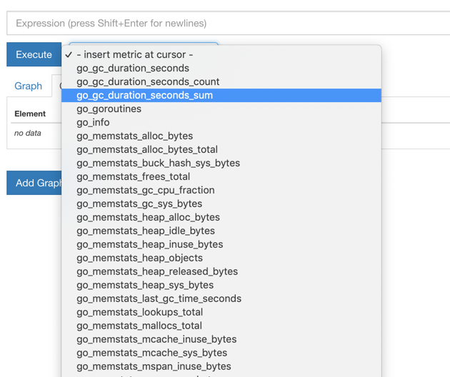
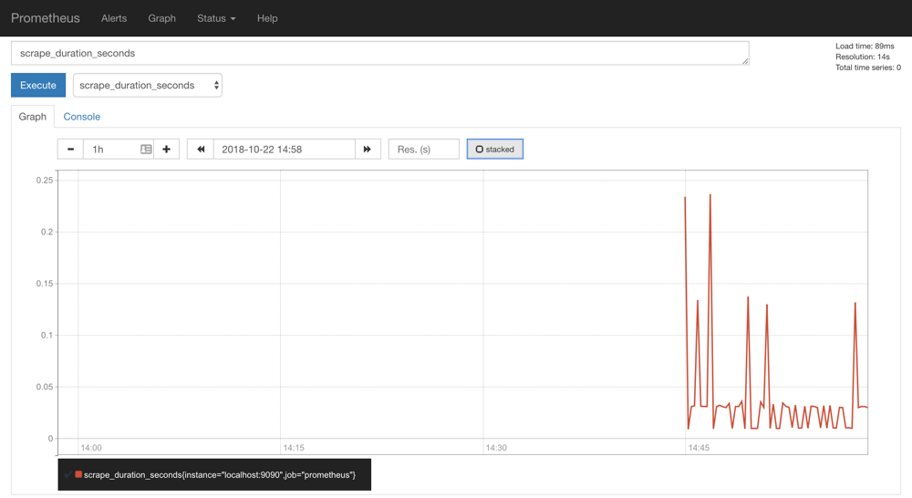

# 52. 在 Kubernets 中手动安装 Prometheus
从今天开始我们就和大家一起来学习 Kubernetes 中监控系统的搭建，我们知道监控是保证系统运行必不可少的功能，特别是对于 Kubernetes 这种比较庞大的系统来说，监控报警更是不可或缺，我们需要时刻了解系统的各种运行指标，也需要时刻了解我们的 Pod 的各种指标，更需要在出现问题的时候有报警信息通知到我们。

在早期的版本中 Kubernetes 提供了 heapster、influxDB、grafana 的组合来监控系统，所以我们可以在 Dashboard 中看到 heapster 提供的一些图表信息，在后续的版本中会陆续移除掉 heapster，现在更加流行的监控工具是 [prometheus](https://prometheus.io)，prometheus 是 Google 内部监控报警系统的开源版本，是 Google SRE 思想在其内部不断完善的产物，它的存在是为了更快和高效的发现问题，快速的接入速度，简单灵活的配置都很好的解决了这一切，而且是已经毕业的 CNCF 项目。

> 这里推荐一本书了解 Goolge 运维的秘密：《SRE: Google运维解密》


## 简介
Prometheus 最初是 SoundCloud 构建的开源系统监控和报警工具，是一个独立的开源项目，于2016年加入了 CNCF 基金会，作为继 Kubernetes 之后的第二个托管项目。

### 特征
Prometheus 相比于其他传统监控工具主要有以下几个特点：

* 具有由 metric 名称和键/值对标识的时间序列数据的多维数据模型
* 有一个灵活的查询语言
* 不依赖分布式存储，只和本地磁盘有关
* 通过 HTTP 的服务拉取时间序列数据
* 也支持推送的方式来添加时间序列数据
* 还支持通过服务发现或静态配置发现目标
* 多种图形和仪表板支持

### 组件
Prometheus 由多个组件组成，但是其中许多组件是可选的：

* Prometheus Server：用于抓取指标、存储时间序列数据
* exporter：暴露指标让任务来抓
* pushgateway：push 的方式将指标数据推送到该网关
* alertmanager：处理报警的报警组件
* adhoc：用于数据查询

大多数 Prometheus 组件都是用 Go 编写的，因此很容易构建和部署为静态的二进制文件。

### 架构
下图是 Prometheus 官方提供的架构及其一些相关的生态系统组件：


整体流程比较简单，Prometheus 直接接收或者通过中间的 Pushgateway 网关被动获取指标数据，在本地存储所有的获取的指标数据，并对这些数据进行一些规则整理，用来生成一些聚合数据或者报警信息，Grafana 或者其他工具用来可视化这些数据。


## 安装
由于 Prometheus 是 Golang 编写的程序，所以要安装的话也非常简单，只需要将二进制文件下载下来直接执行即可，前往地址：[https://prometheus.io/download](https://prometheus.io/download) 下载我们对应的版本即可。

Prometheus 是通过一个 YAML 配置文件来进行启动的，如果我们使用二进制的方式来启动的话，可以使用下面的命令：
```shell
$ ./prometheus --config.file=prometheus.yml
```

其中 prometheus.yml 文件的基本配置如下：
```yaml
global:
  scrape_interval:     15s
  evaluation_interval: 15s

rule_files:
  # - "first.rules"
  # - "second.rules"

scrape_configs:
  - job_name: prometheus
    static_configs:
      - targets: ['localhost:9090']
```

上面这个配置文件中包含了3个模块：global、rule_files 和 scrape_configs。

其中 global 模块控制 Prometheus Server 的全局配置：
* scrape_interval：表示 prometheus 抓取指标数据的频率，默认是15s，我们可以覆盖这个值
* evaluation_interval：用来控制评估规则的频率，prometheus 使用规则产生新的时间序列数据或者产生警报

rule_files 模块制定了规则所在的位置，prometheus 可以根据这个配置加载规则，用于生成新的时间序列数据或者报警信息，当前我们没有配置任何规则。

scrape_configs 用于控制 prometheus 监控哪些资源。由于 prometheus 通过 HTTP 的方式来暴露的它本身的监控数据，prometheus 也能够监控本身的健康情况。在默认的配置里有一个单独的 job，叫做prometheus，它采集 prometheus 服务本身的时间序列数据。这个 job 包含了一个单独的、静态配置的目标：监听 localhost 上的9090端口。prometheus 默认会通过目标的`/metrics`路径采集 metrics。所以，默认的 job 通过 URL：`http://localhost:9090/metrics`采集  metrics。收集到的时间序列包含 prometheus 服务本身的状态和性能。如果我们还有其他的资源需要监控的话，直接配置在该模块下面就可以了。

由于我们这里是要跑在 Kubernetes 系统中，所以我们直接用 Docker 镜像的方式运行即可。

> 为了方便管理，我们将所有的资源对象都安装在`kube-ops`的 namespace 下面，没有的话需要提前安装。

为了能够方便的管理配置文件，我们这里将 prometheus.yml 文件用 ConfigMap 的形式进行管理：（prometheus-cm.yaml）
```yaml
apiVersion: v1
kind: ConfigMap
metadata:
  name: prometheus-config
  namespace: kube-ops
data:
  prometheus.yml: |
    global:
      scrape_interval: 15s
      scrape_timeout: 15s
    scrape_configs:
    - job_name: 'prometheus'
      static_configs:
      - targets: ['localhost:9090']
```

我们这里暂时只配置了对 prometheus 的监控，然后创建该资源对象：
```shell
$ kubectl create -f prometheus-cm.yaml
configmap "prometheus-config" created
```

配置文件创建完成了，以后如果我们有新的资源需要被监控，我们只需要将上面的 ConfigMap 对象更新即可。现在我们来创建 prometheus 的 Pod 资源：(prometheus-deploy.yaml)
```yaml
apiVersion: extensions/v1beta1
kind: Deployment
metadata:
  name: prometheus
  namespace: kube-ops
  labels:
    app: prometheus
spec:
  template:
    metadata:
      labels:
        app: prometheus
    spec:
      serviceAccountName: prometheus
      containers:
      - image: prom/prometheus:v2.4.3
        name: prometheus
        command:
        - "/bin/prometheus"
        args:
        - "--config.file=/etc/prometheus/prometheus.yml"
        - "--storage.tsdb.path=/prometheus"
        - "--storage.tsdb.retention=24h"
        - "--web.enable-admin-api"  # 控制对admin HTTP API的访问，其中包括删除时间序列等功能
        - "--web.enable-lifecycle"  # 支持热更新，直接执行localhost:9090/-/reload立即生效
        ports:
        - containerPort: 9090
          protocol: TCP
          name: http
        volumeMounts:
        - mountPath: "/prometheus"
          subPath: prometheus
          name: data
        - mountPath: "/etc/prometheus"
          name: config-volume
        resources:
          requests:
            cpu: 100m
            memory: 512Mi
          limits:
            cpu: 100m
            memory: 512Mi
      securityContext:
        runAsUser: 0
      volumes:
      - name: data
        persistentVolumeClaim:
          claimName: prometheus
      - configMap:
          name: prometheus-config
        name: config-volume
```

我们在启动程序的时候，除了指定了 prometheus.yml 文件之外，还通过参数`storage.tsdb.path`指定了 TSDB 数据的存储路径、通过`storage.tsdb.retention`设置了保留多长时间的数据，还有下面的`web.enable-admin-api`参数可以用来开启对 admin api 的访问权限，参数`web.enable-lifecycle`非常重要，用来开启支持热更新的，有了这个参数之后，prometheus.yml 配置文件只要更新了，通过执行`localhost:9090/-/reload`就会立即生效，所以一定要加上这个参数。

我们这里将 prometheus.yml 文件对应的 ConfigMap 对象通过 volume 的形式挂载进了 Pod，这样 ConfigMap 更新后，对应的 Pod 里面的文件也会热更新的，然后我们再执行上面的 reload 请求，Prometheus 配置就生效了，除此之外，为了将时间序列数据进行持久化，我们将数据目录和一个 pvc 对象进行了绑定，所以我们需要提前创建好这个 pvc 对象：(prometheus-volume.yaml)
```yaml
apiVersion: v1
kind: PersistentVolume
metadata:
  name: prometheus
spec:
  capacity:
    storage: 10Gi
  accessModes:
  - ReadWriteOnce
  persistentVolumeReclaimPolicy: Recycle
  nfs:
    server: 10.151.30.57
    path: /data/k8s

---
apiVersion: v1
kind: PersistentVolumeClaim
metadata:
  name: prometheus
  namespace: kube-ops
spec:
  accessModes:
  - ReadWriteOnce
  resources:
    requests:
      storage: 10Gi
```

我们这里简单的通过 NFS 作为存储后端创建一个 pv、pvc 对象：
```shell
$ kubectl create -f prometheus-volume.yaml
```

除了上面的注意事项外，我们这里还需要配置 rbac 认证，因为我们需要在 prometheus 中去访问 Kubernetes 的相关信息，所以我们这里管理了一个名为 prometheus 的 serviceAccount 对象：(prometheus-rbac.yaml)
```yaml
apiVersion: v1
kind: ServiceAccount
metadata:
  name: prometheus
  namespace: kube-ops
---
apiVersion: rbac.authorization.k8s.io/v1
kind: ClusterRole
metadata:
  name: prometheus
rules:
- apiGroups: [""]
  resources:
  - nodes
  - services
  - endpoints
  - pods
  - nodes/proxy
  verbs: ["get", "list", "watch"]
- apiGroups: [""]
  resources:
  - configmaps
  verbs: ["get"]
- nonResourceURLs: ["/metics"]  # 对非资源型 endpoint metrics 进行 get 操作
  verbs: ["get"]
---
apiVersion: rbac.authorization.k8s.io/v1beta1
kind: ClusterRoleBinding
metadata:
  name: prometheus
roleRef:
  apiGroup: rbac.authorization.k8s.io
  kind: ClusterRole
  name: prometheus
subjects:
- kind: ServiceAccount
  name: prometheus
  namespace: kube-ops
```

由于我们要获取的资源信息，在每一个 namespace 下面都有可能存在，所以我们这里使用的是 ClusterRole 的资源对象，值得一提的是我们这里的权限规则声明中有一个`nonResourceURLs`的属性，是用来对非资源型 metrics 进行操作的权限声明，这个在以前我们很少遇到过，然后直接创建上面的资源对象即可：
```shell
$ kubectl create -f prometheus-rbac.yaml
serviceaccount "prometheus" created
clusterrole.rbac.authorization.k8s.io "prometheus" created
clusterrolebinding.rbac.authorization.k8s.io "prometheus" created
```

还有一个要注意的地方是我们这里必须要添加一个`securityContext`的属性，将其中的`runAsUser`设置为0，这是因为现在的 prometheus 运行过程中使用的用户是 [nobody](https://github.com/prometheus/prometheus/blob/master/Dockerfile)，否则会出现下面的`permission denied`之类的权限错误：
```shell
level=error ts=2018-10-22T14:34:58.632016274Z caller=main.go:617 err="opening storage failed: lock DB directory: open /data/lock: permission denied"
```

现在我们就可以添加 promethues 的资源对象了：
```shell
$ kubectl create -f prometheus-deploy.yaml
deployment.extensions "prometheus" created
$ kubectl get pods -n kube-ops
NAME                          READY     STATUS    RESTARTS   AGE
prometheus-6dd775cbff-zb69l   1/1       Running   0          20m
$ kubectl logs -f prometheus-6dd775cbff-zb69l -n kube-ops
......
level=info ts=2018-10-22T14:44:40.535385503Z caller=main.go:523 msg="Server is ready to receive web requests."
```

Pod 创建成功后，为了能够在外部访问到 prometheus 的 webui 服务，我们还需要创建一个 Service 对象：(prometheus-svc.yaml)
```yaml
apiVersion: v1
kind: Service
metadata:
  name: prometheus
  namespace: kube-ops
  labels:
    app: prometheus
spec:
  selector:
    app: prometheus
  type: NodePort
  ports:
    - name: web
      port: 9090
      targetPort: http
```

为了方便测试，我们这里创建一个`NodePort`类型的服务，当然我们可以创建一个`Ingress`对象，通过域名来进行访问：
```shell
$ kubectl create -f prometheus-svc.yaml
service "prometheus" created
$ kubectl get svc -n kube-ops
NAME         TYPE       CLUSTER-IP       EXTERNAL-IP   PORT(S)                          AGE
prometheus   NodePort   10.111.118.104   <none>        9090:30987/TCP                   24s
```

然后我们就可以通过**http://任意节点IP:30987**访问 prometheus 的 webui 服务了。



为了数据的一致性，prometheus 所有的数据都是使用的 UTC 时间，所以我们默认打开的 dashboard 中有这样一个警告，我们需要在查询的时候指定我们当前的时间才可以。然后我们可以查看当前监控系统中的一些监控目标：


由于我们现在还没有配置任何的报警信息，所以 Alerts 菜单下面现在没有任何数据，隔一会儿，我们可以去 Graph 菜单下面查看我们抓取的 prometheus 本身的一些监控数据了，其中`- insert metrics at cursor -`下面就是我们搜集到的一些监控数据指标：


比如我们这里就选择`scrape_duration_seconds`这个指标，然后点击`Execute`，如果这个时候没有查询到任何数据，我们可以切换到`Graph`这个 tab 下面重新选择下时间，选择到当前的时间点，重新执行，就可以看到类似于下面的图表数据了：


除了简单的直接使用采集到的一些监控指标数据之外，这个时候也可以使用强大的 PromQL 工具，PromQL其实就是 prometheus 便于数据聚合展示开发的一套 ad hoc 查询语言的，你想要查什么找对应函数取你的数据好了。

下节课我们再来和大家学习怎样使用 Prometheus 来监控 Kubernetes 系统的组件以及常用的资源对象的监控。
