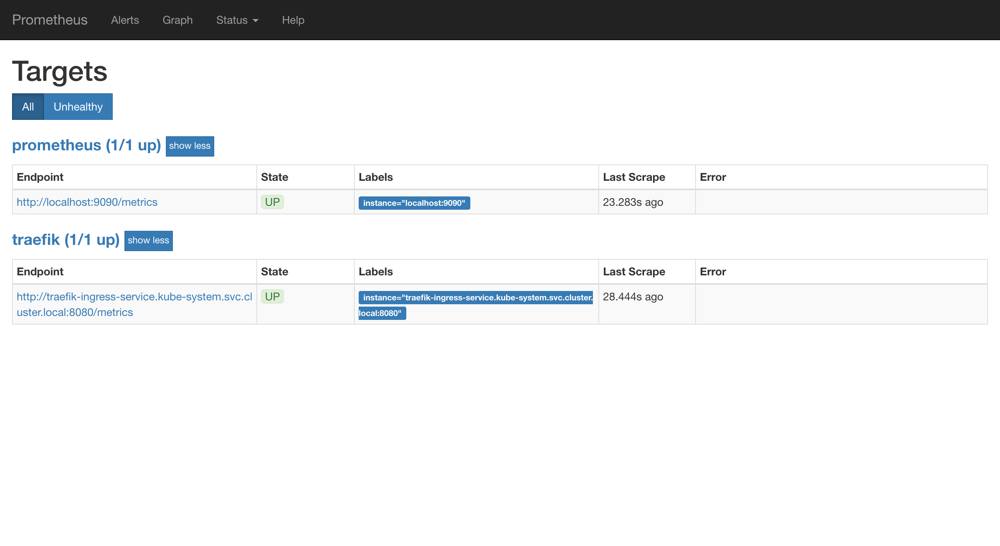
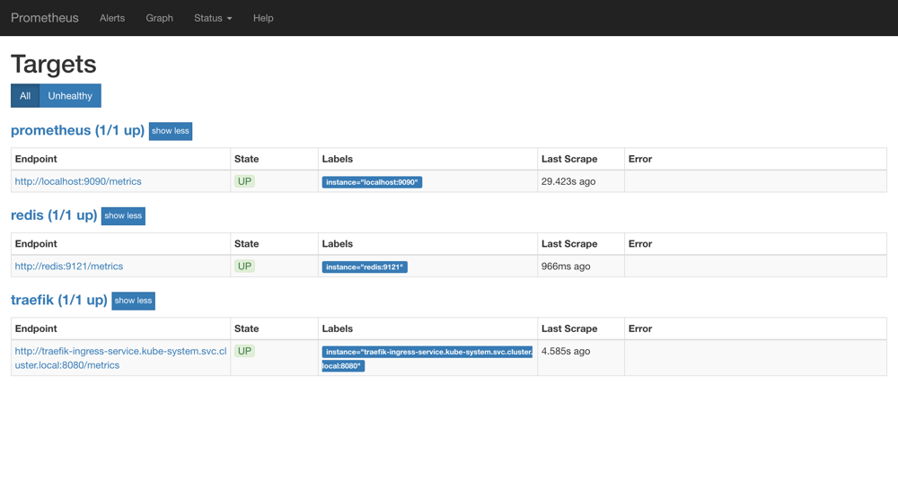
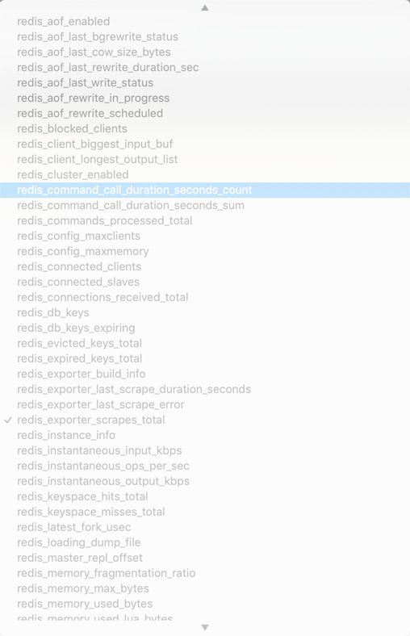
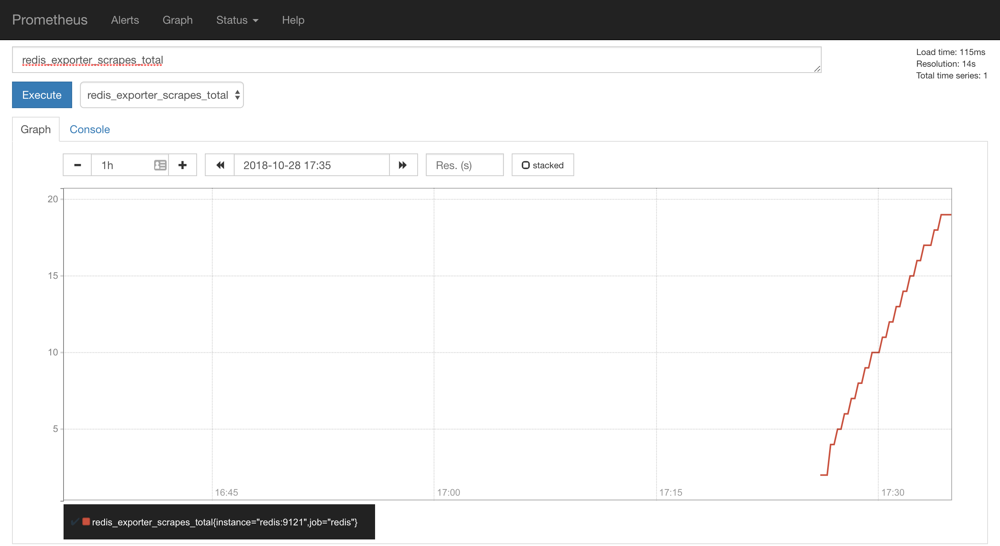

# 53. 监控 Kubernetes 集群应用

上一节我们和大家介绍了`Prometheus`的数据指标是通过一个公开的 HTTP(S) 数据接口获取到的，我们不需要单独安装监控的 agent，只需要暴露一个 metrics 接口，Prometheus 就会定期去拉取数据；对于一些普通的 HTTP 服务，我们完全可以直接重用这个服务，添加一个`/metrics`接口暴露给 Prometheus；而且获取到的指标数据格式是非常易懂的，不需要太高的学习成本。

现在很多服务从一开始就内置了一个`/metrics`接口，比如 Kubernetes 的各个组件、istio 服务网格都直接提供了数据指标接口。有一些服务即使没有原生集成该接口，也完全可以使用一些 exporter 来获取到指标数据，比如 mysqld_exporter、node_exporter，这些 exporter 就有点类似于传统监控服务中的 agent，作为一直服务存在，用来收集目标服务的指标数据然后直接暴露给 Prometheus。


## 普通应用监控
前面我们已经和大家学习了 ingress 的使用，我们采用的是`Traefik`作为我们的 ingress-controller，是我们 Kubernetes 集群内部服务和外部用户之间的桥梁。Traefik 本身内置了一个`/metrics`的接口，但是需要我们在参数中配置开启:
```yaml
[metrics]
  [metrics.prometheus]
    entryPoint = "traefik"
    buckets = [0.1, 0.3, 1.2, 5.0]
```

> 之前的版本中是通过`--web`和`--web.metrics.prometheus`两个参数进行开启的，要注意查看对应版本的文档。

我们需要在`traefik.toml`的配置文件中添加上上面的配置信息，然后更新 ConfigMap 和 Pod 资源对象即可，Traefik Pod 运行后，我们可以看到我们的服务 IP：
```shell
$ kubectl get svc -n kube-system
NAME                      TYPE        CLUSTER-IP       EXTERNAL-IP   PORT(S)                       AGE
......
traefik-ingress-service   NodePort    10.101.33.56     <none>        80:31692/TCP,8080:32115/TCP   63d
```

然后我们可以使用`curl`检查是否开启了 Prometheus 指标数据接口，或者通过 NodePort 访问也可以：
```shell
$ curl 10.101.33.56:8080/metrics
# HELP go_gc_duration_seconds A summary of the GC invocation durations.
# TYPE go_gc_duration_seconds summary
go_gc_duration_seconds{quantile="0"} 0.000121036
go_gc_duration_seconds{quantile="0.25"} 0.000210328
go_gc_duration_seconds{quantile="0.5"} 0.000279974
go_gc_duration_seconds{quantile="0.75"} 0.000420738
go_gc_duration_seconds{quantile="1"} 0.001191494
go_gc_duration_seconds_sum 0.004353914
go_gc_duration_seconds_count 12
# HELP go_goroutines Number of goroutines that currently exist.
# TYPE go_goroutines gauge
go_goroutines 63
......
```

从这里可以看到 Traefik 的监控数据接口已经开启成功了，然后我们就可以将这个`/metrics`接口配置到`prometheus.yml`中去了，直接加到默认的`prometheus`这个 job 下面：(prome-cm.yaml)
```yaml
apiVersion: v1
kind: ConfigMap
metadata:
  name: prometheus-config
  namespace: kube-ops
data:
  prometheus.yml: |
    global:
      scrape_interval: 30s
      scrape_timeout: 30s

    scrape_configs:
    - job_name: 'prometheus'
      static_configs:
        - targets: ['localhost:9090']

    - job_name: 'traefik'
      static_configs:
        - targets: ['traefik-ingress-service.kube-system.svc.cluster.local:8080']
```

当然，我们这里只是一个很简单的配置，scrape_configs 下面可以支持很多参数，例如：

* basic_auth 和 bearer_token：比如我们提供的`/metrics`接口需要 basic 认证的时候，通过传统的用户名/密码或者在请求的header中添加对应的 token 都可以支持
* kubernetes_sd_configs 或    consul_sd_configs：可以用来自动发现一些应用的监控数据

由于我们这里 Traefik 对应的 servicename 是`traefik-ingress-service`，并且在 kube-system 这个 namespace 下面，所以我们这里的`targets`的路径配置则需要使用`FQDN`的形式：`traefik-ingress-service.kube-system.svc.cluster.local`，当然如果你的 Traefik 和 Prometheus 都部署在同一个命名空间的话，则直接填 `servicename:serviceport`即可。然后我们重新更新这个 ConfigMap 资源对象：
```shell
$ kubectl delete -f prome-cm.yaml
configmap "prometheus-config" deleted
$ kubectl create -f prome-cm.yaml
configmap "prometheus-config" created
```

现在 Prometheus 的配置文件内容已经更改了，隔一会儿被挂载到 Pod 中的 prometheus.yml 文件也会更新，由于我们之前的 Prometheus 启动参数中添加了`--web.enable-lifecycle`参数，所以现在我们只需要执行一个 reload 命令即可让配置生效：
```shell
$ kubectl get svc -n kube-ops
NAME         TYPE       CLUSTER-IP     EXTERNAL-IP   PORT(S)                          AGE
prometheus   NodePort   10.102.74.90   <none>        9090:30358/TCP                   3d
$ curl -X POST "http://10.102.74.90:9090/-/reload"
```

> 由于 ConfigMap 通过 Volume 的形式挂载到 Pod 中去的热更新需要一定的间隔时间才会生效，所以需要稍微等一小会儿。

reload 这个 url 是一个 POST 请求，所以这里我们通过 service 的 CLUSTER-IP:PORT 就可以访问到这个重载的接口，这个时候我们再去看 Prometheus 的 Dashboard 中查看采集的目标数据：


可以看到我们刚刚添加的`traefik`这个任务已经出现了，然后同样的我们可以切换到 Graph 下面去，我们可以找到一些 Traefik 的指标数据，至于这些指标数据代表什么意义，一般情况下，我们可以去查看对应的`/metrics`接口，里面一般情况下都会有对应的注释。

到这里我们就在 Prometheus 上配置了第一个 Kubernetes 应用。

## 使用 exporter 监控应用
上面我们也说过有一些应用可能没有自带`/metrics`接口供 Prometheus 使用，在这种情况下，我们就需要利用 exporter 服务来为 Prometheus 提供指标数据了。Prometheus 官方为许多应用就提供了对应的 exporter 应用，也有许多第三方的实现，我们可以前往官方网站进行查看：[exporters](https://prometheus.io/docs/instrumenting/exporters/)

比如我们这里通过一个[redis-exporter](https://github.com/oliver006/redis_exporter)的服务来监控 redis 服务，对于这类应用，我们一般会以 sidecar 的形式和主应用部署在同一个 Pod 中，比如我们这里来部署一个 redis 应用，并用 redis-exporter 的方式来采集监控数据供 Prometheus 使用，如下资源清单文件：（prome-redis.yaml）
```yaml
apiVersion: extensions/v1beta1
kind: Deployment
metadata:
  name: redis
  namespace: kube-ops
spec:
  template:
    metadata:
      annotations:
        prometheus.io/scrape: "true"
        prometheus.io/port: "9121"
      labels:
        app: redis
    spec:
      containers:
      - name: redis
        image: redis:4
        resources:
          requests:
            cpu: 100m
            memory: 100Mi
        ports:
        - containerPort: 6379
      - name: redis-exporter
        image: oliver006/redis_exporter:latest
        resources:
          requests:
            cpu: 100m
            memory: 100Mi
        ports:
        - containerPort: 9121
---
kind: Service
apiVersion: v1
metadata:
  name: redis
  namespace: kube-ops
spec:
  selector:
    app: redis
  ports:
  - name: redis
    port: 6379
    targetPort: 6379
  - name: prom
    port: 9121
    targetPort: 9121
```

可以看到上面我们在 redis 这个 Pod 中包含了两个容器，一个就是 redis 本身的主应用，另外一个容器就是 redis_exporter。现在直接创建上面的应用：
```shell
$ kubectl create -f prome-redis.yaml
deployment.extensions "redis" created
service "redis" created
```

创建完成后，我们可以看到 redis 的 Pod 里面包含有两个容器：
```shell
$ kubectl get pods -n kube-ops
NAME                          READY     STATUS    RESTARTS   AGE
prometheus-8566cd9699-gt9wh   1/1       Running   0          3d
redis-544b6c8c54-8xd2g        2/2       Running   0          3m
$ kubectl get svc -n kube-ops
NAME         TYPE        CLUSTER-IP      EXTERNAL-IP   PORT(S)                          AGE
prometheus   NodePort    10.102.74.90    <none>        9090:30358/TCP                   3d
redis        ClusterIP   10.104.131.44   <none>        6379/TCP,9121/TCP                5m
```

我们可以通过 9121 端口来校验是否能够采集到数据：
```shell
$ curl 10.104.131.44:9121/metrics
# HELP go_gc_duration_seconds A summary of the GC invocation durations.
# TYPE go_gc_duration_seconds summary
go_gc_duration_seconds{quantile="0"} 0
go_gc_duration_seconds{quantile="0.25"} 0
go_gc_duration_seconds{quantile="0.5"} 0
go_gc_duration_seconds{quantile="0.75"} 0
go_gc_duration_seconds{quantile="1"} 0
go_gc_duration_seconds_sum 0
go_gc_duration_seconds_count 0
......
# HELP redis_used_cpu_user_children used_cpu_user_childrenmetric
# TYPE redis_used_cpu_user_children gauge
redis_used_cpu_user_children{addr="redis://localhost:6379",alias=""} 0
```

同样的，现在我们只需要更新 Prometheus 的配置文件：
```yaml
- job_name: 'redis'
  static_configs:
  - targets: ['redis:9121']
```

> 由于我们这里的 redis 服务和 Prometheus 处于同一个 namespace，所以我们直接使用 servicename 即可。

配置文件更新后，重新加载：
```shell
$ kubectl delete -f prome-cm.yaml
configmap "prometheus-config" deleted
$ kubectl create -f prome-cm.yaml
configmap "prometheus-config" created
# 隔一会儿执行reload操作
$ curl -X POST "http://10.102.74.90:9090/-/reload"
```

这个时候我们再去看 Prometheus 的 Dashboard 中查看采集的目标数据：
 

可以看到配置的 redis 这个 job 已经生效了。切换到 Graph 下面可以看到很多关于 redis 的指标数据：


我们选择任意一个指标，比如`redis_exporter_scrapes_total`，然后点击执行就可以看到对应的数据图表了：


> 注意，如果时间有问题，我们需要手动在 Graph 下面调整下时间

除了监控群集中部署的服务之外，我们下节课再和大家学习怎样监视 Kubernetes 群集本身。

