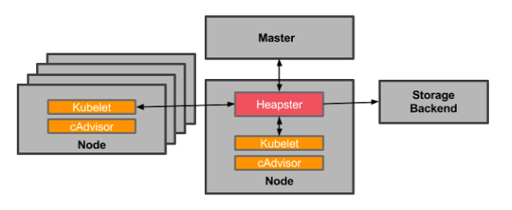
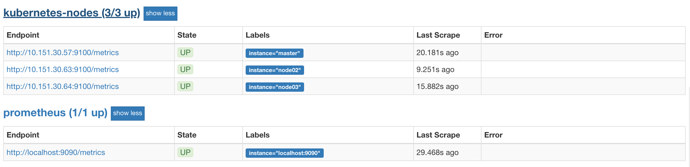
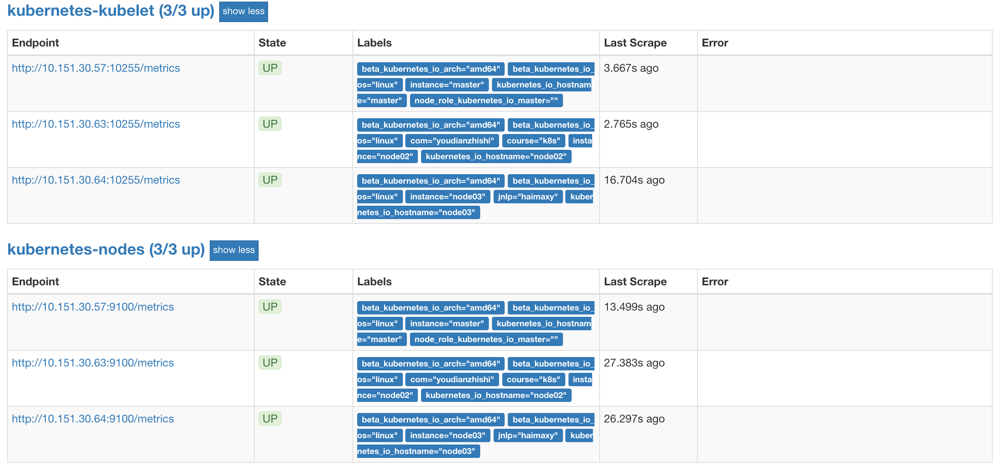
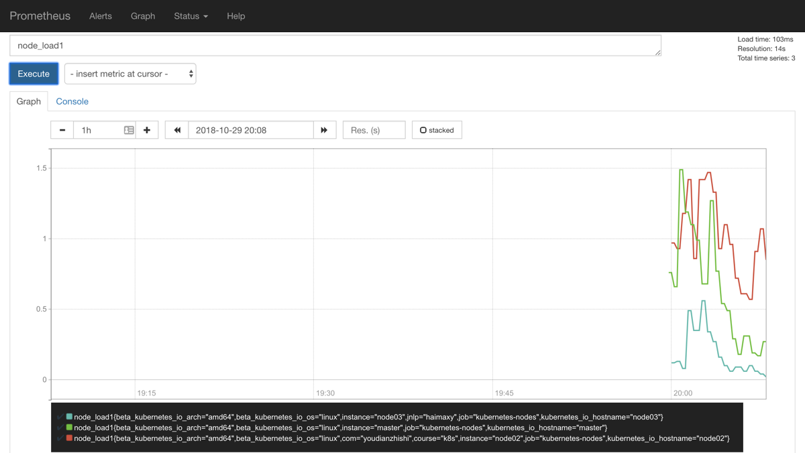
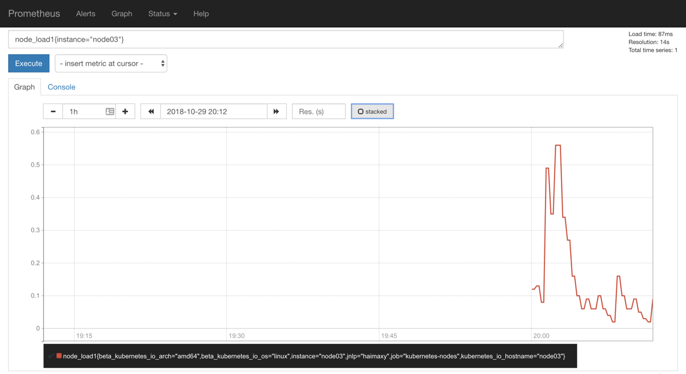

# 54. 监控 Kubernetes 集群节点
上节课我们和大家学习了怎样用 Promethues 来监控 Kubernetes 集群中的应用，但是对于 Kubernetes 集群本身的监控也是非常重要的，我们需要时时刻刻了解集群的运行状态。

对于集群的监控一般我们需要考虑以下几个方面：

* Kubernetes 节点的监控：比如节点的 cpu、load、disk、memory 等指标
* 内部系统组件的状态：比如 kube-scheduler、kube-controller-manager、kubedns/coredns 等组件的详细运行状态
* 编排级的 metrics：比如 Deployment 的状态、资源请求、调度和 API 延迟等数据指标

## 监控方案
Kubernetes 集群的监控方案目前主要有以下集中方案：

* Heapster：Heapster 是一个集群范围的监控和数据聚合工具，以 Pod 的形式运行在集群中。

除了 Kubelet/cAdvisor 之外，我们还可以向 Heapster 添加其他指标源数据，比如 kube-state-metrics，我们会在下面和大家讲解的

  > 需要注意的是 Heapster 已经被废弃了，后续版本中会使用 metrics-server 代替。

* cAdvisor：[cAdvisor](https://github.com/google/cadvisor)是`Google`开源的容器资源监控和性能分析工具，它是专门为容器而生，本身也支持 Docker 容器，在 Kubernetes 中，我们不需要单独去安装，cAdvisor 作为 kubelet 内置的一部分程序可以直接使用。
* Kube-state-metrics：[kube-state-metrics](https://github.com/kubernetes/kube-state-metrics)通过监听 API Server 生成有关资源对象的状态指标，比如 Deployment、Node、Pod，需要注意的是 kube-state-metrics 只是简单提供一个 metrics 数据，并不会存储这些指标数据，所以我们可以使用 Prometheus 来抓取这些数据然后存储。
* metrics-server：metrics-server 也是一个集群范围内的资源数据聚合工具，是 Heapster 的替代品，同样的，metrics-server 也只是显示数据，并不提供数据存储服务。

不过 kube-state-metrics 和 metrics-server 之间还是有很大不同的，二者的主要区别如下：

* kube-state-metrics 主要关注的是业务相关的一些元数据，比如 Deployment、Pod、副本状态等
* metrics-server 主要关注的是[资源度量 API](https://github.com/kubernetes/community/blob/master/contributors/design-proposals/instrumentation/resource-metrics-api.md) 的实现，比如 CPU、文件描述符、内存、请求延时等指标。

## 监控集群节点
现在我们就来开始我们集群的监控工作，首先来监控我们集群的节点，要监控节点其实我们已经有很多非常成熟的方案了，比如 Nagios、zabbix，甚至我们自己来收集数据也可以，我们这里通过 Prometheus 来采集节点的监控指标数据，可以通过[node_exporter](https://github.com/prometheus/node_exporter)来获取，顾名思义，node_exporter 抓哟就是用于采集服务器节点的各种运行指标的，目前 node_exporter 支持几乎所有常见的监控点，比如 conntrack，cpu，diskstats，filesystem，loadavg，meminfo，netstat等，详细的监控点列表可以参考其[Github repo](https://github.com/prometheus/node_exporter)。

我们可以通过 DaemonSet 控制器来部署该服务，这样每一个节点都会自动运行一个这样的 Pod，如果我们从集群中删除或者添加节点后，也会进行自动扩展。

在部署 node-exporter 的时候有一些细节需要注意，如下资源清单文件：(prome-node-exporter.yaml)
```yaml
apiVersion: extensions/v1beta1
kind: DaemonSet
metadata:
  name: node-exporter
  namespace: kube-ops
  labels:
    name: node-exporter
spec:
  template:
    metadata:
      labels:
        name: node-exporter
    spec:
      hostPID: true
      hostIPC: true
      hostNetwork: true
      containers:
      - name: node-exporter
        image: prom/node-exporter:v0.16.0
        ports:
        - containerPort: 9100
        resources:
          requests:
            cpu: 0.15
        securityContext:
          privileged: true
        args:
        - --path.procfs
        - /host/proc
        - --path.sysfs
        - /host/sys
        - --collector.filesystem.ignored-mount-points
        - '"^/(sys|proc|dev|host|etc)($|/)"'
        volumeMounts:
        - name: dev
          mountPath: /host/dev
        - name: proc
          mountPath: /host/proc
        - name: sys
          mountPath: /host/sys
        - name: rootfs
          mountPath: /rootfs
      tolerations:
      - key: "node-role.kubernetes.io/master"
        operator: "Exists"
        effect: "NoSchedule"
      volumes:
        - name: proc
          hostPath:
            path: /proc
        - name: dev
          hostPath:
            path: /dev
        - name: sys
          hostPath:
            path: /sys
        - name: rootfs
          hostPath:
            path: /
```

由于我们要获取到的数据是主机的监控指标数据，而我们的 node-exporter 是运行在容器中的，所以我们在 Pod 中需要配置一些 Pod 的安全策略，这里我们就添加了`hostPID: true`、`hostIPC: true`、`hostNetwork: true`3个策略，用来使用主机的 PID namespace、IPC namespace 以及主机网络，这些 namespace 就是用于容器隔离的关键技术，要注意这里的 namespace 和集群中的 namespace 是两个完全不相同的概念。

另外我们还将主机的`/dev`、`/proc`、`/sys`这些目录挂载到容器中，这些因为我们采集的很多节点数据都是通过这些文件夹下面的文件来获取到的，比如我们在使用`top`命令可以查看当前`cpu`使用情况，数据就来源于文件`/proc/stat`，使用`free`命令可以查看当前内存使用情况，其数据来源是来自`/proc/meminfo`文件。

另外由于我们集群使用的是 kubeadm 搭建的，所以如果希望 master 节点也一起被监控，则需要添加响应的容忍，对于污点和容忍还不是很熟悉的同学可以在前面的章节中回顾下。

然后直接创建上面的资源对象即可：
```shell
$ kubectl create -f prome-node-exporter.yaml
daemonset.extensions "node-exporter" created
$ kubectl get pods -n kube-ops -o wide
NAME                          READY     STATUS    RESTARTS   AGE       IP             NODE
node-exporter-jfwfv           1/1       Running   0          30m       10.151.30.63   node02
node-exporter-kr8rt           1/1       Running   0          30m       10.151.30.64   node03
node-exporter-whb7n           1/1       Running   0          20m       10.151.30.57   master
prometheus-8566cd9699-gt9wh   1/1       Running   0          4d        10.244.4.39    node02
redis-544b6c8c54-8xd2g        2/2       Running   0          23h       10.244.2.87    node03
```

部署完成后，我们可以看到在3个节点上都运行了一个 Pod，有的同学可能会说我们这里不需要创建一个 Service 吗？我们应该怎样去获取`/metrics`数据呢？我们上面是不是指定了`hostNetwork=true`，所以在每个节点上就会绑定一个端口 9100，我们可以通过这个端口去获取到监控指标数据：
```shell
$ curl 127.0.0.1:9100/metrics
...
node_filesystem_device_error{device="shm",fstype="tmpfs",mountpoint="/rootfs/var/lib/docker/containers/aefe8b1b63c3aa5f27766053ec817415faf8f6f417bb210d266fef0c2da64674/shm"} 1
node_filesystem_device_error{device="shm",fstype="tmpfs",mountpoint="/rootfs/var/lib/docker/containers/c8652ca72230496038a07e4fe4ee47046abb5f88d9d2440f0c8a923d5f3e133c/shm"} 1
node_filesystem_device_error{device="tmpfs",fstype="tmpfs",mountpoint="/dev"} 0
node_filesystem_device_error{device="tmpfs",fstype="tmpfs",mountpoint="/dev/shm"} 0
...
```

当然如果你觉得上面的手动安装方式比较麻烦，我们也可以使用 Helm 的方式来安装：
```shell
$ helm install --name node-exporter stable/prometheus-node-exporter --namespace kube-ops
```


## 服务发现
由于我们这里3个节点上面都运行了 node-exporter 程序，如果我们通过一个 Service 来将数据收集到一起用静态配置的方式配置到 Prometheus 去中，就只会显示一条数据，我们得自己在指标数据中去过滤每个节点的数据，那么有没有一种方式可以让 Prometheus 去自动发现我们节点的 node-exporter 程序，并且按节点进行分组呢？是有的，就是我们前面和大家提到过的**服务发现**。

在 Kubernetes 下，Promethues 通过与 Kubernetes API 集成，目前主要支持5中服务发现模式，分别是：Node、Service、Pod、Endpoints、Ingress。

我们通过 kubectl 命令可以很方便的获取到当前集群中的所有节点信息：
```shell
$ kubectl get nodes
NAME      STATUS    ROLES     AGE       VERSION
master    Ready     master    165d      v1.10.0
node02    Ready     <none>    85d       v1.10.0
node03    Ready     <none>    145d      v1.10.0
```

但是要让 Prometheus 也能够获取到当前集群中的所有节点信息的话，我们就需要利用 Node 的服务发现模式，同样的，在 prometheus.yml 文件中配置如下的 job 任务即可：
```yaml
- job_name: 'kubernetes-nodes'
  kubernetes_sd_configs:
  - role: node
```

通过指定`kubernetes_sd_configs`的模式为`node`，Prometheus 就会自动从 Kubernetes 中发现所有的 node 节点并作为当前 job 监控的目标实例，发现的节点`/metrics`接口是默认的 kubelet 的 HTTP 接口。

prometheus 的 ConfigMap 更新完成后，同样的我们执行 reload 操作，让配置生效：
```shell
$ kubectl delete -f prome-cm.yaml
configmap "prometheus-config" deleted
$ kubectl create -f prome-cm.yaml
configmap "prometheus-config" created
# 隔一会儿再执行下面的 reload 操作
$ kubectl get svc -n kube-ops
NAME            TYPE        CLUSTER-IP      EXTERNAL-IP   PORT(S)                          AGE
prometheus      NodePort    10.102.74.90    <none>        9090:30358/TCP                   5d
......
$ curl -X POST "http://10.102.74.90:9090/-/reload"
```

配置生效后，我们再去 prometheus 的 dashboard 中查看 Targets 是否能够正常抓取数据，访问**任意节点IP:30358**：

 

我们可以看到上面的`kubernetes-nodes`这个 job 任务已经自动发现了我们3个 node 节点，但是在获取数据的时候失败了，出现了类似于下面的错误信息：
```shell
Get http://10.151.30.57:10250/metrics: net/http: HTTP/1.x transport connection broken: malformed HTTP response "\x15\x03\x01\x00\x02\x02"
```

这个是因为 prometheus 去发现 Node 模式的服务的时候，访问的端口默认是**10250**，而现在该端口下面已经没有了`/metrics`指标数据了，现在 kubelet 只读的数据接口统一通过**10255**端口进行暴露了，所以我们应该去替换掉这里的端口，但是我们是要替换成**10255**端口吗？不是的，因为我们是要去配置上面通过`node-exporter`抓取到的节点指标数据，而我们上面是不是指定了`hostNetwork=true`，所以在每个节点上就会绑定一个端口**9100**，所以我们应该将这里的**10250**替换成**9100**，但是应该怎样替换呢？

这里我们就需要使用到 Prometheus 提供的`relabel_configs`中的`replace`能力了，relabel 可以在 Prometheus 采集数据之前，通过Target 实例的 Metadata 信息，动态重新写入 Label 的值。除此之外，我们还能根据 Target 实例的 Metadata 信息选择是否采集或者忽略该 Target 实例。比如我们这里就可以去匹配`__address__`这个 Label 标签，然后替换掉其中的端口：
```yaml
- job_name: 'kubernetes-nodes'
  kubernetes_sd_configs:
  - role: node
  relabel_configs:
  - source_labels: [__address__]
    regex: '(.*):10250'
    replacement: '${1}:9100'
    target_label: __address__
    action: replace
```

这里就是一个正则表达式，去匹配`__address__`，然后将 host 部分保留下来，port 替换成了**9100**，现在我们重新更新配置文件，执行 reload 操作，然后再去看 Prometheus 的 Dashboard 的 Targets 路径下面 kubernetes-nodes 这个 job 任务是否正常了：



我们可以看到现在已经正常了，但是还有一个问题就是我们采集的指标数据 Label 标签就只有一个节点的 hostname，这对于我们在进行监控分组分类查询的时候带来了很多不方便的地方，要是我们能够将集群中 Node 节点的 Label 标签也能获取到就很好了。

这里我们可以通过`labelmap`这个属性来将 Kubernetes 的 Label 标签添加为 Prometheus 的指标标签：
```yaml
- job_name: 'kubernetes-nodes'
  kubernetes_sd_configs:
  - role: node
  relabel_configs:
  - source_labels: [__address__]
    regex: '(.*):10250'
    replacement: '${1}:9100'
    target_label: __address__
    action: replace
  - action: labelmap
    regex: __meta_kubernetes_node_label_(.+)
```

添加了一个 action 为`labelmap`，正则表达式是`__meta_kubernetes_node_label_(.+)`的配置，这里的意思就是表达式中匹配都的数据也添加到指标数据的 Label 标签中去。

对于 kubernetes_sd_configs 下面可用的标签如下：
可用元标签：

* __meta_kubernetes_node_name：节点对象的名称
* __meta_kubernetes_node_label_<labelname>：节点对象中的每个标签
* __meta_kubernetes_node_annotation_<annotationname>：来自节点对象的每个注释
*  __meta_kubernetes_node_address_<address_type>：每个节点地址类型的第一个地址（如果存在）
* 

> 关于 kubernets_sd_configs 更多信息可以查看官方文档：[kubernetes_sd_config](https://prometheus.io/docs/prometheus/latest/configuration/configuration/#%3Ckubernetes_sd_config%3E)


另外由于 kubelet 也自带了一些监控指标数据，就上面我们提到的**10255**端口，所以我们这里也把 kubelet 的监控任务也一并配置上：
```yaml
- job_name: 'kubernetes-nodes'
  kubernetes_sd_configs:
  - role: node
  relabel_configs:
  - source_labels: [__address__]
    regex: '(.*):10250'
    replacement: '${1}:9100'
    target_label: __address__
    action: replace
  - action: labelmap
    regex: __meta_kubernetes_node_label_(.+)

- job_name: 'kubernetes-kubelet'
  kubernetes_sd_configs:
  - role: node
  relabel_configs:
  - source_labels: [__address__]
    regex: '(.*):10250'
    replacement: '${1}:10255'
    target_label: __address__
    action: replace
  - action: labelmap
    regex: __meta_kubernetes_node_label_(.+)
```

现在我们再去更新下配置文件，执行 reload 操作，让配置生效，然后访问 Prometheus 的 Dashboard 查看 Targets 路径：



现在可以看到我们上面添加的`kubernetes-kubelet`和`kubernetes-nodes`这两个 job 任务都已经配置成功了，而且二者的 Labels 标签都和集群的 node 节点标签保持一致了。

现在我们就可以切换到 Graph 路径下面查看采集的一些指标数据了，比如查询 node_load1 指标：
 


我们可以看到将3个 node 节点对应的 node_load1 指标数据都查询出来了，同样的，我们还可以使用 PromQL 语句来进行更复杂的一些聚合查询操作，还可以根据我们的 Labels 标签对指标数据进行聚合，比如我们这里只查询 node03 节点的数据，可以使用表达式`node_load1{instance="node03"}`来进行查询：




到这里我们就把 Kubernetes 集群节点的使用 Prometheus 监控起来了，下节课我们再来和大家学习怎样监控 Pod 或者 Service 之类的资源对象。

