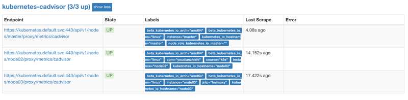
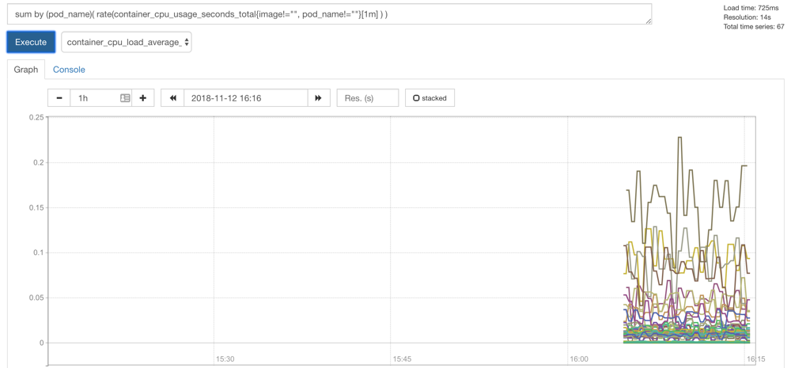
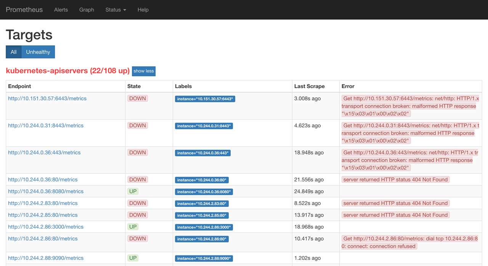
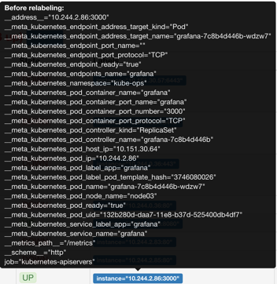
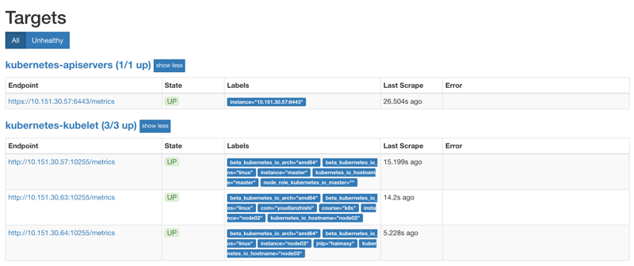
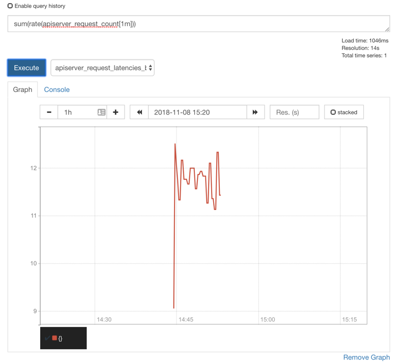
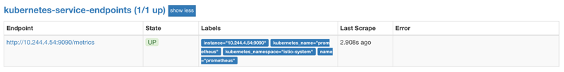
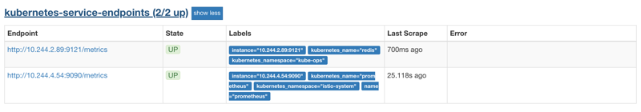

# 55. 监控 Kubernetes 常用资源对象
上节课我们学习了怎样用 Prometheus 来自动发现 Kubernetes 集群的节点，用到了 Prometheus 针对 Kubernetes 的服务发现机制`kubernetes_sd_configs`的使用，这节课我们来和大家一起了解下怎样在 Prometheus 中来自动监控 Kubernetes 中的一些常用资源对象。

前面我们和大家介绍过了在 Prometheus 中用静态的方式来监控 Kubernetes 集群中的普通应用，但是如果针对集群中众多的资源对象都采用静态的方式来进行配置的话显然是不现实的，所以同样我们需要使用到 Prometheus 提供的其他类型的服务发现机制。

## 容器监控
说到容器监控我们自然会想到`cAdvisor`，我们前面也说过`cAdvisor`已经内置在了 kubelet 组件之中，所以我们不需要单独去安装，`cAdvisor`的数据路径为`/api/v1/nodes/<node>/proxy/metrics`，同样我们这里使用 node 的服务发现模式，因为每一个节点下面都有 kubelet，自然都有`cAdvisor`采集到的数据指标，配置如下：
```yaml
- job_name: 'kubernetes-cadvisor'
  kubernetes_sd_configs:
  - role: node
  scheme: https
  tls_config:
    ca_file: /var/run/secrets/kubernetes.io/serviceaccount/ca.crt
  bearer_token_file: /var/run/secrets/kubernetes.io/serviceaccount/token
  relabel_configs:
  - action: labelmap
    regex: __meta_kubernetes_node_label_(.+)
  - target_label: __address__
    replacement: kubernetes.default.svc:443
  - source_labels: [__meta_kubernetes_node_name]
    regex: (.+)
    target_label: __metrics_path__
    replacement: /api/v1/nodes/${1}/proxy/metrics/cadvisor
```

上面的配置和我们之前配置 node-exporter 的时候几乎是一样的，区别是我们这里使用了 https 的协议，另外需要注意的是配置了 ca.cart 和 token 这两个文件，这两个文件是 Pod 启动后自动注入进来的，通过这两个文件我们可以在 Pod 中访问 apiserver，比如我们这里的`__address__`不在是 nodeip 了，而是 kubernetes 在集群中的服务地址，然后加上`__metrics_path__`的访问路径：`/api/v1/nodes/${1}/proxy/metrics/cadvisor`，现在同样更新下配置，然后查看 Targets 路径：


然后我们可以切换到 Graph 路径下面查询容器相关数据，比如我们这里来查询集群中所有 Pod 的 CPU 使用情况，这里用的数据指标是 container_cpu_usage_seconds_total，然后去除一些无效的数据，查询1分钟内的数据，由于查询到的数据都是容器相关的，最好要安装 Pod 来进行聚合，对应的`promQL`语句如下：
```
sum by (pod_name)(rate(container_cpu_usage_seconds_total{image!="", pod_name!=""}[1m] ))
```


我们可以看到上面的结果就是集群中的所有 Pod 在1分钟之内的 CPU 使用情况的曲线图，当然还有很多数据可以获取到，我们后面在需要的时候再和大家介绍。

## apiserver 监控
apiserver 作为 Kubernetes 最核心的组件，当然他的监控也是非常有必要的，对于 apiserver 的监控我们可以直接通过 kubernetes 的 Service 来获取：
```shell
$ kubectl get svc
NAME            TYPE        CLUSTER-IP       EXTERNAL-IP   PORT(S)    AGE
kubernetes      ClusterIP   10.96.0.1        <none>        443/TCP    175d
```

上面这个 Service 就是我们集群的 apiserver 在集群内部的 Service 地址，要自动发现 Service 类型的服务，我们就需要用到 role 为 Endpoints 的 kubernetes_sd_configs，我们可以在 ConfigMap 对象中添加上一个 Endpoints 类型的服务的监控任务：
```yaml
- job_name: 'kubernetes-apiservers'
  kubernetes_sd_configs:
  - role: endpoints
```

上面这个任务是定义的一个类型为`endpoints`的`kubernetes_sd_configs`，添加到 Prometheus 的 ConfigMap 的配置文件中，然后更新配置：
```shell
$ kubectl delete -f prome-cm.yaml
$ kubectl create -f prome-cm.yaml
$ # 隔一会儿执行reload操作
$ kubectl get svc -n kube-ops
NAME         TYPE        CLUSTER-IP      EXTERNAL-IP   PORT(S)                          AGE
prometheus   NodePort    10.102.74.90    <none>        9090:30358/TCP                   14d
$ curl -X POST "http://10.102.74.90:9090/-/reload"
```

更新完成后，我们再去查看 Prometheus 的 Dashboard 的 target 页面：


我们可以看到 kubernetes-apiservers 下面出现了很多实例，这是因为这里我们使用的是 Endpoints 类型的服务发现，所以 Prometheus 把所有的 Endpoints 服务都抓取过来了，同样的，上面我们需要的服务名为`kubernetes`这个 apiserver 的服务也在这个列表之中，那么我们应该怎样来过滤出这个服务来呢？还记得上节课的`relabel_configs`吗？没错，同样我们需要使用这个配置，只是我们这里不是使用`replace`这个动作了，而是`keep`，就是只把符合我们要求的给保留下来，哪些才是符合我们要求的呢？我们可以把鼠标放置在任意一个 target 上，可以查看到`Before relabeling`里面所有的元数据，比如我们要过滤的服务是 default 这个 namespace 下面，服务名为 kubernetes 的元数据，所以这里我们就可以根据对应的`__meta_kubernetes_namespace`和`__meta_kubernetes_service_name`这两个元数据来 relabel



另外由于 kubernetes 这个服务对应的端口是443，需要使用 https 协议，所以这里我们需要使用 https 的协议，对应的就需要将对应的 ca 证书配置上，如下：
```yaml
- job_name: 'kubernetes-apiservers'
  kubernetes_sd_configs:
  - role: endpoints
  scheme: https
  tls_config:
    ca_file: /var/run/secrets/kubernetes.io/serviceaccount/ca.crt
  bearer_token_file: /var/run/secrets/kubernetes.io/serviceaccount/token
  relabel_configs:
  - source_labels: [__meta_kubernetes_namespace, __meta_kubernetes_service_name, __meta_kubernetes_endpoint_port_name]
    action: keep
    regex: default;kubernetes;https
```

现在重新更新配置文件、重新加载 Prometheus，切换到 Prometheus 的 Targets 路径下查看：



现在可以看到 kubernetes-apiserver 这个任务下面只有 apiserver 这一个实例了，证明我们的 relabel 是成功的，现在我们切换到 graph 路径下面查看下采集到数据，比如查询 apiserver 的总的请求数：
```shell
sum(rate(apiserver_request_count[1m]))
```

> 这里我们使用到了 promql 里面的 rate 和 sum函数，表示的意思是 apiserver 在1分钟内总的请求数。



这样我们就完成了对 Kubernetes APIServer 的监控。


另外如果我们要来监控其他系统组件，比如 kube-controller-manager、kube-scheduler 的话应该怎么做呢？由于 apiserver 服务 namespace 在 default 使用默认的 Service kubernetes，而其余组件服务在 kube-system 这个 namespace 下面，如果我们想要来监控这些组件的话，需要手动创建单独的 Service，其中 kube-sheduler 的指标数据端口为 10251，kube-controller-manager 对应的端口为 10252，大家可以尝试下自己来配置下这几个系统组件。

## Service 的监控
上面的 apiserver 实际上是一种特殊的 Service，现在我们同样来配置一个任务用来专门发现普通类型的 Service：
```yaml
- job_name: 'kubernetes-service-endpoints'
  kubernetes_sd_configs:
  - role: endpoints
  relabel_configs:
  - source_labels: [__meta_kubernetes_service_annotation_prometheus_io_scrape]
    action: keep
    regex: true
  - source_labels: [__meta_kubernetes_service_annotation_prometheus_io_scheme]
    action: replace
    target_label: __scheme__
    regex: (https?)
  - source_labels: [__meta_kubernetes_service_annotation_prometheus_io_path]
    action: replace
    target_label: __metrics_path__
    regex: (.+)
  - source_labels: [__address__, __meta_kubernetes_service_annotation_prometheus_io_port]
    action: replace
    target_label: __address__
    regex: ([^:]+)(?::\d+)?;(\d+)
    replacement: $1:$2
  - action: labelmap
    regex: __meta_kubernetes_service_label_(.+)
  - source_labels: [__meta_kubernetes_namespace]
    action: replace
    target_label: kubernetes_namespace
  - source_labels: [__meta_kubernetes_service_name]
    action: replace
    target_label: kubernetes_name
```

注意我们这里在`relabel_configs`区域做了大量的配置，特别是第一个保留`__meta_kubernetes_service_annotation_prometheus_io_scrape`为`true`的才保留下来，这就是说要想自动发现集群中的 Service，就需要我们在 Service 的`annotation`区域添加`prometheus.io/scrape=true`的声明，现在我们先将上面的配置更新，查看下效果：




我们可以看到`kubernetes-service-endpoints`这一个任务下面只发现了一个服务，这是因为我们在`relabel_configs`中过滤了 annotation 有`prometheus.io/scrape=true`的 Service，而现在我们系统中只有这样一个服务符合要求，所以只出现了一个实例。

现在我们在之前创建的 redis 这个 Service 中添加上`prometheus.io/scrape=true`这个 annotation：(prome-redis-exporter.yaml)
```yaml
kind: Service
apiVersion: v1
metadata:
  name: redis
  namespace: kube-ops
  annotations:
    prometheus.io/scrape: "true"
    prometheus.io/port: "9121"
spec:
  selector:
    app: redis
  ports:
  - name: redis
    port: 6379
    targetPort: 6379
  - name: prom
    port: 9121
    targetPort: 9121
```

由于 redis 服务的 metrics 接口在9121这个 redis-exporter 服务上面，所以我们还需要添加一个`prometheus.io/port=9121`这样的`annotations`，然后更新这个 Service：
```shell
$ kubectl apply -f prome-redis-exporter.yaml
deployment.extensions "redis" unchanged
service "redis" changed
```

更新完成后，去 Prometheus 查看 Targets 路径，可以看到 redis 服务自动出现在了`kubernetes-service-endpoints`这个任务下面：




这样以后我们有了新的服务，服务本身提供了`/metrics`接口，我们就完全不需要用静态的方式去配置了，到这里我们就可以将之前配置的 redis 的静态配置去掉了。

> 大家可以尝试去将之前配置的 traefik 服务用动态发现的方式重新配置到上面的 service-endpoints 中。


同样的，大家可以自己去尝试下去配置下自动发现 Pod、ingress 这些资源对象。


## kube-state-metrics
上面我们配置了自动发现 Service（Pod也是一样的）的监控，但是这些监控数据都是应用内部的监控，需要应用本身提供一个`/metrics`接口，或者对应的 exporter 来暴露对应的指标数据，但是在 Kubernetes 集群上 Pod、DaemonSet、Deployment、Job、CronJob 等各种资源对象的状态也需要监控，这也反映了使用这些资源部署的应用的状态。但通过查看前面从集群中拉取的指标(这些指标主要来自 apiserver 和 kubelet 中集成的 cAdvisor)，并没有具体的各种资源对象的状态指标。对于 Prometheus 来说，当然是需要引入新的 exporter 来暴露这些指标，Kubernetes 提供了一个[kube-state-metrics](https://github.com/kubernetes/kube-state-metrics)就是我们需要的。


kube-state-metrics 已经给出了在 Kubernetes 部署的 manifest 定义文件，我们直接将代码 Clone 到集群中(能用 kubectl 工具操作就行):
```shell
$ git clone https://github.com/kubernetes/kube-state-metrics.git
$ cd kube-state-metrics/kubernetes
$ kubectl create -f .
clusterrolebinding.rbac.authorization.k8s.io "kube-state-metrics" created
clusterrole.rbac.authorization.k8s.io "kube-state-metrics" created
deployment.apps "kube-state-metrics" created
rolebinding.rbac.authorization.k8s.io "kube-state-metrics" created
role.rbac.authorization.k8s.io "kube-state-metrics-resizer" created
serviceaccount "kube-state-metrics" created
service "kube-state-metrics" created
```

将 kube-state-metrics 部署到 Kubernetes 上之后，就会发现 Kubernetes 集群中的 Prometheus 会在kubernetes-service-endpoints 这个 job 下自动服务发现 kube-state-metrics，并开始拉取 metrics，这是因为部署 kube-state-metrics 的 manifest 定义文件 kube-state-metrics-service.yaml 对 Service 的定义包含`prometheus.io/scrape: 'true'`这样的一个`annotation`，因此 kube-state-metrics 的 endpoint 可以被 Prometheus 自动服务发现。

关于 kube-state-metrics 暴露的所有监控指标可以参考 kube-state-metrics 的文档[kube-state-metrics Documentation](https://github.com/kubernetes/kube-state-metrics/tree/master/Documentation)。


到这里我们就完成了 Kubernetes 集群上部署应用的监控，下节课我们再来和大家介绍下怎样使用 `Grafana`来展示我们的这些监控数据。
