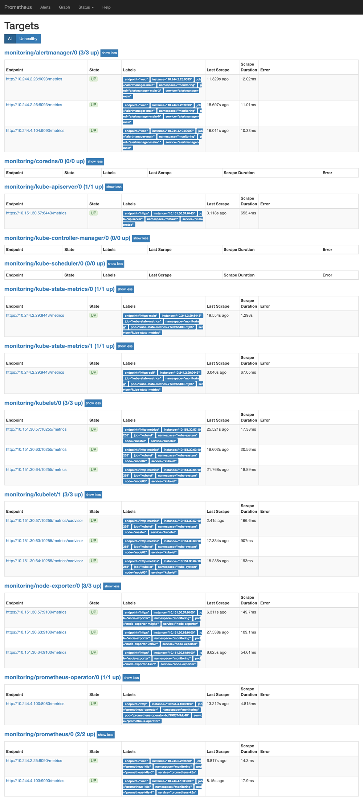
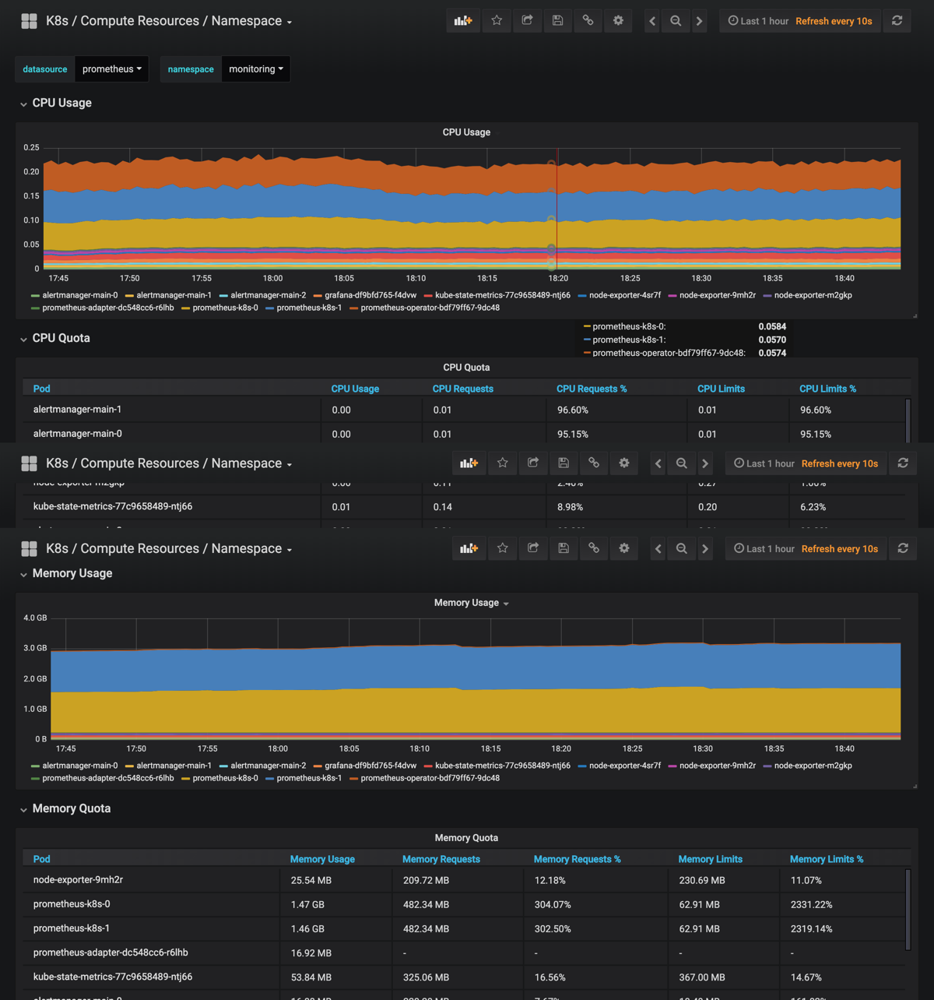

# 58. Prometheus Operator 的安装
前面的课程中我们学习了用自定义的方式来对 Kubernetes 集群进行监控，但是还是有一些缺陷，比如 Prometheus、AlertManager 这些组件服务本身的高可用，当然我们也完全可以用自定义的方式来实现这些需求，我们也知道 Promethues 在代码上就已经对 Kubernetes 有了原生的支持，可以通过服务发现的形式来自动监控集群，因此我们可以使用另外一种更加高级的方式来部署 Prometheus：`Operator` 框架。

## Operator
`Operator`是由[CoreOS](https://coreos.com/)公司开发的，用来扩展 Kubernetes API，特定的应用程序控制器，它用来创建、配置和管理复杂的有状态应用，如数据库、缓存和监控系统。`Operator`基于 Kubernetes 的资源和控制器概念之上构建，但同时又包含了应用程序特定的一些专业知识，比如创建一个数据库的`Operator`，则必须对创建的数据库的各种运维方式非常了解，创建`Operator`的关键是`CRD`（自定义资源）的设计。

> `CRD`是对 Kubernetes API 的扩展，Kubernetes 中的每个资源都是一个 API 对象的集合，例如我们在YAML文件里定义的那些`spec`都是对 Kubernetes 中的资源对象的定义，所有的自定义资源可以跟 Kubernetes 中内建的资源一样使用 kubectl 操作。


`Operator`是将运维人员对软件操作的知识给代码化，同时利用 Kubernetes 强大的抽象来管理大规模的软件应用。目前`CoreOS`官方提供了几种`Operator`的实现，其中就包括我们今天的主角：`Prometheus Operator`，`Operator`的核心实现就是基于 Kubernetes 的以下两个概念：

* 资源：对象的状态定义
* 控制器：观测、分析和行动，以调节资源的分布

当然我们如果有对应的需求也完全可以自己去实现一个`Operator`，接下来我们就来给大家详细介绍下`Prometheus-Operator`的使用方法。

## 介绍
首先我们先来了解下`Prometheus-Operator`的架构图：


上图是`Prometheus-Operator`官方提供的架构图，其中`Operator`是最核心的部分，作为一个控制器，他会去创建`Prometheus`、`ServiceMonitor`、`AlertManager`以及`PrometheusRule`4个`CRD`资源对象，然后会一直监控并维持这4个资源对象的状态。

其中创建的`prometheus`这种资源对象就是作为`Prometheus Server`存在，而`ServiceMonitor`就是`exporter`的各种抽象，`exporter`前面我们已经学习了，是用来提供专门提供`metrics`数据接口的工具，`Prometheus`就是通过`ServiceMonitor`提供的`metrics`数据接口去 pull 数据的，当然`alertmanager`这种资源对象就是对应的`AlertManager`的抽象，而`PrometheusRule`是用来被`Prometheus`实例使用的报警规则文件。

这样我们要在集群中监控什么数据，就变成了直接去操作 Kubernetes 集群的资源对象了，是不是方便很多了。上图中的 Service 和 ServiceMonitor 都是 Kubernetes 的资源，一个 ServiceMonitor 可以通过 labelSelector 的方式去匹配一类 Service，Prometheus 也可以通过 labelSelector 去匹配多个ServiceMonitor。


## 安装
我们这里直接通过 Prometheus-Operator 的源码来进行安装，当然也可以用 Helm 来进行一键安装，我们采用源码安装可以去了解更多的实现细节。首页将源码 Clone 下来：
```shell
$ git clone https://github.com/coreos/kube-prometheus.git
$ cd manifests
$ ls
00namespace-namespace.yaml                                         node-exporter-clusterRole.yaml
0prometheus-operator-0alertmanagerCustomResourceDefinition.yaml    node-exporter-daemonset.yaml
......
```

> 最新的版本官方将资源[https://github.com/coreos/prometheus-operator/tree/master/contrib/kube-prometheus](https://github.com/coreos/prometheus-operator/tree/master/contrib/kube-prometheus)迁移到了独立的 git 仓库中：[https://github.com/coreos/kube-prometheus.git](https://github.com/coreos/kube-prometheus.git)

进入到 manifests 目录下面，这个目录下面包含我们所有的资源清单文件，我们需要对其中的文件 prometheus-serviceMonitorKubelet.yaml 进行简单的修改，因为默认情况下，这个 ServiceMonitor 是关联的 kubelet 的10250端口去采集的节点数据，而我们前面说过为了安全，这个 metrics 数据已经迁移到10255这个只读端口上面去了，我们只需要将文件中的`https-metrics`更改成`http-metrics`即可，这个在 Prometheus-Operator 对节点端点同步的代码中有相关定义，感兴趣的可以[点此查看完整代码](https://github.com/coreos/prometheus-operator/blob/7a8bc75512e39a984f46b2788b5fa9bf64999571/pkg/prometheus/operator.go#L400)：
```go
Subsets: []v1.EndpointSubset{
    {
        Ports: []v1.EndpointPort{
            {
                Name: "https-metrics",
                Port: 10250,
            },
            {
                Name: "http-metrics",
                Port: 10255,
            },
            {
                Name: "cadvisor",
                Port: 4194,
            },
        },
    },
},
```

修改完成后，直接在该文件夹下面执行创建资源命令即可：
```shell
$ kubectl apply -f .
```

部署完成后，会创建一个名为`monitoring`的 namespace，所以资源对象对将部署在改命名空间下面，此外 Operator 会自动创建4个 CRD 资源对象：
```shell
$ kubectl get crd |grep coreos
alertmanagers.monitoring.coreos.com     5d
prometheuses.monitoring.coreos.com      5d
prometheusrules.monitoring.coreos.com   5d
servicemonitors.monitoring.coreos.com   5d
```

可以在 monitoring 命名空间下面查看所有的 Pod，其中 alertmanager 和 prometheus 是用 StatefulSet 控制器管理的，其中还有一个比较核心的 prometheus-operator 的 Pod，用来控制其他资源对象和监听对象变化的：
```shell
$ kubectl get pods -n monitoring
NAME                                  READY     STATUS    RESTARTS   AGE
alertmanager-main-0                   2/2       Running   0          21h
alertmanager-main-1                   2/2       Running   0          21h
alertmanager-main-2                   2/2       Running   0          21h
grafana-df9bfd765-f4dvw               1/1       Running   0          22h
kube-state-metrics-77c9658489-ntj66   4/4       Running   0          20h
node-exporter-4sr7f                   2/2       Running   0          21h
node-exporter-9mh2r                   2/2       Running   0          21h
node-exporter-m2gkp                   2/2       Running   0          21h
prometheus-adapter-dc548cc6-r6lhb     1/1       Running   0          22h
prometheus-k8s-0                      3/3       Running   1          21h
prometheus-k8s-1                      3/3       Running   1          21h
prometheus-operator-bdf79ff67-9dc48   1/1       Running   0          21h
```

查看创建的 Service:
```shell
kubectl get svc -n monitoring
NAME                    TYPE        CLUSTER-IP       EXTERNAL-IP   PORT(S)             AGE
alertmanager-main       ClusterIP   10.110.204.224   <none>        9093/TCP            23h
alertmanager-operated   ClusterIP   None             <none>        9093/TCP,6783/TCP   23h
grafana                 ClusterIP   10.98.191.31     <none>        3000/TCP            23h
kube-state-metrics      ClusterIP   None             <none>        8443/TCP,9443/TCP   23h
node-exporter           ClusterIP   None             <none>        9100/TCP            23h
prometheus-adapter      ClusterIP   10.107.201.172   <none>        443/TCP             23h
prometheus-k8s          ClusterIP   10.107.105.53    <none>        9090/TCP            23h
prometheus-operated     ClusterIP   None             <none>        9090/TCP            23h
prometheus-operator     ClusterIP   None             <none>        8080/TCP            23h
```

可以看到上面针对 grafana 和 prometheus 都创建了一个类型为 ClusterIP 的 Service，当然如果我们想要在外网访问这两个服务的话可以通过创建对应的 Ingress 对象或者使用 NodePort 类型的 Service，我们这里为了简单，直接使用 NodePort 类型的服务即可，编辑 grafana 和 prometheus-k8s 这两个 Service，将服务类型更改为 NodePort:
```shell
$ kubectl edit svc grafana -n monitoring
$ kubectl edit svc prometheus-k8s -n monitoring
$ kubectl get svc -n monitoring
NAME                    TYPE        CLUSTER-IP       EXTERNAL-IP   PORT(S)             AGE
grafana                 NodePort    10.98.191.31     <none>        3000:32333/TCP      23h
prometheus-k8s          NodePort    10.107.105.53    <none>        9090:30166/TCP      23h
......
```

更改完成后，我们就可以通过<NodeIP:NodePort>去访问上面的两个服务了，比如查看 prometheus 的 targets 页面：



## 配置
我们可以看到大部分的配置都是正常的，只有两三个没有管理到对应的监控目标，比如 kube-controller-manager 和 kube-scheduler 这两个系统组件，这就和 ServiceMonitor 的定义有关系了，我们先来查看下 kube-scheduler 组件对应的 ServiceMonitor 资源的定义：(prometheus-serviceMonitorKubeScheduler.yaml)
```yaml
apiVersion: monitoring.coreos.com/v1
kind: ServiceMonitor
metadata:
  labels:
    k8s-app: kube-scheduler
  name: kube-scheduler
  namespace: monitoring
spec:
  endpoints:
  - interval: 30s # 每30s获取一次信息
    port: http-metrics  # 对应service的端口名
  jobLabel: k8s-app
  namespaceSelector: # 表示去匹配某一命名空间中的service，如果想从所有的namespace中匹配用any: true
    matchNames:
    - kube-system
  selector:  # 匹配的 Service 的labels，如果使用mathLabels，则下面的所有标签都匹配时才会匹配该service，如果使用matchExpressions，则至少匹配一个标签的service都会被选择
    matchLabels:
      k8s-app: kube-scheduler
```

上面是一个典型的 ServiceMonitor 资源文件的声明方式，上面我们通过`selector.matchLabels`在 kube-system 这个命名空间下面匹配具有`k8s-app=kube-scheduler`这样的 Service，但是我们系统中根本就没有对应的 Service，所以我们需要手动创建一个 Service：（prometheus-kubeSchedulerService.yaml）
```yaml
apiVersion: v1
kind: Service
metadata:
  namespace: kube-system
  name: kube-scheduler
  labels:
    k8s-app: kube-scheduler
spec:
  selector:
    component: kube-scheduler
  ports:
  - name: http-metrics
    port: 10251
    targetPort: 10251
    protocol: TCP
```

> 10251是`kube-scheduler`组件 metrics 数据所在的端口，10252是`kube-controller-manager`组件的监控数据所在端口。

其中最重要的是上面 labels 和 selector 部分，labels 区域的配置必须和我们上面的 ServiceMonitor 对象中的 selector 保持一致，`selector`下面配置的是`component=kube-scheduler`，为什么会是这个 label 标签呢，我们可以去 describe 下 kube-scheduelr 这个 Pod：
```shell
$ kubectl describe pod kube-scheduler-master -n kube-system
Name:         kube-scheduler-master
Namespace:    kube-system
Node:         master/10.151.30.57
Start Time:   Sun, 05 Aug 2018 18:13:32 +0800
Labels:       component=kube-scheduler
              tier=control-plane
......
```

我们可以看到这个 Pod 具有`component=kube-scheduler`和`tier=control-plane`这两个标签，而前面这个标签具有更唯一的特性，所以使用前面这个标签较好，这样上面创建的 Service 就可以和我们的 Pod 进行关联了，直接创建即可：
```shell
$ kubectl create -f prometheus-kubeSchedulerService.yaml
$ kubectl get svc -n kube-system -l k8s-app=kube-scheduler
NAME             TYPE        CLUSTER-IP       EXTERNAL-IP   PORT(S)     AGE
kube-scheduler   ClusterIP   10.102.119.231   <none>        10251/TCP   18m
```

创建完成后，隔一小会儿后去 prometheus 查看 targets 下面 kube-scheduler 的状态：


我们可以看到现在已经发现了 target，但是抓取数据结果出错了，这个错误是因为我们集群是使用 kubeadm 搭建的，其中 kube-scheduler 默认是绑定在`127.0.0.1`上面的，而上面我们这个地方是想通过节点的 IP 去访问，所以访问被拒绝了，我们只要把 kube-scheduler 绑定的地址更改成`0.0.0.0`即可满足要求，由于 kube-scheduler 是以静态 Pod 的形式运行在集群中的，所以我们只需要更改静态 Pod 目录下面对应的 YAML 文件即可：
```shell
$ ls /etc/kubernetes/manifests/
etcd.yaml  kube-apiserver.yaml  kube-controller-manager.yaml  kube-scheduler.yaml
```

将 kube-scheduler.yaml 文件中`-command`的`--address`地址更改成`0.0.0.0`：
```yaml
containers:
- command:
- kube-scheduler
- --leader-elect=true
- --kubeconfig=/etc/kubernetes/scheduler.conf
- --address=0.0.0.0
```

修改完成后我们将该文件从当前文件夹中移除，隔一会儿再移回该目录，就可以自动更新了，然后再去看 prometheus 中 kube-scheduler 这个 target 是否已经正常了：


大家可以按照上面的方法尝试去修复下 kube-controller-manager 组件的监控。

上面的监控数据配置完成后，现在我们可以去查看下 grafana 下面的 dashboard，同样使用上面的 NodePort 访问即可，第一次登录使用 admin:admin 登录即可，进入首页后，可以发现已经和我们的 Prometheus 数据源关联上了，正常来说可以看到一些监控图表了：



下节课我们再来和大家介绍怎样来完全自定义一个 ServiceMonitor 以及 AlertManager 相关的配置。


---
[点击查看本文视频](https://youdianzhishi.com/course/6n8xd6/)

扫描下面的二维码(或微信搜索`k8s技术圈`)关注我们的微信公众帐号，在微信公众帐号中回复 **加群** 即可加入到我们的 kubernetes 讨论群里面共同学习。


