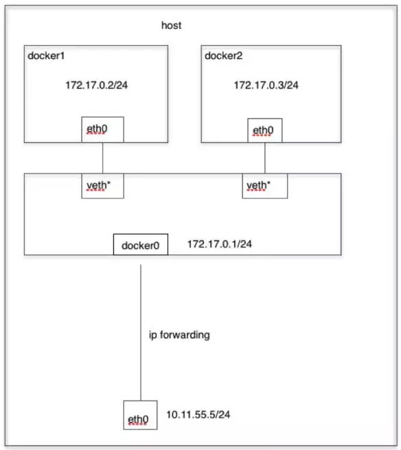
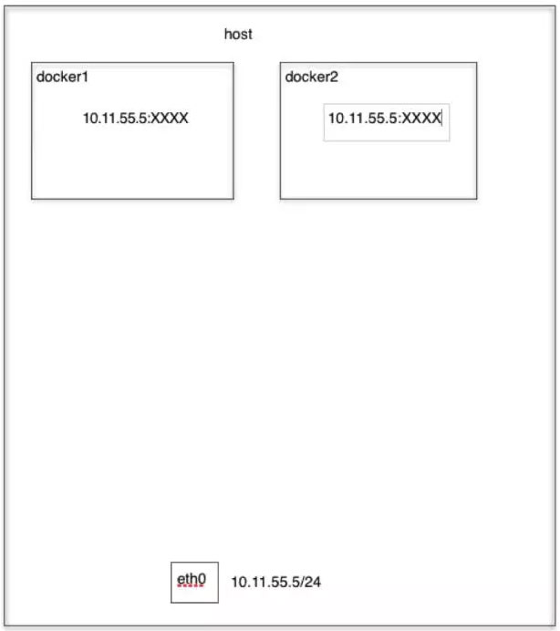
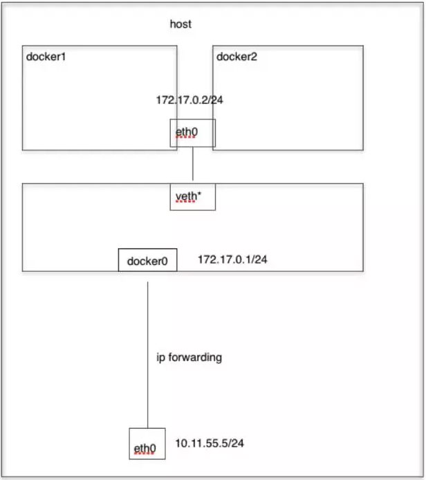
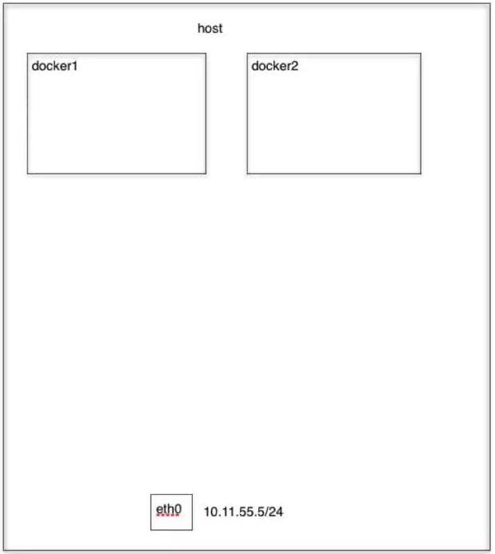

# 7. Docker 的网络模式

## Bridge模式
当`Docker`进程启动时，会在主机上创建一个名为`docker0`的虚拟网桥，此主机上启动的`Docker`容器会连接到这个虚拟网桥上。虚拟网桥的工作方式和物理交换机类似，这样主机上的所有容器就通过交换机连在了一个二层网络中。从`docker0`子网中分配一个 IP 给容器使用，并设置 docker0 的 IP 地址为容器的**默认网关**。在主机上创建一对虚拟网卡`veth pair`设备，Docker 将 veth pair 设备的一端放在新创建的容器中，并命名为`eth0`（容器的网卡），另一端放在主机中，以`vethxxx`这样类似的名字命名，并将这个网络设备加入到 docker0 网桥中。可以通过`brctl show`命令查看。

`bridge`模式是 docker 的默认网络模式，不写`–net`参数，就是`bridge`模式。使用`docker run -p`时，docker 实际是在`iptables`做了`DNAT`规则，实现端口转发功能。可以使用`iptables -t nat -vnL`查看。`bridge`模式如下图所示：
​​

演示：
```shell
$ docker run -tid --net=bridge --name docker_bri1 \
             ubuntu-base:v3
             docker run -tid --net=bridge --name docker_bri2 \
             ubuntu-base:v3 

$ brctl show
$ docker exec -ti docker_bri1 /bin/bash
$ ifconfig –a
$ route –n
```

如果你之前有 Docker 使用经验，你可能已经习惯了使用`--link`参数来使容器互联。

随着 Docker 网络的完善，强烈建议大家将容器加入自定义的 Docker 网络来连接多个容器，而不是使用 --link 参数。

下面先创建一个新的 Docker 网络。
```shell
$ docker network create -d bridge my-net
```

`-d`参数指定 Docker 网络类型，有 `bridge overlay`。其中 overlay 网络类型用于 Swarm mode，在本小节中你可以忽略它。

运行一个容器并连接到新建的 my-net 网络
```shell
$ docker run -it --rm --name busybox1 --network my-net busybox sh
```

打开新的终端，再运行一个容器并加入到 my-net 网络
```shell
$ docker run -it --rm --name busybox2 --network my-net busybox sh
```

再打开一个新的终端查看容器信息
```shell
$ docker container ls

CONTAINER ID        IMAGE               COMMAND             CREATED             STATUS              PORTS               NAMES
b47060aca56b        busybox             "sh"                11 minutes ago      Up 11 minutes                           busybox2
8720575823ec        busybox             "sh"                16 minutes ago      Up 16 minutes                           busybox1
```

下面通过 ping 来证明 busybox1 容器和 busybox2 容器建立了互联关系。
在 busybox1 容器输入以下命令
```shell
/ # ping busybox2
PING busybox2 (172.19.0.3): 56 data bytes
64 bytes from 172.19.0.3: seq=0 ttl=64 time=0.072 ms
64 bytes from 172.19.0.3: seq=1 ttl=64 time=0.118 ms
```

用 ping 来测试连接 busybox2 容器，它会解析成 172.19.0.3。
同理在 busybox2 容器执行 ping busybox1，也会成功连接到。
```shell
/ # ping busybox1
PING busybox1 (172.19.0.2): 56 data bytes
64 bytes from 172.19.0.2: seq=0 ttl=64 time=0.064 ms
64 bytes from 172.19.0.2: seq=1 ttl=64 time=0.143 ms
```
这样，busybox1 容器和 busybox2 容器建立了互联关系。

如果你有多个容器之间需要互相连接，推荐使用`Docker Compose`。

## Host 模式
如果启动容器的时候使用`host`模式，那么这个容器将不会获得一个独立的`Network Namespace`，而是和宿主机共用一个 Network Namespace。容器将不会虚拟出自己的网卡，配置自己的 IP 等，而是使用宿主机的 IP 和端口。但是，容器的其他方面，如文件系统、进程列表等还是和宿主机隔离的。
Host模式如下图所示：

​​

演示：
```shell
$ docker run -tid --net=host --name docker_host1 ubuntu-base:v3
$ docker run -tid --net=host --name docker_host2 ubuntu-base:v3

$ docker exec -ti docker_host1 /bin/bash
$ docker exec -ti docker_host1 /bin/bash

$ ifconfig –a
$ route –n
```

## Container 模式
这个模式指定新创建的容器和已经存在的一个容器共享一个 Network Namespace，而不是和宿主机共享。新创建的容器不会创建自己的网卡，配置自己的 IP，而是和一个指定的容器共享 IP、端口范围等。同样，两个容器除了网络方面，其他的如文件系统、进程列表等还是隔离的。两个容器的进程可以通过 lo 网卡设备通信。
Container模式示意图：

​​
演示：
```shell
$ docker run -tid --net=container:docker_bri1 \
              --name docker_con1 ubuntu-base:v3

$ docker exec -ti docker_con1 /bin/bash
$ docker exec -ti docker_bri1 /bin/bash

$ ifconfig –a
$ route -n
```

## None模式
使用`none`模式，Docker 容器拥有自己的 Network Namespace，但是，并不为Docker 容器进行任何网络配置。也就是说，这个 Docker 容器没有网卡、IP、路由等信息。需要我们自己为 Docker 容器添加网卡、配置 IP 等。
None模式示意图:

​​
演示：
```shell
$ docker run -tid --net=none --name \
                docker_non1 ubuntu-base:v3

$ docker exec -ti docker_non1 /bin/bash

$ ifconfig –a
$ route -n
```

Docker 的跨主机通信我们这里就先暂时不讲解，我们在后面的`Kubernetes`课程当中会用到。
