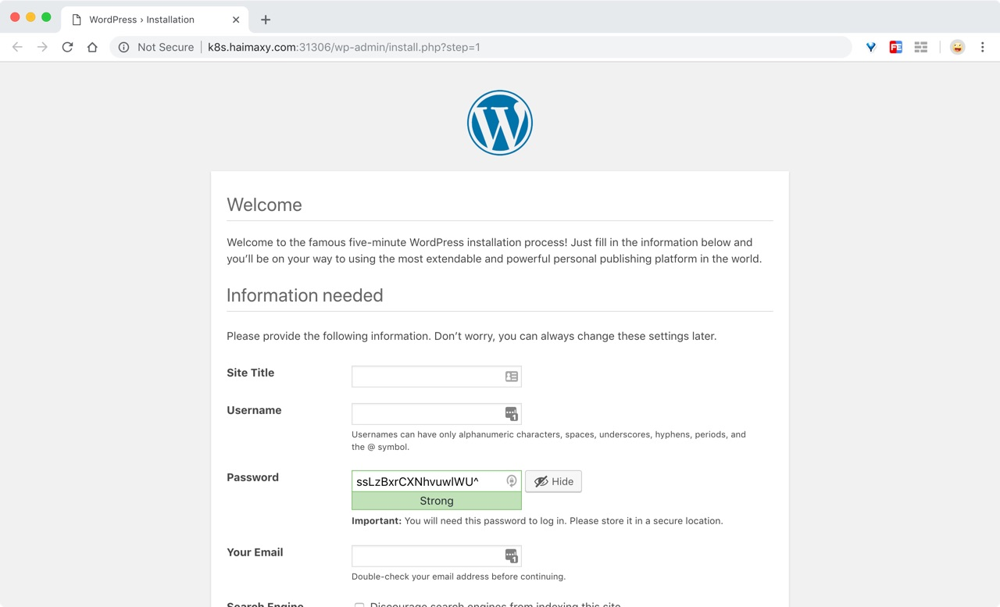

# 50. Helm 部署应用示例
到这里我们就把 Helm 涉及到的一些知识点基本上和大家讲解完了，今天我们就用一个完整的示例来给大家演示下如何从0开始部署一个 Helm 应用。

大家是否还记得前面我们手动部署的 wordpress 示例，如果现在我们来使用 Helm Chart 来部署 wordpress 应用应该怎么操作呢？

## 创建 chart
首先同样的我们还是手动创建一个 chart 包，执行下面的创建命令：
```shell
$ helm create wordpress
Creating wordpress
```

然后我们就需要来编写 helm 的模板了，但是应该如何开始呢？这个我们就要去回顾下之前在没有使用 helm 的情况下，我们是怎样部署 wordpress 应用的，我们可以前往[github 仓库](https://github.com/cnych/kubernetes-learning/blob/master/wordpress/wordpress-all.yaml)查看之前应用的资源清单，我们知道 wordpress 是依赖于 mysql 数据库的，所以我们在部署的时候是将 wordpress 和 mysql 两个应用独立部署的，然后在 wordpress 的 Pod 中通过环境变量的形式将 mysql 数据库的链接地址、端口以及数据库名称注入到应用中去的，为了解决服务依赖的问题，我们还用了一个 initContainer 来检查 mysql 数据库是否已经启动，保证 wordpress 应用启动之前能够正常连接。所以第一步我们完全就可以将之前的资源清单文件内容直接照搬过来。

将 Deployment 资源中的 yaml 文件复制到 templates/deployment.yaml 文件中，将 Service 资源中的 yaml 文件内容复制到 templates/service.yaml 文件中，其他的暂时不用考虑。

然后同样的我们可以先使用 debug 命令调试模板是否能够正常渲染：
```shell
$ helm install --dry-run --debug .
```

由于我们之前是将应用安装在 blog 这个 namespace 下面的，所以我们需要在提前添加一个 namespace，但是如果我们在 chart 模板中就将这些资源固定在某个 namespace 下面显然是不合适的，我们在使用`helm install`命令安装的时候可以通过`--namespace`参数来指定将我们的应用安装在某个 namespace 下面，所以我们在 chart 模板中都不会带上 namespace 的声明，所以这里我们将 deployment.yaml 和 service.yaml 文件中的 namespace 字段都移除掉。然后执行安装命名：
```shell
$ kubectl create ns blog
namespace "blog" created
$ helm install . --namespace blog
NAME:   viable-ant
LAST DEPLOYED: Sun Oct  7 00:43:40 2018
NAMESPACE: blog
STATUS: DEPLOYED

RESOURCES:
==> v1/Service
NAME       TYPE       CLUSTER-IP    EXTERNAL-IP  PORT(S)       AGE
mysql      ClusterIP  10.97.198.88  <none>       3306/TCP      0s
wordpress  NodePort   10.100.28.2   <none>       80:31306/TCP  0s

==> v1beta1/Deployment
NAME              DESIRED  CURRENT  UP-TO-DATE  AVAILABLE  AGE
mysql-deploy      1        1        1           0          0s
wordpress-deploy  1        1        1           0          0s

==> v1/Pod(related)
NAME                              READY  STATUS             RESTARTS  AGE
mysql-deploy-67dfd986dd-86bdx     0/1    ContainerCreating  0         0s
wordpress-deploy-5df954b8c-t2h7t  0/1    Init:0/1           0         0s


NOTES:
1. Get the application URL by running these commands:
  export POD_NAME=$(kubectl get pods --namespace blog -l "app=wordpress,release=viable-ant" -o jsonpath="{.items[0].metadata.name}")
  echo "Visit http://127.0.0.1:8080 to use your application"
  kubectl port-forward $POD_NAME 8080:80
```

我们在安装的时候指定了 namespace 参数，我们可以看到 RESOURCES 区域现在已经是我们指点的资源对象了，NOTES 区域的显示是默认的信息，可以暂时忽略，现在我们可以查看下 blog 这个 namespace 下面的资源对象：
```shell
$ kubectl get pods -n blog
NAME                               READY     STATUS              RESTARTS   AGE
mysql-deploy-67dfd986dd-86bdx      1/1       Running   0          5m
wordpress-deploy-5df954b8c-t2h7t   1/1       Running     0          5m
$ kubectl get service -n blog
NAME        TYPE        CLUSTER-IP     EXTERNAL-IP   PORT(S)        AGE
mysql       ClusterIP   10.97.198.88   <none>        3306/TCP       5m
wordpress   NodePort    10.100.28.2    <none>        80:31306/TCP   5m
```

隔一会儿时间等镜像下载完成、Pod 启动起来后就可以通过 NodeIP:31306 去访问下我们部署的服务是否能够正常访问。




## 定制数据
尽管现在我们通过上面的方法可以直接使用 helm 来安装我们的应用了，但是完全不能定制化，比如我们希望资源的名称和 helm release 的名称产生关联，比如我希望可以通过参数化的形式去控制应用的资源大小，比如我还希望能够自己去控制数据库的数据持久化，因为在生产环境下面很大的可能是使用 PV/PVC 或者 StorageClass，而不是使用 hostPath。所以其实现在还远远不够。

### 名称
首先，我们将资源的名称定义成一个命名模板，因为除了 Deployment 里面需要使用，Service 资源里面也可以使用，这样两个地方直接引用同一个命名模板就可以了，我们打开 templates/_helpers.tpl 文件，其实可以看到默认的 partial 文件中就已经有这样的名称的命名模板的定义了：
```yaml
{{/* vim: set filetype=mustache: */}}
{{/*
Expand the name of the chart.
*/}}
{{- define "wordpress.name" -}}
{{- default .Chart.Name .Values.nameOverride | trunc 63 | trimSuffix "-" -}}
{{- end -}}

{{/*
Create a default fully qualified app name.
We truncate at 63 chars because some Kubernetes name fields are limited to this (by the DNS naming spec).
If release name contains chart name it will be used as a full name.
*/}}
{{- define "wordpress.fullname" -}}
{{- if .Values.fullnameOverride -}}
{{- .Values.fullnameOverride | trunc 63 | trimSuffix "-" -}}
{{- else -}}
{{- $name := default .Chart.Name .Values.nameOverride -}}
{{- if contains $name .Release.Name -}}
{{- .Release.Name | trunc 63 | trimSuffix "-" -}}
{{- else -}}
{{- printf "%s-%s" .Release.Name $name | trunc 63 | trimSuffix "-" -}}
{{- end -}}
{{- end -}}
{{- end -}}

{{/*
Create chart name and version as used by the chart label.
*/}}
{{- define "wordpress.chart" -}}
{{- printf "%s-%s" .Chart.Name .Chart.Version | replace "+" "_" | trunc 63 | trimSuffix "-" -}}
{{- end -}}
```

其中`wordpress.fullname`这个命名模板就是我们需要的，但是我们需要仔细分析下这个命名模板的逻辑：

* 首先是如果定义了值 fullnameOverride，则直接截取前63个字符(这是因为 kubernetes 的命名机制决定的)，然后使用`-`进行连接
* 如果没有定义值 fullnameOverride，那么就直接取值 nameOverride(默认是 chart 的名称):
    * 如果值 nameOverride 包含了当前 release 的名称，则同样直接截取前63个字符，用`-`进行连接
    * 如果值 nameOverride 没包含当前 release 的名称，则将 release 的名称和值 nameOverride 用`-`进行拼接，然后截取前63个字符作为应用的名称

所以现在我们将 templates 目录下面的 deployment.yaml 和 service.yaml 文件中关于 wordpress 的 name 替换成命名模板：
```yaml
apiVersion: apps/v1beta1
kind: Deployment
metadata:
  name: {{ template "wordpress.fullname" . }}
......

apiVersion: v1
kind: Service
metadata:
  name: {{ template "wordpress.fullname" . }}
......
```

然后将 values.yaml 文件中的内容全部清空，添加下面两个值定义：
```yaml
nameOverride: ""
fullnameOverride: ""
```

将 templates 目录下面的 ingress.yaml 和 NOTES.txt 文件删除，后面我们再手动添加，然后使用 debug 命令来查看模板是否能够按照我们的要求就行渲染：
```shell
$ helm install --dry-run --debug .
helm install --dry-run --debug .
[debug] Created tunnel using local port: '38888'

......

---
# Source: wordpress/templates/service.yaml
apiVersion: v1
kind: Service
metadata:
  name: mysql
......
---
# Source: wordpress/templates/service.yaml
apiVersion: v1
kind: Service
metadata:
  name: old-fox-wordpress
......
---
# Source: wordpress/templates/deployment.yaml
apiVersion: apps/v1beta1
kind: Deployment
metadata:
  name: mysql-deploy
......
---
# Source: wordpress/templates/deployment.yaml
apiVersion: apps/v1beta1
kind: Deployment
metadata:
  name: old-fox-wordpress
  labels:
    app: wordpress
......
```

我们可以看到 Deployment 和 Service 的名称都是 old-fox-wordpress，这是因为我们没有定义 fullnameOverride 和 nameOverride 这两个值，所以最后渲染的时候就是使用的 release 的名称拼接上 chart 的名称，如果我们用 --set 参数来指定下值 fullnameOverride 呢：
```shell
$ helm install --dry-run --debug --set fullnameOverride=mywordpress .
[debug] Created tunnel using local port: '41110'

......

---
# Source: wordpress/templates/service.yaml
apiVersion: v1
kind: Service
metadata:
  name: mywordpress
......
---
# Source: wordpress/templates/deployment.yaml
apiVersion: apps/v1beta1
kind: Deployment
metadata:
  name: mywordpress
  labels:
    app: wordpress
......
```

可以看到资源名称被我们指定的值覆盖了，一般情况下面我们还会为我们的资源添加上合适的 labels 标签，比如我们这里可以给 wordpress 的 Deployment 和 Service 都添加上下面的 labels 标签：
```yaml
apiVersion: apps/v1beta1
kind: Deployment
metadata:
  name: {{ template "wordpress.fullname" . }}
  labels:
    app: {{ .Chart.Name }}
    chart: {{ template "wordpress.chart" . }}
    release: {{ .Release.Name }}

......
apiVersion: v1
kind: Service
metadata:
  name: {{ template "wordpress.fullname" . }}
  labels:
    app: {{ .Chart.Name }}
    chart: {{ template "wordpress.chart" . }}
    release: {{ .Release.Name }}
```

然后使用 debug 模式查看下模板渲染结果：
```shell
$ helm install --dry-run --debug .
[debug] Created tunnel using local port: '40645'

......

---
# Source: wordpress/templates/service.yaml
apiVersion: v1
kind: Service
metadata:
  name: youngling-clam-wordpress
  labels:
    app: wordpress
    chart: wordpress-0.1.0
    release: youngling-clam
......
---
# Source: wordpress/templates/deployment.yaml
apiVersion: apps/v1beta1
kind: Deployment
metadata:
  name: youngling-clam-wordpress
  labels:
    app: wordpress
    chart: wordpress-0.1.0
    release: youngling-clam
......
```

有的同学可能已经发现了，我们这个地方的应用是依赖于 mysql 的，那么为什么我们只是把 wordpress 相关的数据来做了定制呢？当然我们也可以在我们的这个 chart 中来定制 mysql，但是这却不是最好的方法，最好的方法是让我们去依赖一个独立的 mysql chart，这样可以将 wordpress 和 mysql 之间的耦合关系降低，后面我们再和大家来看看怎样解耦。

为了不影响对 wordpress 的操作，我们可以临时将 templates 目录下面的 mysql 的资源对象单独提取出来，比如我们这里统一放到一个叫 mysql.yaml 的资源文件中，现在我们的结构就是这样的了：
```shell
$ tree .
.
├── charts
├── Chart.yaml
├── templates
│   ├── deployment.yaml
│   ├── _helpers.tpl
│   ├── mysql.yaml
│   └── service.yaml
└── values.yaml

2 directories, 6 files
```

### 镜像
现在我们使用的镜像还是固定的`wordpress:latest`，为了方便其他人使用，我们在编写 chart 包的时候会提供一个定制参数值，可以自由指定使用的镜像，包括 tag 版本。我们可以先去添加 values.yaml 文件中的内容：
```yaml
nameOverride: ""
fullnameOverride: ""

## 官方 WordPress 镜像
## 引用：https://hub.docker.com/r/library/wordpress/tags/
image:
  registry: docker.io
  repository: wordpress
  tag: 4.9.8
  ## 指定一个 imagePullPolicy
  ## 如果镜像 tag 是'latest'，则默认是'Always'，否则设置'IfNotPresent'
  ## 引用: http://kubernetes.io/docs/user-guide/images/#pre-pulling-images
  ##
  pullPolicy: IfNotPresent
  ## 指定一组 imagePullSecretes[可选]
  ## Secrets 必须在 namespace 下面手动创建
  ## 引用: https://kubernetes.io/docs/tasks/configure-pod-container/pull-image-private-registry/
  ##
  # pullSecrets:
  #   - myRegistrKeySecretName
```

我们在 values.yaml 文件中添加了一个 image 的对象，里面包含仓库地址、镜像名称、镜像版本，这是因为一个标准的镜像就包含这3个部分，每一个部分都是可能被定制的，然后指定一个镜像拉取策略的参数 imagePullPolicy，还不算完，为什么呢？如果我们要使用的镜像是一个私有仓库的镜像怎么办？所以我们这里还预留了一个参数：pullSecrets，用来指定私有仓库地址的 Secrets，现在我们再去修改 templates/deployment.yaml 文件就简单很多了：
```yaml
apiVersion: apps/v1beta1
kind: Deployment
metadata:
  name: {{ template "wordpress.fullname" . }}
  labels:
    app: {{ .Chart.Name }}
    chart: {{ template "wordpress.chart" . }}
    release: {{ .Release.Name }}
spec:
  strategy:
    type: RollingUpdate
    rollingUpdate:
      maxSurge: 1
      maxUnavailable: 1
  template:
    metadata:
      labels:
        app: {{ .Chart.Name }}
        chart: {{ template "wordpress.chart" . }}
        release: {{ .Release.Name }}
    spec:
      initContainers:
      - name: init-db
        image: busybox
        imagePullPolicy: IfNotPresent
        command: ['sh', '-c', 'until nslookup mysql;do echo waiting for mysql service; sleep 2; done;']
      {{- if .Values.image.pullSecrets }}
      imagePullSecrets:
      {{- range .Values.image.pullSecrets }}
      - name: {{ . }}
      {{- end }}
      {{- end }}
      containers:
      - name: {{ template "wordpress.fullname" . }}
        image: "{{ .Values.image.registry }}/{{ .Values.image.repository }}:{{ .Values.image.tag }}"
        imagePullPolicy: {{ .Values.image.pullPolicy | quote }}
......
```

我们首先判断是否存在值`pullSecrets`，如果存在，则将 Secrets 循环渲染出来，然后是容器的名称还是使用命名模板 wordpress.fullname 的定义，然后就是 image 的地址以及 imagePullPolicy，这样我们就完成了对镜像的定制，默认的值直接写入到 values.yaml 文件中，现在我们使用 debug 命令查看下模板渲染的结果：
```yaml
helm install --dry-run --debug .
[debug] Created tunnel using local port: '46735'

......

---
# Source: wordpress/templates/deployment.yaml
apiVersion: apps/v1beta1
kind: Deployment
metadata:
  name: eponymous-narwhal-wordpress
  labels:
    app: wordpress
    chart: wordpress-0.1.0
    release: eponymous-narwhal
spec:
  strategy:
    type: RollingUpdate
    rollingUpdate:
      maxSurge: 1
      maxUnavailable: 1
  template:
    metadata:
      labels:
        app: wordpress
        chart: wordpress-0.1.0
        release: eponymous-narwhal
    spec:
      initContainers:
      - name: init-db
        image: busybox
        imagePullPolicy: IfNotPresent
        command: ['sh', '-c', 'until nslookup mysql;do echo waiting for mysql service; sleep 2; done;']
      containers:
      - name: eponymous-narwhal-wordpress
        image: "docker.io/wordpress:4.9.8"
        imagePullPolicy: "IfNotPresent"
......
```

假如现在我们的镜像地址是 youdianzhishi.com/wordpress:4.9，那么我们在安装的就可以覆盖 image 对象中的相关参数了：
```yaml
$ helm install --dry-run --debug --set image.registry=youdianzhishi.com --set image.tag=4.9 .
[debug] Created tunnel using local port: '36449'

......

# Source: wordpress/templates/deployment.yaml
apiVersion: apps/v1beta1
kind: Deployment
metadata:
  name: peddling-prawn-wordpress
  labels:
    app: wordpress
    chart: wordpress-0.1.0
    release: peddling-prawn
spec:
  strategy:
    type: RollingUpdate
    rollingUpdate:
      maxSurge: 1
      maxUnavailable: 1
  template:
    metadata:
      labels:
        app: wordpress
        chart: wordpress-0.1.0
        release: peddling-prawn
    spec:
      initContainers:
      - name: init-db
        image: busybox
        imagePullPolicy: IfNotPresent
        command: ['sh', '-c', 'until nslookup mysql;do echo waiting for mysql service; sleep 2; done;']
      containers:
      - name: peddling-prawn-wordpress
        image: "youdianzhishi.com/wordpress:4.9"
        imagePullPolicy: "IfNotPresent"
......
```

我们可以看到镜像地址是不是就被替换了，当然如果你需要覆盖的值比较多，最好还是通过指定一个 yaml 文件来覆盖默认的这些 values 值。


### 健康检查、资源限制
按照我们前面的资源文件声明，接下来我们就应该定制健康检查部分和资源限制部分，同样还是先添加模板值：（values.yaml）
```yaml
......
## liveness 和 readliness probes 配置
## 引用: https://kubernetes.io/docs/tasks/configure-pod-container/configure-liveness-readiness-probes/#configure-probes)
livenessProbe:
  initialDelaySeconds: 120
  periodSeconds: 10
  timeoutSeconds: 5
  failureThreshold: 6
  successThreshold: 1
readinessProbe:
  initialDelaySeconds: 30
  periodSeconds: 10
  timeoutSeconds: 5
  failureThreshold: 6
  successThreshold: 1
```

我们在 values.yaml 文件中添加了 livenessProbe 和 readinessProbe 这两个对象，里面都是健康检测的相关属性，然后我们需要将这些值都嵌入到模板中去，按照以前的方法我们是不是一个属性一个属性的添加，但是这样太麻烦了，我们可以用一个函数`toYaml`将这两个对象中的属性一次性全部输出到模板中去：
```yaml
containers:
- name: {{ template "wordpress.fullname" . }}
image: "{{ .Values.image.registry }}/{{ .Values.image.repository }}:{{ .Values.image.tag }}"
imagePullPolicy: {{ .Values.image.pullPolicy | quote }}
ports:
- name: wdport
    containerPort: 80
livenessProbe:
    tcpSocket:
    port: 80
{{ toYaml .Values.livenessProbe | indent 10 }}
readinessProbe:
    tcpSocket:
    port: 80
{{ toYaml .Values.readinessProbe | indent 10 }}
```

可以看到我们这里使用的方法是`{{ toYaml .Values.livenessProbe | indent 10 }}`，至于为什么是保留10个空格呢？这个就需要大家对这些对象的层级关系要比较清楚才行。现在我们用 debug 来查看下模板渲染后的结果呢：
```shell
helm install --dry-run --debug .
[debug] Created tunnel using local port: '40467'

......
      containers:
      - name: mouthy-crocodile-wordpress
        image: "docker.io/wordpress:4.9.8"
        imagePullPolicy: "IfNotPresent"
        ports:
        - name: wdport
          containerPort: 80
        livenessProbe:
          tcpSocket:
            port: 80
          failureThreshold: 6
          initialDelaySeconds: 120
          periodSeconds: 10
          successThreshold: 1
          timeoutSeconds: 5

        readinessProbe:
          tcpSocket:
            port: 80
          failureThreshold: 6
          initialDelaySeconds: 30
          periodSeconds: 10
          successThreshold: 1
          timeoutSeconds: 5
......
```

可以看到符合我们的渲染结果的。然后就是我们的 resource 资源部分，因为并不是所有的应用资源消耗情况都是一样的，还需要结合自己的集群去进行定制

```yaml
## Configure resource requests and limits
## ref: http://kubernetes.io/docs/user-guide/compute-resources/
##
resources:
  requests:
    memory: 512Mi
    cpu: 300m
```

todo......
