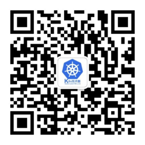
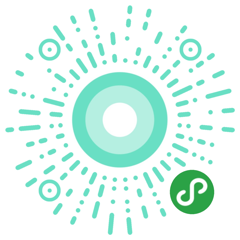

# kubernetes-learning -- 从Docker到Kubernetes进阶

## 介绍

[Kubernetes](http://kubernetes.io/)是Google基于Borg开源的容器编排调度引擎，作为[CNCF](http://cncf.io/)（Cloud Native Computing Foundation）最重要的组件之一，它的目标不仅仅是一个编排系统，而是提供一个规范，可以让你来描述集群的架构，定义服务的最终状态，`Kubernetes` 可以帮你将系统自动地达到和维持在这个状态。`Kubernetes` 作为云原生应用的基石，相当于一个云操作系统，其重要性不言而喻。

之前一直有同学跟我说我 `Docker` 掌握得还可以，但是不知道怎么使用 `Kubernetes`，网上的其他关于 `Kubernetes` 的课程费用又太高，本书就是为你们准备的，当然如果你不了解 `Docker`，不了解 `Kubernetes`，都没有关系，我们会从 `Docker` 入门一步步深入，到 `Kubernetes` 的进阶使用的。所以大家完全没必要担心。

学完本课程以后，你将会对 `Docker` 和 `Kubernetes` 有一个更加深入的认识，我们会讲到：

* `Docker` 的一些常用方法，当然我们的重点会在 Kubernetes 上面
* 会用 `kubeadm` 来搭建一套 `Kubernetes` 的集群
* 理解 `Kubernetes` 集群的运行原理
* 常用的一些控制器使用方法
* 还有 `Kubernetes` 的一些调度策略
* `Kubernetes`的运维
* 包管理工具 `Helm` 的使用
* 最后我们会实现基于 Kubernetes 的 CI/CD

GitHub地址：[https://github.com/cnych/kubernetes-learning/tree/master/docs](https://github.com/cnych/kubernetes-learning/)

视频课程在线地址：[https://www.haimaxy.com/course/6n8xd6/](https://www.haimaxy.com/course/6n8xd6/)

## 社区&读者交流

* 博客：[阳明的博客](https://blog.qikqiak.com/)
* 微信群：`k8s`技术圈，扫描我的微信二维码，[阳明](https://blog.qikqiak.com/page/about/)，或直接搜索微信号**iEverything**后拉您入群，请增加备注(k8s或kubernetes)
* 知乎专栏：[k8s技术圈](https://zhuanlan.zhihu.com/kube100)
* 开发者头条：[k8s技术圈](https://toutiao.io/subjects/268333)
* 微信公众号：扫描下面的二维码关注微信公众号`k8s技术圈`

* 优点知识：[优点知识](https://www.haimaxy.com/)是一个综合的技术学习平台，本书配套的视频教程将会发布在该平台上面，感兴趣的朋友可以扫描下发的二维码关注自己感兴趣的课程。

